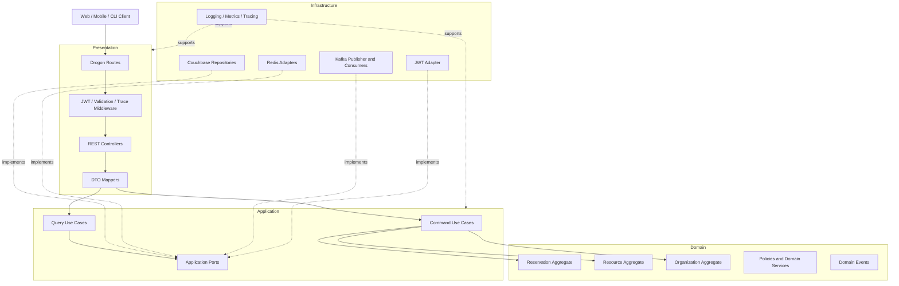
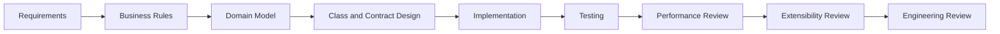

# Haven — Introduction

## Table of Contents

- [1. Overview](#1-overview)
- [2. Project Vision](#2-project-vision)
- [3. Problem Statement](#3-problem-statement)
- [4. Why Haven Exists](#4-why-haven-exists)
- [5. Product Scope](#5-product-scope)
- [6. Engineering Goals](#6-engineering-goals)
- [7. Non-Goals](#7-non-goals)
- [8. Core Business Capabilities](#8-core-business-capabilities)
- [9. Guiding Architecture Principles](#9-guiding-architecture-principles)
- [10. Technology Stack](#10-technology-stack)
- [11. High-Level Architecture Philosophy](#11-high-level-architecture-philosophy)
- [12. Domain Overview](#12-domain-overview)
- [13. Repository Structure](#13-repository-structure)
- [14. Development Methodology](#14-development-methodology)
- [15. Documentation Strategy](#15-documentation-strategy)
- [16. Delivery Roadmap](#16-delivery-roadmap)
- [17. Engineering Standards](#17-engineering-standards)
- [18. Design Decisions Introduced](#18-design-decisions-introduced)
- [19. Deferred Decisions](#19-deferred-decisions)
- [20. Risks and Constraints](#20-risks-and-constraints)
- [21. Interview Discussion Notes](#21-interview-discussion-notes)
- [22. Reading Guide](#22-reading-guide)
- [23. Key Takeaways](#23-key-takeaways)
- [24. Next Document](#24-next-document)

---

## 1. Overview

Haven is a production-oriented backend reservation platform implemented in Modern C++20.

The system is designed to support reservations for multiple classes of time-bound resources, including:

- Meeting rooms
- Office desks
- Parking slots
- Hotel-style rooms
- Game zones
- Other resources that can be reserved for a fixed start and end time

Haven is intentionally not designed as a generic inventory or asset-lending platform. Its bounded context is limited to resources reserved for predefined time intervals.

The project serves two goals:

1. Build a realistic reservation platform with production engineering concerns.
2. Demonstrate senior backend engineering skills through architecture, code quality, testing, observability, concurrency control, and documented trade-offs.

Haven is a portfolio project, but it should not resemble a tutorial project. The architecture and implementation should be defensible during SDE-2 and SDE-3 backend interviews.

---

## 2. Project Vision

> Haven is a multi-tenant reservation platform that consistently allocates scarce, time-bound resources under concurrent access while remaining modular, observable, testable, and extensible.

The defining problem is not CRUD.

The defining problem is coordinating multiple users who may attempt to reserve the same resource for overlapping time periods.

The system must guarantee that:

- A resource is not double-booked for conflicting time intervals.
- Tenant data is isolated.
- Duplicate client retries do not create duplicate reservations.
- Business rules are enforced consistently.
- Resource search remains responsive.
- Reservation state remains authoritative even when caches or asynchronous consumers fail.
- The codebase can evolve without coupling business logic to specific infrastructure technologies.

---

## 3. Problem Statement

Organizations manage resources such as meeting rooms, desks, and parking slots. Users need to discover resources matching their requirements and reserve them for fixed time intervals.

A basic implementation can expose create, read, update, and delete operations. That approach is insufficient because the difficult parts of a reservation platform are behavioral and distributed:

- Concurrent users may reserve the same resource at nearly the same instant.
- Search results become stale between discovery and booking.
- Some resources require approval while others are confirmed immediately.
- Duplicate requests can occur because of client retries and network timeouts.
- Resource availability is derived from reservation data and may be expensive to compute.
- Notifications and reporting must not block the core reservation path.
- Tenant isolation must be enforced in every request and query.
- The system must degrade safely when infrastructure dependencies fail.

Haven addresses these problems through an architecture centered on explicit domain rules, small consistency boundaries, optimistic concurrency, idempotency, and asynchronous side effects.

---

## 4. Why Haven Exists

### 4.1 Business Motivation

Many organizations operate shared resources that are difficult to coordinate manually. Resource contention causes scheduling conflicts, inefficient utilization, and administrative overhead.

Haven provides a consistent model for reserving any resource that follows the same core contract:

```text
resource + start time + end time + reservation policy
```

This common model allows the reservation engine to remain independent of specific resource types.

### 4.2 Engineering Motivation

The project is intended to demonstrate:

- Requirements-driven architecture
- Multi-tenant design
- Domain-Driven Design
- Clean and Hexagonal Architecture
- Optimistic concurrency
- Idempotent APIs
- Event-driven integrations
- Database modeling for access patterns
- Redis caching without making cache a source of truth
- Structured logging, metrics, and tracing
- Integration, concurrency, and performance testing
- Modern C++20 ownership and safety practices
- Containerized local development
- CI/CD and production hardening

### 4.3 Portfolio Motivation

A recruiter or interviewer reviewing Haven should be able to see:

- Why each major component exists
- Which trade-offs were considered
- Which responsibilities belong to each layer
- How correctness is preserved under concurrent access
- How the architecture can evolve
- How the implementation is tested and operated

The design documentation is therefore a first-class project artifact rather than an afterthought.

---

## 5. Product Scope

### 5.1 In Scope for MVP

The MVP supports:

- Two to three isolated organizations
- JWT-authenticated users
- Resource discovery
- Fixed start and end time reservations
- Maximum standard reservation duration of 12 hours
- A controlled extension to 24 hours for maintenance use cases
- Automatic confirmation for ordinary resources
- Approval workflow for selected priority resources
- Reservation creation
- Reservation lookup
- Reservation cancellation
- Reservation approval and rejection
- User reservation history
- Derived availability search
- Domain event publication
- Notification processing
- Health endpoints
- API documentation
- Docker-based local development
- Testing, logging, metrics, and tracing foundations

### 5.2 Supported Resource Categories

The MVP domain is generic enough to represent:

| Resource Type | Example Reservation |
|---|---|
| Meeting room | 10:00–11:00 |
| Office desk | 09:00–17:00 |
| Parking slot | 08:00–18:00 |
| Hotel-style room | 14:00–11:00 next day, subject to policy |
| Game zone | 18:00–20:00 |

All supported resources must use a predefined start and end time.

### 5.3 Deliberate Product Boundary

Open-ended lending is not supported.

For example, laboratory equipment checked out until an unknown return time belongs to a different business domain because it introduces:

- Check-out and return workflows
- Late-return handling
- Damage or loss processing
- Different availability semantics
- Different conflict rules

Haven will reject such requirements rather than polluting the time-bound reservation model.

---

## 6. Engineering Goals

### 6.1 Correctness

The system must prevent double booking.

For any resource and time interval, conflicting confirmed reservations must not coexist.

### 6.2 Maintainability

The codebase must make business rules discoverable and local.

A new engineer should be able to understand the reservation lifecycle without reading Drogon controllers, Couchbase queries, or Kafka adapters.

### 6.3 Extensibility

Adding a new time-bound resource type should require minimal changes.

The reservation engine should depend on resource capabilities and policies rather than hardcoded resource-specific branches.

### 6.4 Testability

Domain and application logic must be testable without:

- Drogon
- Couchbase
- Redis
- Kafka
- Docker
- Network access

### 6.5 Observability

The platform must support:

- Structured logs
- Request and trace identifiers
- Business and technical metrics
- Distributed tracing foundations
- Health and dependency checks

### 6.6 Operational Simplicity

The MVP should remain deployable as a modular monolith.

The project should demonstrate clean boundaries without introducing unnecessary microservice operations.

### 6.7 Performance

Performance-sensitive areas include:

- Availability search
- Overlap queries
- Reservation creation
- Conflict detection
- Idempotency lookup
- Event publication
- Cache reads and invalidation

Performance changes must be benchmarked rather than assumed.

---

## 7. Non-Goals

The MVP intentionally excludes:

- Recurring reservations
- Open-ended loans
- Multi-region active-active writes
- Multi-stage or multi-approver workflows
- Delegated booking on behalf of another user
- Waitlists
- Dynamic pricing
- Billing
- Calendar synchronization with Google or Microsoft
- WebSockets for live availability
- Resource maintenance scheduling as a separate workflow
- Soft holds during search
- Bulk reservation creation
- Full administrative UI
- Independent microservice deployments
- Event sourcing
- Complex capacity-based partial allocation

These features may be evaluated later through new requirements and ADRs.

---

## 8. Core Business Capabilities

### 8.1 Authenticate and Authorize

The system identifies the caller through JWT claims and determines whether the user belongs to the relevant organization and may perform the requested action.

Authentication answers:

> Who is making the request?

Authorization answers:

> Is this caller allowed to perform the operation within this tenant?

### 8.2 Search Resources

A client searches for resources by:

- Organization context
- Resource type
- Requested start and end time
- Capacity
- Location
- Features
- Pagination and sorting

The search response returns resource identifiers and sufficient metadata for selection.

Search results are snapshots. They do not reserve or lock a resource.

### 8.3 Create Reservation

The client submits the selected `resourceId` with a requested time interval.

The server:

1. Validates the request.
2. Enforces tenant authorization.
3. Checks idempotency.
4. Loads the resource and policies.
5. Evaluates business rules.
6. Checks overlapping reservations.
7. Creates and persists a reservation.
8. Publishes domain events.
9. Returns `CONFIRMED` or `PENDING_APPROVAL`.

### 8.4 Manage Reservation Lifecycle

Supported lifecycle actions include:

- Confirm
- Approve
- Reject
- Cancel
- Extend
- Expire
- Complete

State transitions must be explicit and validated.

### 8.5 Publish Business Events

Reservation state changes produce business events such as:

- `ReservationCreated`
- `ReservationApprovalRequested`
- `ReservationConfirmed`
- `ReservationRejected`
- `ReservationCancelled`
- `ReservationExpired`
- `ReservationCompleted`

Peripheral modules consume these events for notification, audit, reporting, and future integrations.

---

## 9. Guiding Architecture Principles

### 9.1 Requirements Before Technology

Architecture choices must trace back to functional requirements, non-functional requirements, scale assumptions, or explicit learning goals.

A technology should not be introduced merely because it is popular.

### 9.2 Reservations Are the Source of Truth

Reservations are the authoritative record of resource allocation.

The following are derived from reservations:

- Availability
- Calendar views
- Search projections
- Redis cache entries
- Reporting data
- Analytics

Derived data must be rebuildable.

### 9.3 Correctness Before Performance

Haven must prefer a slower correct response over a faster incorrect reservation.

Performance optimizations must not weaken double-booking protection.

### 9.4 Cache Is Not a Correctness Dependency

Redis may improve latency or reduce repeated reads, but a Redis outage must not corrupt reservation state.

Where possible, the system should fall back to Couchbase with degraded performance.

### 9.5 Core Business Logic Is Framework-Independent

The domain must not depend on:

- Drogon types
- Couchbase SDK types
- Redis clients
- Kafka producers
- JSON libraries
- HTTP status codes

Infrastructure adapts to the domain, not the reverse.

### 9.6 Small Aggregate Boundaries

`Resource`, `Reservation`, and `Organization` are separate aggregates.

Reservations are not embedded in resource aggregates because they have different write patterns, lifecycles, and scalability characteristics.

### 9.7 Explicit Business Actions

The domain exposes actions such as:

- `confirm`
- `cancel`
- `approve`
- `reject`
- `extend`

It does not expose generic mutation APIs such as `setStatus`.

### 9.8 Asynchronous Peripheral Work

Notification, reporting, audit, and analytics must not block the core reservation path.

The reservation workflow emits facts; consumers decide how to react.

### 9.9 Modular Monolith First

Logical bounded contexts are separated in code but deployed as one application for the MVP.

This reduces:

- Operational overhead
- Distributed debugging
- Deployment complexity
- Cross-service transaction concerns
- Local development burden

The architecture should preserve future extraction paths where justified.

### 9.10 Design for Current Requirements

Haven will provide extension points for plausible evolution, but it will not implement abstractions for hypothetical domains.

---

## 10. Technology Stack

| Concern | Selected Technology | Purpose |
|---|---|---|
| Language | Modern C++20 | Performance, ownership control, backend engineering depth |
| Web framework | Drogon | HTTP server, routing, middleware, asynchronous I/O |
| Build | CMake | Portable project configuration and build orchestration |
| Dependencies | vcpkg | Reproducible third-party dependency management |
| Primary database | Couchbase | JSON document storage, indexing, CAS-based concurrency |
| Cache | Redis | Derived and slow-changing cached data |
| Messaging | Kafka | Durable asynchronous domain event distribution |
| Authentication | JWT | Stateless caller identity and tenant claims |
| Logging | spdlog | Structured, high-performance application logging |
| Unit testing | GoogleTest | Domain and application behavior testing |
| Benchmarking | Google Benchmark | Repeatable performance measurement |
| Containers | Docker / Compose | Reproducible local infrastructure |
| API documentation | OpenAPI / Swagger | Versioned public API contract |
| Formatting | clang-format | Consistent source formatting |
| Static analysis | clang-tidy | Defect detection and style enforcement |
| CI | GitHub Actions | Automated build, analysis, and tests |
| Diagrams | Mermaid / Draw.io | Architecture and behavioral documentation |

Technology-specific decisions are documented through ADRs.

---

## 11. High-Level Architecture Philosophy

Haven follows Clean Architecture and Hexagonal Architecture principles.



The source-code dependency direction points inward.

Infrastructure implementations depend on interfaces owned by the domain or application layer.

---

## 12. Domain Overview

### 12.1 Organization

Represents the tenant boundary.

Owns organization-level configuration and policies such as:

- Standard maximum duration
- Maintenance duration allowance
- Approval requirements
- Working hours
- Tenant-specific resource rules

### 12.2 Resource

Represents a reservable asset.

Owns:

- Identity
- Organization ownership
- Resource type
- Capacity
- Features
- Location
- Activation status
- Reservation-related policy references

A resource does not store its reservation history.

### 12.3 Reservation

Represents the allocation request and lifecycle.

Owns:

- Reservation identity
- Organization identity
- Resource identity
- Creator identity
- Time interval
- Purpose
- Status
- Approval information
- Audit metadata
- Concurrency version

### 12.4 Approval

Approval is a workflow associated with selected reservations.

For the MVP, approval data remains limited and may be modeled within the reservation consistency boundary. It is not yet a multi-stage independent workflow engine.

### 12.5 Availability

Availability is not an entity.

It is a derived answer to the question:

> Can this resource accept a reservation for the requested interval?

### 12.6 Calendar

Calendar is a view of reservation data rather than an authoritative model.

### 12.7 Notification

Notification is a separate bounded context and asynchronous consumer of reservation events.

---

## 13. Repository Structure

The initial repository should evolve toward the following structure:

```text
Haven/
├── AI_CONTEXT/
│   ├── PROJECT_CONTEXT.md
│   ├── CODING_GUIDELINES.md
│   ├── PROMPT_RULES.md
│   ├── DOCUMENT_TEMPLATE.md
│   ├── REVIEW_CHECKLIST.md
│   ├── CPP_STYLE_GUIDE.md
│   └── ADR_TEMPLATE.md
│
├── apps/
│   └── server/
│
├── cmake/
│
├── config/
│
├── docs/
│   ├── 00-introduction.md
│   ├── 01-requirements.md
│   ├── 02-high-level-design.md
│   ├── 03-low-level-design.md
│   ├── 04-domain-model.md
│   ├── 05-api-design.md
│   ├── 06-database-design.md
│   ├── 07-event-driven-design.md
│   ├── 08-concurrency.md
│   ├── 09-caching.md
│   ├── 10-security.md
│   ├── 11-observability.md
│   ├── 12-testing.md
│   ├── 13-performance.md
│   ├── 14-deployment.md
│   ├── 15-architecture-decisions/
│   └── diagrams/
│
├── src/
│   ├── domain/
│   ├── application/
│   ├── infrastructure/
│   ├── presentation/
│   └── bootstrap/
│
├── tests/
│   ├── unit/
│   ├── integration/
│   ├── contract/
│   └── concurrency/
│
├── benchmarks/
│
├── scripts/
│
├── docker/
│
├── .github/
│   └── workflows/
│
├── CMakeLists.txt
├── CMakePresets.json
├── vcpkg.json
├── docker-compose.yml
└── README.md
```

The exact folder structure will be finalized during project skeleton creation.

---

## 14. Development Methodology

Haven is developed incrementally.

Every significant capability follows this flow:



### 14.1 Requirements

Define functional behavior, non-functional expectations, constraints, and acceptance criteria.

### 14.2 Business Rules

Identify invariants and legal state transitions before class design.

### 14.3 Domain Model

Identify aggregates, entities, value objects, domain services, and events.

### 14.4 Contracts

Design APIs, commands, queries, repository interfaces, and adapter ports.

### 14.5 Implementation

Implement the smallest coherent vertical slice.

### 14.6 Testing

Add unit, integration, contract, failure-path, concurrency, and benchmark coverage as appropriate.

### 14.7 Engineering Review

Review:

- Correctness
- Readability
- Ownership
- Exception safety
- Thread safety
- Performance
- Maintainability
- Architecture compliance
- Operational impact

---

## 15. Documentation Strategy

Documentation is version-controlled alongside code.

The primary document set is:

| Document | Purpose |
|---|---|
| `00-introduction.md` | Project vision, scope, philosophy, and reading guide |
| `01-requirements.md` | Functional and non-functional requirements |
| `02-high-level-design.md` | System context, components, flows, and deployment |
| `03-low-level-design.md` | LLD methodology, layers, class responsibilities, and contracts |
| `04-domain-model.md` | Ubiquitous language, aggregates, entities, value objects, invariants |
| `05-api-design.md` | OpenAPI-level REST contracts and error model |
| `06-database-design.md` | Couchbase document model, indexes, access patterns |
| `07-event-driven-design.md` | Events, topics, producers, consumers, and delivery semantics |
| `08-concurrency.md` | Conflict detection, CAS, retries, idempotency |
| `09-caching.md` | Redis ownership, keys, TTLs, fallbacks, invalidation |
| `10-security.md` | Authentication, authorization, isolation, abuse prevention |
| `11-observability.md` | Logs, metrics, tracing, dashboards, alerts |
| `12-testing.md` | Test pyramid, environments, fixtures, and failure testing |
| `13-performance.md` | Benchmarks, workloads, bottlenecks, optimization process |
| `14-deployment.md` | Docker Compose and future production topology |
| `15-architecture-decisions/` | Individual Architecture Decision Records |

Each major architectural decision should be captured in an ADR.

---

## 16. Delivery Roadmap

| Phase | Focus | Status |
|---:|---|---|
| 0 | Requirements gathering | Complete |
| 1 | High-level design | Complete |
| 2 | Low-level design and domain modeling | In progress |
| 3 | Development environment setup | Planned |
| 4 | Production project skeleton | Planned |
| 5 | First APIs | Planned |
| 6 | Couchbase integration | Planned |
| 7 | Redis integration | Planned |
| 8 | Reservation engine | Planned |
| 9 | Conflict detection | Planned |
| 10 | Optimistic concurrency and retry handling | Planned |
| 11 | Asynchronous events | Planned |
| 12 | Notifications and reporting consumers | Planned |
| 13 | Metrics and tracing | Planned |
| 14 | Comprehensive testing | Planned |
| 15 | Performance benchmarking | Planned |
| 16 | Production hardening | Planned |
| 17 | CI/CD | Planned |
| 18 | Documentation and portfolio polish | Planned |

Phases may be adjusted as new evidence is discovered, but changes must be documented.

---

## 17. Engineering Standards

Haven follows these standards:

- C++20
- RAII for all resource management
- Strong domain types instead of primitive strings
- Immutable value objects where practical
- Constructor-based dependency injection
- Composition over inheritance
- Domain behavior instead of public setters
- No global mutable state
- No raw owning pointers
- Explicit thread-safety documentation
- Explicit exception and failure contracts
- Structured logs
- Automated formatting
- Static analysis
- Reproducible builds
- Tests at appropriate boundaries
- Benchmarks for performance-sensitive code
- Documentation updates in the same change as behavior updates

The files under `AI_CONTEXT/` define the full engineering rules.

---

## 18. Design Decisions Introduced

The following decisions are introduced by this document and expanded in later documents or ADRs:

| Decision | Summary |
|---|---|
| Product boundary | Fixed start/end time reservations only |
| Tenancy | Multi-tenant system with initial support for two to three organizations |
| Availability | Derived from reservations |
| Calendar | Read view over reservations |
| Source of truth | Reservation persistence |
| Architecture | Modular monolith |
| Dependency model | Clean and Hexagonal Architecture |
| Concurrency | Optimistic concurrency using Couchbase CAS |
| Cache role | Performance optimization only |
| Messaging | Kafka for asynchronous domain events |
| Framework | Drogon confined to presentation |
| API style | Resource-oriented and task-oriented REST where business actions require it |
| ID ownership | Server generates reservation IDs; client supplies resource ID and idempotency key |
| Approval | Simple workflow for priority resources |

---

## 19. Deferred Decisions

The following decisions will be finalized in later documents:

- Couchbase bucket, scope, and collection layout
- Exact document key conventions
- Exact secondary indexes
- Conflict-detection persistence algorithm
- Idempotency record lifecycle
- Kafka topic names and partition keys
- Outbox implementation details
- Redis key structure and TTLs
- JWT provider and signing strategy
- Rate-limiting algorithm
- Metrics backend
- Distributed tracing backend
- Production orchestration platform
- Backup and recovery procedures
- Multi-region architecture

Deferral is intentional where the introduction document lacks sufficient detail.

---

## 20. Risks and Constraints

### 20.1 Portfolio Scope Risk

The technology stack contains many infrastructure components. The project may become infrastructure-heavy before the reservation engine is complete.

**Mitigation:** Implement in vertical slices and delay optional infrastructure until the core domain behavior is stable.

### 20.2 C++ Ecosystem Complexity

C++ backend tooling and library integration can increase build and debugging complexity.

**Mitigation:** Use pinned dependencies, CMake presets, vcpkg manifests, Docker Compose, static analysis, and small increments.

### 20.3 Couchbase Query and Concurrency Design

Time-interval overlap queries and concurrent reservation creation require careful document and index design.

**Mitigation:** Document access patterns first, validate with integration tests, and benchmark representative workloads.

### 20.4 Event Delivery Consistency

Persisting a reservation and publishing an event are separate operations unless an outbox or equivalent mechanism is used.

**Mitigation:** Design failure recovery and event-delivery consistency explicitly in the event-driven design document.

### 20.5 Over-Engineering

DDD, Clean Architecture, Kafka, Redis, and multiple design patterns can produce unnecessary abstraction.

**Mitigation:** Every class and component must solve a documented problem. MVP requirements override hypothetical extensibility.

---

## 21. Interview Discussion Notes

### Why is Haven not a CRUD project?

Because correctness depends on coordinating concurrent writes, enforcing state transitions, preserving idempotency, deriving availability, isolating tenants, and handling asynchronous side effects.

### Why start with a modular monolith?

The MVP does not justify microservice operational overhead. Clear module boundaries preserve an extraction path without forcing distributed transactions and complex local development.

### Why is availability derived?

Reservations are the business facts. Availability is a projection of those facts and can be rebuilt if a cache or read model is lost.

### Why does Redis not own reservation correctness?

A cache outage should reduce performance rather than permit double booking or make authoritative state unavailable.

### Why use optimistic concurrency?

Reservation conflicts are usually sparse across the entire resource set but may be high for selected hot resources. Optimistic concurrency avoids global locks while allowing one conflicting writer to win deterministically.

### Why reject open-ended lending?

It introduces a different lifecycle and availability model. Keeping that domain out of Haven protects cohesion and avoids speculative abstractions.

### Why use strong domain types in C++?

Types such as `ReservationId`, `OrganizationId`, and `TimeInterval` prevent accidental parameter interchange and move validation closer to the domain.

---

## 22. Reading Guide

A new contributor should read documents in this order:

1. `00-introduction.md`
2. `01-requirements.md`
3. `02-high-level-design.md`
4. `03-low-level-design.md`
5. `04-domain-model.md`
6. Relevant feature and infrastructure documents
7. Related ADRs
8. Source code and tests

For implementation work:

1. Read the relevant requirement.
2. Read the domain model and API contract.
3. Read the database or infrastructure design.
4. Review related ADRs.
5. Read the tests.
6. Modify implementation and documentation together.

---

## 23. Key Takeaways

- Haven is a time-bound, multi-tenant reservation platform.
- Correct concurrent allocation is the central engineering problem.
- Reservations are the source of truth.
- Availability and calendar data are derived views.
- Business logic remains independent of Drogon, Couchbase, Redis, and Kafka.
- The MVP uses a modular monolith with explicit bounded contexts.
- Infrastructure is introduced to solve documented problems rather than to decorate the architecture.
- The project is developed through requirements, design, implementation, testing, measurement, and review.
- Documentation and ADRs are part of the product.

---

## 24. Next Document

The next document is:

```text
docs/01-requirements.md
```

It will define:

- Actors
- Functional requirements
- Non-functional requirements
- User journeys
- Business rules
- State requirements
- Scale assumptions
- Availability and consistency expectations
- Acceptance criteria
- Explicit MVP exclusions
