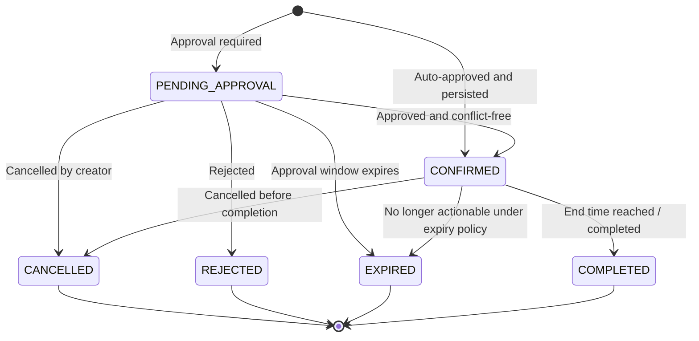

# Haven — Requirements

## Table of Contents

- [1. Overview](#1-overview)
- [2. Purpose](#2-purpose)
- [3. Product Definition](#3-product-definition)
- [4. Scope](#4-scope)
- [5. Actors](#5-actors)
- [6. Assumptions](#6-assumptions)
- [7. Functional Requirements](#7-functional-requirements)
- [8. Business Rules](#8-business-rules)
- [9. Reservation Lifecycle Requirements](#9-reservation-lifecycle-requirements)
- [10. Availability Requirements](#10-availability-requirements)
- [11. Approval Requirements](#11-approval-requirements)
- [12. Multi-Tenancy Requirements](#12-multi-tenancy-requirements)
- [13. API-Level Requirements](#13-api-level-requirements)
- [14. Data Requirements](#14-data-requirements)
- [15. Event and Notification Requirements](#15-event-and-notification-requirements)
- [16. Non-Functional Requirements](#16-non-functional-requirements)
- [17. Scale Assumptions](#17-scale-assumptions)
- [18. Failure and Degradation Requirements](#18-failure-and-degradation-requirements)
- [19. Security Requirements](#19-security-requirements)
- [20. Observability Requirements](#20-observability-requirements)
- [21. Testing Requirements](#21-testing-requirements)
- [22. Performance Requirements](#22-performance-requirements)
- [23. Operational Requirements](#23-operational-requirements)
- [24. Acceptance Criteria](#24-acceptance-criteria)
- [25. Out of Scope](#25-out-of-scope)
- [26. Open Questions](#26-open-questions)
- [27. Risks](#27-risks)
- [28. Interview Discussion Notes](#28-interview-discussion-notes)
- [29. Summary](#29-summary)
- [30. Next Document](#30-next-document)

---

## 1. Overview

This document defines the functional, business, technical, and operational requirements for the Haven MVP.

It is the authoritative requirements contract for subsequent architecture, API, database, concurrency, testing, and deployment decisions.

The requirements are intentionally constrained. Haven must demonstrate production engineering quality without becoming a scattered product that attempts to solve every possible scheduling or asset-management problem.

---

## 2. Purpose

This document exists to answer:

- What must Haven do?
- Who may use it?
- Which business rules must always hold?
- What level of consistency is required?
- How should the system behave under failure?
- What is included in the MVP?
- What is explicitly excluded?
- How will implementation completeness be evaluated?

Architecture decisions must trace back to one or more requirements in this document.

---

## 3. Product Definition

Haven is a multi-tenant platform for reserving scarce resources for predefined time intervals.

A reservation is defined by:

```text
organization + resource + creator + start time + end time + purpose
```

Supported resource categories include:

- Meeting rooms
- Office desks
- Parking slots
- Hotel-style rooms
- Game zones
- Other future resource types that follow the same fixed-interval contract

Haven is not an open-ended lending system.

The platform must ensure that two conflicting confirmed reservations cannot allocate the same resource for overlapping time intervals.

---

## 4. Scope

### 4.1 MVP Scope

The MVP includes:

- Two to three isolated organizations
- JWT-based authentication
- Tenant-aware authorization
- Resource search
- Resource detail retrieval
- Reservation creation
- Reservation retrieval
- User reservation listing
- Reservation cancellation
- Simple reservation extension
- Single-step approval and rejection
- Pending-approval listing
- Derived availability
- Idempotent reservation creation
- Domain event publication
- Asynchronous notification handling
- Health checks
- API documentation
- Dockerized local development
- Automated tests
- Logging and metrics foundations

### 4.2 Product Boundary

Every supported reservation must have:

- A known start time
- A known end time
- A finite duration
- A single selected resource
- A single owning organization

Requirements that introduce an unknown return time or asset checkout lifecycle are outside Haven's bounded context.

---

## 5. Actors

### 5.1 Standard User

A standard user may:

- Authenticate
- Search available resources in their organization
- View resource details
- Create a reservation
- View their reservations
- Cancel eligible reservations
- Extend eligible reservations

### 5.2 Approver

An approver may:

- Perform all standard-user actions
- View reservations pending approval within authorized scope
- Approve a pending reservation
- Reject a pending reservation with a reason

### 5.3 Organization Administrator

For MVP, organization administration is limited.

An administrator may be represented through seeded configuration and may:

- View organization policies
- Review resources and policies through operational tooling
- Act as an approver where authorized

Full organization and resource administration APIs are not required for the first MVP release.

### 5.4 System Operator

A system operator may:

- Inspect health endpoints
- Review logs and metrics
- Diagnose failed event processing
- Restart or recover infrastructure
- Perform local development and test setup

### 5.5 Asynchronous Consumer

An internal consumer may:

- Consume reservation lifecycle events
- Send notifications
- Produce audit or reporting records
- Retry transient processing failures

The consumer is not a human actor but participates in the system requirements.

---

## 6. Assumptions

### 6.1 Identity Assumptions

- A valid JWT contains a stable user identifier.
- A valid JWT identifies the user's organization.
- Roles or permissions required for approval are available through claims or an authorization lookup.
- Organization and user identity are not accepted blindly from the reservation request body.

### 6.2 Time Assumptions

- API timestamps are expressed in ISO-8601 UTC.
- The frontend is responsible for converting user-local time into UTC.
- The backend stores and compares canonical timestamps.
- Reservation interval semantics are half-open:

```text
[startTime, endTime)
```

This permits adjacent reservations such as:

```text
10:00–11:00
11:00–12:00
```

without treating them as overlapping.

### 6.3 Resource Assumptions

- Resources are created or seeded before users reserve them.
- Each resource belongs to exactly one organization.
- Resource identifiers are generated and owned by the server-side resource catalog.
- The client selects a resource by using a `resourceId` returned by search.

### 6.4 Infrastructure Assumptions

- Couchbase is the source of truth for persistent reservation state.
- Redis is an optional performance optimization.
- Kafka carries asynchronous events.
- The application is initially deployed as a modular monolith.

---

## 7. Functional Requirements

Requirement identifiers use the format:

```text
FR-<AREA>-<NUMBER>
```

Priority values:

- **Must** — required for MVP correctness
- **Should** — expected for MVP completeness
- **Could** — optional if time permits

---

### 7.1 Authentication and Authorization

#### FR-AUTH-001 — Authenticate Requests

**Priority:** Must

All protected endpoints must require:

```http
Authorization: Bearer <JWT>
```

The system must reject missing, malformed, expired, or invalid tokens.

#### FR-AUTH-002 — Derive Caller Identity

**Priority:** Must

The system must derive the authenticated user identity from trusted authentication context.

The reservation request body must not be the authoritative source for:

- Creator identity
- Organization identity
- Roles
- Permissions

#### FR-AUTH-003 — Enforce Tenant Membership

**Priority:** Must

A user may access only resources and reservations belonging to their organization unless an explicit future cross-tenant capability is introduced.

#### FR-AUTH-004 — Authorize Approval Actions

**Priority:** Must

Only users with the appropriate approval permission may approve or reject a reservation.

#### FR-AUTH-005 — Reject Cross-Tenant Identifiers

**Priority:** Must

If a caller submits a valid resource or reservation identifier belonging to another tenant, the system must not expose whether that object exists.

The API should return an authorization-safe result such as `404 Not Found` or a policy-defined `403 Forbidden`.

---

### 7.2 Resource Search

#### FR-RESOURCE-001 — Search Available Resources

**Priority:** Must

The system must allow authenticated users to search for resources available during a requested interval.

Required filters:

- `resourceType`
- `startTime`
- `endTime`

Optional filters:

- Minimum capacity
- Building
- Floor
- Features
- Sort order
- Pagination

#### FR-RESOURCE-002 — Require Resource Type

**Priority:** Must

`resourceType` must be supplied for MVP search.

Example values:

- `MEETING_ROOM`
- `DESK`
- `PARKING_SLOT`
- `HOTEL_ROOM`
- `GAME_ZONE`

This requirement limits search scope and supports resource-specific metadata and policy evaluation.

#### FR-RESOURCE-003 — Return Selection Metadata

**Priority:** Must

Search results must return enough information for the client to select a resource without an immediate additional request.

At minimum:

- `resourceId`
- Name
- Resource type
- Capacity where applicable
- Location summary
- Features
- Human-readable description

#### FR-RESOURCE-004 — Search Is Non-Authoritative

**Priority:** Must

Search results represent a point-in-time view.

A resource returned as available may become unavailable before reservation creation.

The create-reservation operation must repeat the authoritative conflict check.

#### FR-RESOURCE-005 — Paginate Search Results

**Priority:** Must

Search results must support bounded pagination.

The API must not return all matching resources without a limit.

#### FR-RESOURCE-006 — Retrieve Resource Details

**Priority:** Should

The system should provide a resource detail endpoint for metadata not included in search results.

The resource detail response must not imply guaranteed future availability unless a time interval is supplied and re-evaluated.

#### FR-RESOURCE-007 — Exclude Inactive Resources

**Priority:** Must

Disabled, deleted, or otherwise non-reservable resources must not be returned as available.

---

### 7.3 Reservation Creation

#### FR-RES-001 — Create Reservation

**Priority:** Must

An authenticated user must be able to request a reservation using:

- `resourceId`
- `startTime`
- `endTime`
- Optional `purpose`

#### FR-RES-002 — Generate Reservation Identifier

**Priority:** Must

The server must generate the reservation identifier.

The client must not choose the reservation identifier.

#### FR-RES-003 — Require Idempotency Key

**Priority:** Must

Reservation creation must accept:

```http
Idempotency-Key: <client-generated-key>
```

The same authenticated user and organization retrying the same logical request with the same key must receive the original result rather than create a duplicate reservation.

#### FR-RES-004 — Detect Idempotency Payload Mismatch

**Priority:** Must

Reusing an idempotency key with a materially different request payload must be rejected.

The error must be deterministic and traceable.

#### FR-RES-005 — Validate Resource Ownership

**Priority:** Must

The selected resource must:

- Exist
- Be active
- Belong to the caller's organization
- Be reservable for the requested interval
- Match supported MVP reservation semantics

#### FR-RES-006 — Enforce Conflict Rules

**Priority:** Must

The system must reject a reservation when another blocking reservation overlaps the requested interval for the same resource.

#### FR-RES-007 — Persist Before Long-Running Approval

**Priority:** Must

If approval is required, the system must persist a reservation in `PENDING_APPROVAL` state before asynchronous notification or human approval activity begins.

#### FR-RES-008 — Auto-Confirm Ordinary Resources

**Priority:** Must

If the resource is available and does not require approval, the reservation must be created in `CONFIRMED` state.

#### FR-RES-009 — Return Created Resource

**Priority:** Must

When a reservation record is created, the API must return:

```http
201 Created
```

The response must include:

- `reservationId`
- `status`
- `createdAt`

The response should include a `Location` header pointing to the reservation resource.

#### FR-RES-010 — Preserve Purpose as Free Text

**Priority:** Should

The system may store a caller-provided purpose.

The MVP must not parse purpose text to derive authorization or workflow behavior.

---

### 7.4 Reservation Retrieval

#### FR-RES-011 — Retrieve Reservation by ID

**Priority:** Must

An authorized user must be able to retrieve a reservation by identifier.

The response should include:

- Reservation ID
- Resource summary
- Creator summary
- Time interval
- Purpose
- Status
- Approval summary
- Created and updated timestamps

#### FR-RES-012 — List Caller Reservations

**Priority:** Must

A user must be able to list their reservations.

Supported filters should include:

- Status
- Start-date range
- End-date range
- Upcoming reservations
- Pagination

#### FR-RES-013 — Restrict Reservation Visibility

**Priority:** Must

Users must not view reservations belonging to another organization.

Additional within-tenant visibility rules may be added later.

---

### 7.5 Reservation Cancellation

#### FR-RES-014 — Cancel Reservation

**Priority:** Must

An authorized creator or administrator must be able to cancel an eligible reservation.

Cancellation is a business state transition, not deletion.

#### FR-RES-015 — Preserve Cancelled Reservation

**Priority:** Must

A cancelled reservation must remain persisted for:

- Audit
- History
- Reporting
- Idempotent responses
- Operational diagnosis

#### FR-RES-016 — Reject Invalid Cancellation

**Priority:** Must

The system must reject cancellation when the reservation is already:

- Cancelled
- Rejected
- Completed
- Expired

The exact legal transitions are defined in the lifecycle section.

#### FR-RES-017 — Make Cancellation Idempotent

**Priority:** Should

Repeating a cancellation request for an already-cancelled reservation should return the existing cancelled result rather than fail unpredictably.

---

### 7.6 Reservation Extension

#### FR-RES-018 — Extend Reservation

**Priority:** Should

An authorized user may request a new end time for an eligible reservation.

#### FR-RES-019 — Revalidate Extension

**Priority:** Must

An extension must re-evaluate:

- Maximum duration policy
- Resource state
- Overlapping reservations
- Approval requirements if policy changes
- Legal reservation status

#### FR-RES-020 — Preserve Start Time

**Priority:** Must

The MVP extension action changes only the end time.

Changing the start time requires cancellation and creation of a new reservation.

#### FR-RES-021 — Reject Shortening Through Extend

**Priority:** Must

The extend operation must reject a new end time earlier than or equal to the existing end time.

A future explicit shortening capability may be designed separately.

---

### 7.7 Approval

#### FR-APPROVAL-001 — Identify Approval Requirement

**Priority:** Must

Organization and resource policy must determine whether a reservation requires approval.

#### FR-APPROVAL-002 — List Pending Approvals

**Priority:** Must

Authorized approvers must be able to retrieve pending reservations within their tenant and authorization scope.

#### FR-APPROVAL-003 — Approve Reservation

**Priority:** Must

An authorized approver must be able to approve a `PENDING_APPROVAL` reservation.

Approval must perform an authoritative conflict check before confirmation because the resource may have changed while approval was pending.

#### FR-APPROVAL-004 — Reject Reservation

**Priority:** Must

An authorized approver must be able to reject a pending reservation.

A rejection reason should be supported.

#### FR-APPROVAL-005 — Preserve Approval Metadata

**Priority:** Must

Approval or rejection must record:

- Acting user
- Timestamp
- Outcome
- Optional reason

#### FR-APPROVAL-006 — Single-Step Approval

**Priority:** Must

The MVP supports one approval decision only.

It does not support:

- Multiple approvers
- Quorum
- Escalation
- Delegation
- Approval chains
- SLA reminders as business state

---

### 7.8 Organization Policies

#### FR-ORG-001 — Retrieve Effective Policies

**Priority:** Should

Authenticated users should be able to retrieve effective reservation policies relevant to their organization.

#### FR-ORG-002 — Enforce Standard Duration

**Priority:** Must

The default maximum reservation duration is 12 hours.

#### FR-ORG-003 — Allow Maintenance Duration

**Priority:** Must

Authorized maintenance reservations may extend to a maximum of 24 hours.

The mechanism for identifying a maintenance reservation must be explicit and trusted; free-form purpose text is insufficient.

If the MVP does not expose maintenance creation publicly, the capability may remain available only through seeded policy or internal operations.

#### FR-ORG-004 — Apply Organization-Specific Rules

**Priority:** Must

Policy evaluation must use the resource's organization rather than global hardcoded assumptions.

The MVP may seed equivalent policies for all organizations while retaining tenant-specific ownership.

---

### 7.9 Health and Operational APIs

#### FR-OPS-001 — Liveness Endpoint

**Priority:** Must

The application must expose a liveness endpoint that reports whether the process is running.

Liveness must not fail merely because an external dependency is temporarily unavailable.

#### FR-OPS-002 — Readiness Endpoint

**Priority:** Must

The application must expose a readiness endpoint that reports whether it can safely serve expected traffic.

Readiness may depend on essential infrastructure such as Couchbase.

#### FR-OPS-003 — Dependency Health Detail

**Priority:** Should

Operationally protected health diagnostics should identify dependency status without exposing secrets.

---

## 8. Business Rules

### 8.1 Time Interval Rules

| Rule ID | Rule |
|---|---|
| BR-TIME-001 | `startTime` must be earlier than `endTime`. |
| BR-TIME-002 | Timestamps must be valid UTC ISO-8601 values. |
| BR-TIME-003 | The requested start time must not be unreasonably in the past. |
| BR-TIME-004 | Intervals use `[start, end)` semantics. |
| BR-TIME-005 | Standard reservation duration must not exceed 12 hours. |
| BR-TIME-006 | Authorized maintenance duration must not exceed 24 hours. |
| BR-TIME-007 | Recurrence is unsupported. |
| BR-TIME-008 | Open-ended intervals are unsupported. |

The exact tolerance for clock skew or requests beginning moments in the past will be finalized in API and domain design.

### 8.2 Overlap Rule

Two intervals overlap when:

```text
existing.start < requested.end
AND
existing.end > requested.start
```

Adjacent intervals do not overlap.

### 8.3 Blocking Status Rule

At minimum, `CONFIRMED` reservations block overlapping allocation.

The treatment of `PENDING_APPROVAL` reservations must be explicit.

For the MVP, the recommended policy is:

- A pending approval does not permanently allocate the resource.
- Approval rechecks conflicts before confirmation.
- The UI must not treat a pending reservation as guaranteed.
- Future hold semantics require a separate design.

This avoids long-lived capacity blocking while preserving correctness at confirmation time.

### 8.4 Tenant Rule

Every resource and reservation operation must execute within one organization context.

A request must not combine:

- User from Organization A
- Resource from Organization B
- Policy from Organization C

### 8.5 Resource Rule

A resource may be reserved only when:

- It exists
- It belongs to the caller's organization
- It is active
- Its type is supported
- Its policies permit the requested action

### 8.6 State Transition Rule

Reservation status may change only through explicit domain actions.

A generic `setStatus` operation is forbidden.

### 8.7 History Rule

Reservation lifecycle records must not be physically deleted as part of ordinary business operations.

### 8.8 Idempotency Rule

An idempotency key is scoped at least by:

- Organization
- Authenticated caller
- Operation

The final storage key and expiry policy will be defined in the concurrency and API documents.

---

## 9. Reservation Lifecycle Requirements

### 9.1 Primary States

The MVP reservation lifecycle includes:

- `PENDING_APPROVAL`
- `CONFIRMED`
- `CANCELLED`
- `REJECTED`
- `EXPIRED`
- `COMPLETED`

A transient creation state may exist internally but does not need to be exposed publicly.

### 9.2 State Diagram



### 9.3 Legal Transition Requirements

| From | Action | To | Allowed |
|---|---|---|---:|
| New | Auto-confirm | `CONFIRMED` | Yes |
| New | Require approval | `PENDING_APPROVAL` | Yes |
| `PENDING_APPROVAL` | Approve | `CONFIRMED` | Yes |
| `PENDING_APPROVAL` | Reject | `REJECTED` | Yes |
| `PENDING_APPROVAL` | Cancel | `CANCELLED` | Yes |
| `CONFIRMED` | Cancel | `CANCELLED` | Yes |
| `CONFIRMED` | Extend | `CONFIRMED` | Yes, after revalidation |
| `CONFIRMED` | Complete | `COMPLETED` | Yes |
| Terminal state | Any mutation | Any | No, unless explicitly documented |

### 9.4 Terminal States

The following are terminal for MVP:

- `CANCELLED`
- `REJECTED`
- `EXPIRED`
- `COMPLETED`

Terminal reservations may be read but not mutated.

---

## 10. Availability Requirements

### 10.1 Derived Concept

Availability must not be stored as an independent authoritative domain model in the MVP.

It must be derived from:

- Resource metadata
- Resource active state
- Reservation data
- Requested time interval
- Organization policy

### 10.2 Search Flow


### 10.3 Read Consistency

Search results may be momentarily stale because another user can create a reservation after search completes.

This is acceptable only because create reservation performs an authoritative conflict check.

### 10.4 No Read Lock Requirement

Availability search must not acquire write locks on resources.

Search must not create temporary reservations or holds for the MVP.

### 10.5 Calendar View

Calendar output is a view over reservations and is not an authoritative allocation model.

---

## 11. Approval Requirements

### 11.1 Workflow Purpose

Approval exists for selected priority resources.

Ordinary resources should remain auto-confirmed to minimize workflow overhead.

### 11.2 Approval Boundary

Approval is a workflow, not a boolean flag.

The MVP may store compact approval information inside the reservation aggregate, but behavior must be expressed through approval actions.

### 11.3 Conflict at Approval Time

An approval does not bypass conflict detection.

If another reservation has already been confirmed for the interval, approval must fail with a deterministic conflict result.

### 11.4 Notification

The approver and requester should receive asynchronous notifications for relevant outcomes.

Notification failure must not roll back a completed reservation state transition.

---

## 12. Multi-Tenancy Requirements

### 12.1 Initial Tenants

The first deployment targets two to three organizations.

The design must preserve an evolution path toward a larger multi-tenant platform.

### 12.2 Tenant Identifier

Every tenant-owned persistent document must include or derive an organization identifier.

### 12.3 Query Isolation

Every resource and reservation query must include tenant scope.

### 12.4 Cache Isolation

Redis keys must include tenant context where cached data is tenant-owned.

### 12.5 Event Isolation

Reservation events must carry organization identity.

Consumers must not infer tenant context from topic alone unless topics are intentionally tenant-partitioned.

### 12.6 Metrics Isolation

Metrics should expose tenant dimensions only where cardinality and privacy risks are acceptable.

Raw organization IDs should not be added indiscriminately to high-cardinality metric labels.

### 12.7 Logging Isolation

Logs may include organization identifiers for diagnosis but must avoid sensitive user details and must follow retention policy.

---

## 13. API-Level Requirements

### 13.1 Base Path

MVP APIs use:

```text
/api/v1
```

### 13.2 Core Endpoint Surface

| Capability | Method | Endpoint |
|---|---|---|
| Search available resources | `GET` | `/api/v1/resources` |
| Get resource details | `GET` | `/api/v1/resources/{resourceId}` |
| Create reservation | `POST` | `/api/v1/reservations` |
| Get reservation | `GET` | `/api/v1/reservations/{reservationId}` |
| List caller reservations | `GET` | `/api/v1/reservations/me` |
| Cancel reservation | `POST` | `/api/v1/reservations/{reservationId}/cancel` |
| Extend reservation | `POST` | `/api/v1/reservations/{reservationId}/extend` |
| List approvals | `GET` | `/api/v1/approvals` |
| Approve reservation | `POST` | `/api/v1/approvals/{reservationId}/approve` |
| Reject reservation | `POST` | `/api/v1/approvals/{reservationId}/reject` |
| Organization policies | `GET` | `/api/v1/organization/policies` |
| Liveness | `GET` | `/health/live` |
| Readiness | `GET` | `/health/ready` |

### 13.3 Search Parameters

Search uses query parameters rather than a GET request body.

Required:

```text
resourceType
startTime
endTime
```

### 13.4 Error Contract

All APIs must use a consistent error shape.

Example:

```json
{
  "code": "RESERVATION_CONFLICT",
  "message": "The resource is no longer available for the requested interval.",
  "details": [
    {
      "field": "timeInterval",
      "reason": "OVERLAPPING_RESERVATION"
    }
  ],
  "traceId": "4d7a1ed4cdbb4b5e"
}
```

### 13.5 Status Codes

| Status | Use |
|---:|---|
| `200 OK` | Successful read or completed action |
| `201 Created` | Reservation record created |
| `400 Bad Request` | Malformed input or syntax validation |
| `401 Unauthorized` | Missing or invalid authentication |
| `403 Forbidden` | Authenticated but not permitted |
| `404 Not Found` | Resource not visible or does not exist |
| `409 Conflict` | Overlap, invalid idempotency reuse, concurrent state conflict |
| `422 Unprocessable Content` | Valid syntax but business policy violation |
| `429 Too Many Requests` | Rate limit exceeded |
| `500 Internal Server Error` | Unexpected failure |
| `503 Service Unavailable` | Essential dependency unavailable or safe write processing impossible |

### 13.6 API Contract Documentation

OpenAPI documentation must remain synchronized with implementation.

Contract changes require documentation and compatibility review.

---

## 14. Data Requirements

### 14.1 Source of Truth

Couchbase stores authoritative:

- Resources
- Reservations
- Organization policies
- Idempotency records or equivalent durable deduplication data
- Event outbox records if the outbox pattern is adopted

### 14.2 Resource and Reservation Separation

Resource documents must not embed unbounded reservation collections.

Resources and reservations have different:

- Lifecycles
- Write patterns
- Query patterns
- Concurrency characteristics

### 14.3 Audit Fields

Persistent business records should include:

- `createdAt`
- `createdBy`
- `updatedAt`
- Concurrency version or Couchbase CAS metadata where applicable

### 14.4 Time Storage

Timestamps must be stored in a canonical machine-readable representation.

### 14.5 History

Ordinary cancellation or rejection must not physically delete reservation history.

### 14.6 Index Support

The database design must support:

- Tenant-scoped resource search
- Resource-type filtering
- Time-overlap queries
- Reservation lookup by ID
- User reservation history
- Pending approval listing
- Status and date filters

---

## 15. Event and Notification Requirements

### 15.1 Domain Events

The system must publish events for meaningful reservation lifecycle changes.

Minimum event set:

- `ReservationCreated`
- `ReservationApprovalRequested`
- `ReservationConfirmed`
- `ReservationRejected`
- `ReservationCancelled`

`ReservationExpired` and `ReservationCompleted` should be supported when lifecycle automation is implemented.

### 15.2 Event Naming

Events describe facts in past tense.

### 15.3 Event Content

Events must contain sufficient identity and context for consumers without requiring access to internal domain objects.

At minimum:

- Event ID
- Event type
- Event version
- Occurred-at timestamp
- Organization ID
- Reservation ID
- Resource ID
- Relevant status
- Trace or correlation ID

### 15.4 Event Delivery

The design must address the dual-write problem between reservation persistence and Kafka publication.

The selected strategy will be defined in `07-event-driven-design.md`.

### 15.5 Consumer Idempotency

Notification and reporting consumers must tolerate duplicate event delivery.

### 15.6 Notification Failure

A notification failure must not invalidate an already-completed reservation transaction.

### 15.7 Dead-Letter Handling

Repeatedly failing events should be observable and recoverable through a dead-letter or equivalent operational mechanism.

---

## 16. Non-Functional Requirements

Requirement identifiers use:

```text
NFR-<AREA>-<NUMBER>
```

---

### 16.1 Correctness and Consistency

#### NFR-CONSISTENCY-001 — No Double Booking

**Priority:** Must

The system must not persist conflicting confirmed reservations for the same resource and overlapping time interval.

#### NFR-CONSISTENCY-002 — Deterministic Winner

**Priority:** Must

Under concurrent conflicting requests, at most one request may win.

Losing requests must receive a deterministic conflict response.

#### NFR-CONSISTENCY-003 — Idempotent Client Experience

**Priority:** Must

A retried create request with the same idempotency key and payload must produce the same externally observable result.

#### NFR-CONSISTENCY-004 — No Silent Lost Updates

**Priority:** Must

Concurrent reservation state updates must not silently overwrite one another.

#### NFR-CONSISTENCY-005 — Eventual Consistency Is Limited

**Priority:** Must

Eventual consistency is acceptable for:

- Search caches
- Notifications
- Reporting
- Analytics
- Calendar projections

It is not acceptable for the final reservation conflict decision.

---

### 16.2 Availability and Reliability

#### NFR-AVAILABILITY-001 — Read Availability

**Priority:** Must

Read APIs should remain available during non-critical dependency degradation where safe fallback is possible.

#### NFR-AVAILABILITY-002 — Safe Write Failure

**Priority:** Must

If the system cannot guarantee correct reservation writes, it must reject writes with a retryable error rather than acknowledge unsafe success.

#### NFR-AVAILABILITY-003 — Cache Failure Tolerance

**Priority:** Must

Redis failure must not corrupt authoritative state.

The system should bypass cache when practical.

#### NFR-AVAILABILITY-004 — Process Recovery

**Priority:** Must

The application must recover safely after restart without relying on in-memory reservation state.

#### NFR-AVAILABILITY-005 — Retry Safety

**Priority:** Must

Retries must be bounded and restricted to safe, classified failures.

#### NFR-AVAILABILITY-006 — Partial Failure Visibility

**Priority:** Must

Partial failures must be logged, measured, and surfaced through operational signals.

---

### 16.3 Scalability

#### NFR-SCALE-001 — Stateless Application Instances

**Priority:** Must

Haven application instances should not rely on local process state for persistent user sessions or authoritative reservations.

#### NFR-SCALE-002 — Horizontal Scale Path

**Priority:** Must

Multiple Haven application instances must be able to serve traffic against shared infrastructure.

#### NFR-SCALE-003 — Tenant-Scoped Access

**Priority:** Must

Queries should be tenant-scoped to limit data scanned and preserve isolation.

#### NFR-SCALE-004 — Bounded List Responses

**Priority:** Must

All list APIs must use bounded pagination.

#### NFR-SCALE-005 — Avoid Hot Resource Documents

**Priority:** Must

The design must not append reservation history to one mutable resource document.

#### NFR-SCALE-006 — Event Partitioning

**Priority:** Should

Kafka partitioning should preserve useful ordering for related reservation events without creating unnecessary global serialization.

---

### 16.4 Maintainability

#### NFR-MAINTAIN-001 — Layer Separation

**Priority:** Must

Presentation, application, domain, and infrastructure concerns must remain separated.

#### NFR-MAINTAIN-002 — Framework-Independent Domain

**Priority:** Must

The domain must compile and test without Drogon, Couchbase, Redis, or Kafka.

#### NFR-MAINTAIN-003 — Explicit Dependencies

**Priority:** Must

Dependencies must be supplied through constructor injection or an explicit composition root.

#### NFR-MAINTAIN-004 — No Generic God Service

**Priority:** Must

The design must avoid a monolithic `ReservationService` that owns validation, persistence, messaging, caching, and notification.

#### NFR-MAINTAIN-005 — Documentation Synchronization

**Priority:** Must

Behavior-changing pull requests must update relevant documentation and ADRs.

---

### 16.5 Extensibility

#### NFR-EXT-001 — Add Resource Types

**Priority:** Must

Adding a new fixed-interval resource type should not require rewriting the conflict algorithm.

#### NFR-EXT-002 — Policy Evolution

**Priority:** Should

Organization and resource policy changes should be introduced through explicit policy abstractions rather than controller branches.

#### NFR-EXT-003 — Infrastructure Replacement

**Priority:** Should

Replacing Drogon, Couchbase, Redis, or Kafka should primarily affect adapter layers.

#### NFR-EXT-004 — Service Extraction Path

**Priority:** Should

Logical module boundaries should permit future extraction of notification or approval capabilities if justified.

---

### 16.6 Security

See [Section 19](#19-security-requirements).

### 16.7 Observability

See [Section 20](#20-observability-requirements).

### 16.8 Testability

See [Section 21](#21-testing-requirements).

---

## 17. Scale Assumptions

Scale estimates guide design; they are not contractual load guarantees.

### 17.1 Initial Deployment

| Metric | Initial Assumption |
|---|---:|
| Organizations | 2–3 |
| Resources | Up to 50,000 total |
| Daily active users | 1,000–10,000 |
| Peak concurrent users | 500–2,000 |
| Reservations per day | 10,000–100,000 |
| Peak create requests/sec | 50–200 |
| Peak resource searches/sec | 500–2,000 |
| Search-to-create ratio | Approximately 10:1 |
| Typical overlapping reservations returned | Hundreds, not tens of thousands |

### 17.2 Future Design Target

| Metric | Evolution Target |
|---|---:|
| Organizations | 10,000 |
| Total resources | Millions |
| Daily active users | Hundreds of thousands |
| Reservations per day | Millions |
| Peak create requests/sec | 500–2,000 |
| Peak searches/sec | 5,000–20,000 |

The MVP does not need to prove future-scale throughput, but design decisions should avoid obvious dead ends.

### 17.3 Data Distribution Assumptions

- Most resources are not highly contended.
- A small subset may be hot.
- Search traffic substantially exceeds write traffic.
- Reservation history grows continuously.
- Resource metadata changes infrequently.
- Organization policies change infrequently.

---

## 18. Failure and Degradation Requirements

### 18.1 Couchbase Failure

If Couchbase is unavailable:

- Readiness should fail.
- Reservation writes must not be acknowledged as successful.
- Authoritative reservation reads may fail with `503`.
- Cached non-authoritative resource metadata may be served only if the API contract explicitly allows stale data.
- The application must not fabricate availability.

### 18.2 Redis Failure

If Redis is unavailable:

- The system should bypass cache where practical.
- Correctness must remain unchanged.
- Latency may increase.
- Cache failure metrics and logs must be emitted.
- The system must not fail all reservation writes solely because Redis is unavailable.

### 18.3 Kafka Failure

If Kafka is unavailable:

- The reservation write path must follow the event consistency strategy defined later.
- If an outbox is used, the business transaction may succeed while publication is retried.
- Events must not be silently lost.
- Notification delay is acceptable; reservation corruption is not.

### 18.4 Notification Consumer Failure

If notification processing fails:

- The event must remain retryable.
- The reservation state must remain unchanged.
- Repeated failure must become operationally visible.

### 18.5 High Traffic

Under traffic exceeding safe capacity:

- Read endpoints should remain available where possible.
- Rate limiting and backpressure should protect essential dependencies.
- Writes must not bypass conflict checks.
- If safe write processing is unavailable, return `429` or `503` with retry guidance.
- The MVP does not promise durable asynchronous queueing of unprocessed reservation commands unless a separate request-intake design is approved.

### 18.6 Client Timeout

If the client times out after submitting create reservation:

- The client may retry with the same idempotency key.
- The system must return the original result when available.

### 18.7 Concurrent State Mutation

If two actions mutate the same reservation concurrently:

- Optimistic concurrency must detect stale writes.
- Safe retries may be attempted.
- Illegal or superseded actions must return deterministic errors.

---

## 19. Security Requirements

### 19.1 Authentication

- Protected APIs require valid JWTs.
- Token validation must verify signature, expiry, issuer, and audience as configured.
- Authentication failures must not expose sensitive validation details.

### 19.2 Authorization

Authorization must enforce:

- Organization membership
- Reservation ownership where required
- Approval permissions
- Administrative permissions
- Resource access policy

### 19.3 Tenant Isolation

Tenant isolation must be enforced in:

- API authorization
- Repository queries
- Cache keys
- Events
- Logs
- Tests

### 19.4 Input Validation

The system must validate:

- Identifier format
- Timestamp format
- Interval ordering
- Duration
- Enum values
- Text length
- Pagination bounds
- Filter limits

### 19.5 Rate Limiting

The MVP should support rate limiting at least for:

- Authentication endpoints
- Resource search
- Reservation creation
- Approval actions

### 19.6 Sensitive Data

The system must not log:

- JWT tokens
- Secrets
- Passwords
- Full sensitive personal data

### 19.7 Secrets

Secrets must be supplied through environment or secret-management configuration.

Secrets must not be committed to source control.

### 19.8 Auditability

Security-relevant actions should record:

- Actor
- Tenant
- Operation
- Target
- Outcome
- Timestamp
- Trace ID

### 19.9 Error Safety

Errors must not expose:

- Internal stack traces
- Database credentials
- Raw Couchbase exceptions
- Kafka configuration
- Other-tenant object existence

---

## 20. Observability Requirements

### 20.1 Logging

Logs must be structured and include relevant context:

- Request ID
- Trace ID
- Organization ID
- User ID where safe
- Reservation ID
- Resource ID
- Operation
- Outcome
- Latency
- Error classification

### 20.2 Metrics

Minimum metrics should include:

- Request count by endpoint and status
- Request latency
- Reservation creation success and conflict counts
- Idempotency hit and mismatch counts
- Approval outcomes
- Couchbase latency and failures
- Redis hit, miss, bypass, and failure counts
- Kafka publication and consumer failures
- Retry counts
- Health state

### 20.3 Tracing

Trace context should propagate through:

- HTTP request handling
- Application use cases
- Repository calls
- Event publication
- Event consumption where supported

### 20.4 Alerts

Future deployment alerts should cover:

- Elevated error rates
- Readiness failure
- Database failure
- Event publication backlog
- Dead-letter growth
- High conflict rate
- Latency degradation
- Cache failure

### 20.5 Business Observability

The platform should distinguish technical failures from expected business outcomes such as reservation conflicts.

A `409 Conflict` is not necessarily a system error.

---

## 21. Testing Requirements

### 21.1 Domain Unit Tests

Must cover:

- Time interval construction
- Duration limits
- Legal and illegal state transitions
- Cancellation
- Extension
- Approval and rejection behavior
- Terminal-state protection
- Domain event creation

### 21.2 Application Tests

Must cover:

- Use-case orchestration
- Authorization outcomes
- Repository interaction contracts
- Idempotency behavior
- Error mapping between domain and application
- Event publication requests

Application tests should use in-memory fakes where appropriate.

### 21.3 Repository Integration Tests

Must cover:

- Couchbase serialization
- Tenant-scoped queries
- Overlap query correctness
- CAS conflict handling
- Index assumptions
- Persistence and retrieval
- Idempotency storage

### 21.4 API Contract Tests

Must cover:

- Required headers
- DTO validation
- Status codes
- Error format
- Authentication
- Tenant isolation
- OpenAPI compatibility

### 21.5 Concurrency Tests

Must demonstrate:

- Two identical conflicting writes produce at most one confirmed reservation
- CAS failures are detected
- Retry behavior is bounded
- Duplicate idempotent requests do not duplicate reservations
- Approval-time conflicts are rejected

### 21.6 Failure Tests

Must cover:

- Redis unavailable
- Kafka unavailable
- Couchbase timeout
- Consumer retry
- Malformed JWT
- Dependency recovery
- Partial event publication failure

### 21.7 Performance Tests

Performance-sensitive code should be benchmarked with representative data distributions.

---

## 22. Performance Requirements

Initial targets are engineering objectives, not external SLAs.

### 22.1 Latency Targets

| Operation | Target at Initial Scale |
|---|---:|
| Liveness | p95 < 10 ms |
| Resource detail | p95 < 50 ms |
| Resource search | p95 < 150 ms |
| Create reservation | p95 < 200 ms |
| Get reservation | p95 < 75 ms |
| Cancel reservation | p95 < 150 ms |
| Approval action | p95 < 200 ms |

Targets exclude extreme infrastructure failure and may be revised after measurement.

### 22.2 Throughput

The local and CI environments should support repeatable performance tests.

Production-scale throughput claims must not be made without evidence.

### 22.3 Query Efficiency

- Search must avoid scanning every historical reservation.
- Reservation lookup by ID must be direct.
- Overlap queries must use appropriate tenant, resource, status, and time predicates.
- List operations must be bounded.

### 22.4 Allocation and Copying

C++ implementation should avoid unnecessary allocations and copies in hot paths while preserving readability.

### 22.5 Benchmark Discipline

Performance optimization follows:

```text
measure -> identify bottleneck -> optimize -> remeasure
```

---

## 23. Operational Requirements

### 23.1 Local Development

A developer must be able to start required infrastructure through Docker Compose.

### 23.2 Reproducible Build

The project must provide:

- CMake configuration
- CMake presets
- Pinned dependency manifest
- Documented compiler requirements
- Repeatable test commands

### 23.3 Configuration

Configuration must be externalized.

At minimum:

- Server port
- Couchbase endpoints
- Redis endpoints
- Kafka endpoints
- JWT settings
- Log level
- Timeouts
- Retry limits
- Feature flags where introduced

### 23.4 Graceful Shutdown

The application should:

- Stop accepting new work
- Allow bounded in-flight completion
- Flush logs
- Close clients through RAII
- Stop event consumers safely

### 23.5 Schema and Index Setup

Local setup must include a repeatable way to create required Couchbase collections and indexes.

### 23.6 CI Requirements

CI must run:

- Configure and build
- Unit tests
- Static analysis
- Formatting verification
- Integration tests where environment permits
- Artifact or coverage reporting where configured

---

## 24. Acceptance Criteria

The MVP is functionally acceptable when all Must requirements are implemented and the following scenarios pass.

### AC-001 — Successful Auto-Confirmed Reservation

Given:

- Authenticated user
- Active same-tenant resource
- Valid interval
- No conflict
- No approval requirement

When the user creates a reservation

Then:

- Exactly one reservation is persisted
- Status is `CONFIRMED`
- Response is `201 Created`
- A reservation event is recorded for publication
- Repeating with the same idempotency key returns the same reservation

### AC-002 — Pending Approval Reservation

Given:

- Resource requires approval
- Valid interval
- No initial policy violation

When the user creates a reservation

Then:

- Reservation is persisted as `PENDING_APPROVAL`
- Response is `201 Created`
- Approval-requested event is generated
- The reservation is visible to authorized approvers

### AC-003 — Concurrent Conflict

Given two users request the same resource for overlapping intervals concurrently

Then:

- At most one becomes `CONFIRMED`
- The other receives a conflict
- No double booking exists in persistent storage

### AC-004 — Search Then Race

Given two users both see a resource in search

When one reserves first

Then the second create request is rejected if it conflicts.

### AC-005 — Idempotent Retry

Given a create request times out after persistence

When the client retries with the same key and payload

Then the original reservation result is returned.

### AC-006 — Idempotency Mismatch

Given an idempotency key was used for one payload

When it is reused with a different resource or interval

Then the system rejects the request.

### AC-007 — Cross-Tenant Access

Given a user from Organization A submits a resource ID from Organization B

Then the system does not expose or reserve that resource.

### AC-008 — Approval Conflict

Given a pending reservation and a later confirmed competing reservation

When an approver attempts approval

Then approval fails with a conflict and does not create double booking.

### AC-009 — Cancellation

Given a confirmed reservation eligible for cancellation

When cancelled

Then:

- Status becomes `CANCELLED`
- Reservation remains retrievable
- Cancellation event is generated
- Repeated cancellation is handled predictably

### AC-010 — Redis Failure

Given Redis is unavailable

When a valid reservation is created

Then correctness remains unchanged and the request uses a safe fallback or fails only for an independently justified reason.

### AC-011 — Kafka Failure

Given event transport is unavailable

When a reservation transaction completes under the selected delivery design

Then the event is not silently lost.

### AC-012 — Health Endpoints

Liveness and readiness accurately distinguish process health from dependency readiness.

---

## 25. Out of Scope

The following are explicitly excluded from MVP requirements:

- Recurring reservations
- Unknown end-time lending
- Multiple resources in one reservation
- Partial-capacity booking
- Waitlist
- Soft hold during search
- Dynamic pricing
- Billing
- Payment
- Calendar integration
- Webhook delivery
- Multi-stage approval
- Approval delegation
- Cross-organization reservation
- Public anonymous search
- Multi-region write coordination
- Event sourcing
- Full resource management UI
- Full organization administration APIs
- Durable asynchronous intake of unprocessed reservation commands during overload
- Guaranteed exactly-once Kafka delivery

These exclusions protect delivery focus and domain cohesion.

---

## 26. Open Questions

The following questions require later design decisions:

1. Should `PENDING_APPROVAL` reservations affect search availability?
2. What is the expiry window for pending approval?
3. Is maintenance reservation creation exposed publicly or operationally only?
4. What pagination model should resource search use: offset or cursor?
5. What is the exact idempotency retention period?
6. Which events require strict per-reservation ordering?
7. Will the MVP use a transactional outbox or another event publication strategy?
8. Which JWT issuer will be used locally?
9. What is the exact policy for cancelling reservations after their start time?
10. How are `COMPLETED` and `EXPIRED` states advanced: request-time evaluation or scheduled job?

Open questions must be resolved before their dependent implementation is finalized.

---

## 27. Risks

### 27.1 Pending Approval Semantics

If pending reservations do not block availability, users may be disappointed when approval later conflicts.

If they do block availability, resources may be held for long periods.

This decision must be explicit and measurable.

### 27.2 Couchbase Time-Range Query Complexity

Efficient overlap search across large data volumes depends on document shape and indexes.

Incorrect indexing may cause latency or scan amplification.

### 27.3 Idempotency and Persistence Atomicity

The idempotency result and reservation write must remain consistent.

A partial write can produce duplicate or unrecoverable client behavior.

### 27.4 Event Dual Write

Persisting a reservation and publishing Kafka independently can lose events.

### 27.5 Framework Leakage

Convenient Drogon or Couchbase types may leak into application and domain layers without strict review.

### 27.6 Scope Growth

Adding recurring booking, holds, lending, billing, or multi-level approval before the core engine is stable would threaten delivery.

---

## 28. Interview Discussion Notes

### Why repeat conflict detection after search?

Search is a snapshot and cannot reserve the resource. The write path must be authoritative because another user may reserve after search completes.

### Why use `201 Created` for pending approval?

A reservation resource is persisted immediately, even though its final business outcome is pending.

### Why not put creator and organization in the request body?

They are security-sensitive identity attributes already derived from trusted authentication context. Accepting them from the caller creates conflicting sources of truth and impersonation risk.

### Why not queue writes automatically during overload?

Queueing reservation commands creates a new asynchronous command lifecycle and delays conflict resolution. The MVP prefers explicit backpressure and retryable failure over hidden uncertainty.

### Why are pending approvals rechecked?

The resource state can change during the human approval delay. Approval is not a substitute for the final consistency check.

### Why is availability not strongly guaranteed by search?

Guaranteeing a search result would require holds or locking, which reduces utilization and adds a separate lifecycle. The MVP guarantees correctness only at reservation creation or confirmation.

### Why is multi-tenancy included with only two to three organizations?

Tenant isolation affects authentication, queries, cache keys, events, logging, and testing. Designing it from the beginning avoids a costly retrofit while keeping the initial operational scale manageable.

---

## 29. Summary

Haven MVP must provide:

- Tenant-isolated resource discovery
- Fixed-interval reservations
- No double booking
- Idempotent creation
- Automatic confirmation or simple approval
- Explicit lifecycle transitions
- Derived availability
- Persistent history
- Asynchronous events and notifications
- Safe degradation under dependency failure
- Framework-independent domain logic
- Production-oriented testing and observability

The requirements deliberately prioritize correctness, domain cohesion, and maintainability over feature breadth.

---

## 30. Next Document

The next document is:

```text
docs/02-high-level-design.md
```

It will define:

- System context
- Bounded contexts
- Component responsibilities
- Request and event flows
- Clean Architecture boundaries
- Component diagram
- Deployment topology
- Scalability model
- Dependency failure behavior
- Technology placement
