# Haven — High-Level Design

## 1. Overview

This document defines the high-level architecture for Haven, a multi-tenant reservation platform for fixed time-bound resources.

It describes:

- System context
- Architectural style
- Logical modules and bounded contexts
- Component responsibilities
- Request and event flows
- Data ownership
- Deployment topology
- Scalability model
- Failure and degradation behavior
- Technology placement
- Major trade-offs

The design intentionally starts as a modular monolith with strict internal boundaries.

---

## 2. Goals

- Preserve reservation correctness under concurrency.
- Keep domain logic independent from frameworks and infrastructure.
- Support tenant isolation from the first release.
- Enable resource discovery and reservation without embedding reservation history in resource documents.
- Support synchronous core workflows and asynchronous peripheral processing.
- Allow horizontal scaling of stateless application instances.
- Keep Redis and Kafka outside the correctness boundary where possible.
- Provide an evolution path toward extracted services without requiring premature microservices.

---

## 3. Non-Goals

This HLD does not define:

- Concrete C++ class signatures
- Couchbase document schemas
- Exact Kafka topic names
- Redis key formats
- Production Kubernetes manifests
- Multi-region active-active behavior
- Recurring reservation semantics
- Open-ended lending workflows

These are covered in later documents or explicitly out of scope.

---

## 4. Architecture Style

Haven uses:

- Modular monolith deployment
- Clean Architecture
- Hexagonal Architecture
- Domain-Driven Design boundaries
- Event-driven integration for peripheral capabilities
- Optimistic concurrency for reservation writes
- Cache-aside behavior for selected read paths

The modular monolith is one deployable backend process with multiple logical modules.

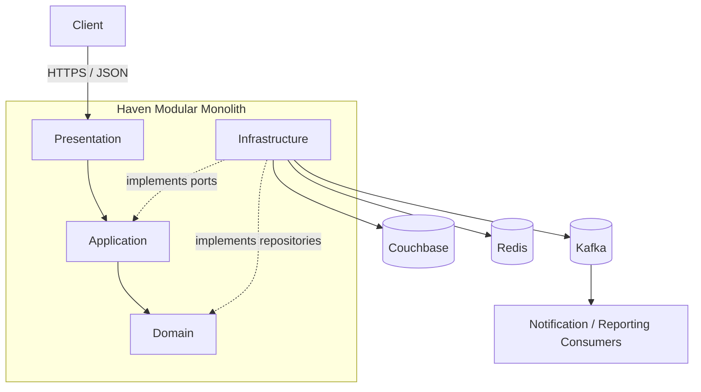

---

## 5. System Context

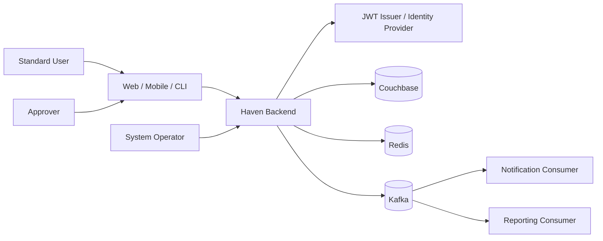

### 5.1 External Actors

| Actor | Responsibility |
|---|---|
| Standard user | Search, reserve, view, cancel, extend |
| Approver | Review, approve, reject |
| System operator | Monitor and operate the platform |
| Identity provider | Issue and validate identity context |
| Notification consumer | Convert business events into email or future channels |
| Reporting consumer | Build audit and reporting outputs |

---

## 6. Logical Bounded Contexts

### 6.1 Identity

Owns:

- Authentication adapter
- JWT verification
- Caller identity
- Claims mapping

Does not own reservation authorization policy.

### 6.2 Organization

Owns:

- Tenant identity
- Organization policies
- Reservation duration policy
- Approval rules
- Working-hour configuration

### 6.3 Resource Catalog

Owns:

- Resource identity
- Resource type
- Capacity
- Features
- Location
- Active state
- Search metadata

Does not own reservation history or authoritative availability state.

### 6.4 Reservation

Owns:

- Reservation lifecycle
- Time interval
- Conflict rules
- Idempotent create workflow
- Cancellation
- Extension
- Domain events

### 6.5 Approval

Owns:

- Pending approval queries
- Approval and rejection actions
- Approval authorization
- Approval metadata

For MVP, approval information may remain inside the reservation consistency boundary.

### 6.6 Notification

Owns:

- Message templates
- Delivery channels
- Delivery retries
- Consumer idempotency

### 6.7 Reporting and Audit

Owns:

- Derived audit records
- Operational reporting
- Analytics projections

---

## 7. Component Responsibilities

### 7.1 Presentation Components

| Component | Responsibility |
|---|---|
| Drogon router | Route HTTP requests |
| JWT middleware | Authenticate and create caller context |
| Validation middleware | Validate transport-level structure |
| Controllers | Map HTTP requests to use cases |
| DTO mappers | Translate JSON DTOs and application commands |
| Exception mapper | Map application errors to HTTP contracts |
| OpenAPI adapter | Expose versioned API documentation |

Presentation contains no reservation business logic.

### 7.2 Application Components

| Component | Responsibility |
|---|---|
| CreateReservation use case | Orchestrate authoritative creation |
| SearchResources query | Coordinate catalog and overlap lookup |
| CancelReservation use case | Authorize and execute cancellation |
| ExtendReservation use case | Revalidate extension |
| ApproveReservation use case | Authorize, recheck conflict, confirm |
| RejectReservation use case | Authorize and reject |
| Idempotency service | Resolve duplicate client requests |
| Transaction coordinator | Coordinate persistence and outbox where required |

### 7.3 Domain Components

| Component | Responsibility |
|---|---|
| Reservation aggregate | Protect lifecycle and invariants |
| Resource aggregate | Protect resource identity and reservability |
| Organization aggregate | Own tenant policies |
| TimeInterval value object | Validate and compare intervals |
| Conflict policy | Define overlap semantics |
| Approval policy evaluator | Decide whether approval is required |
| Domain events | Record meaningful business facts |

### 7.4 Infrastructure Components

| Component | Responsibility |
|---|---|
| Couchbase repositories | Persist and query aggregates |
| Couchbase index bootstrap | Ensure required indexes |
| Redis cache adapter | Cache derived or slow-changing data |
| Kafka publisher | Publish durable business events |
| Kafka consumers | Consume notification and reporting events |
| JWT adapter | Verify tokens and map claims |
| Clock adapter | Provide system time |
| ID generator | Generate stable identifiers |
| Telemetry adapters | Logging, metrics, tracing |
| Configuration loader | Validate and expose configuration |

---

## 8. Dependency Direction

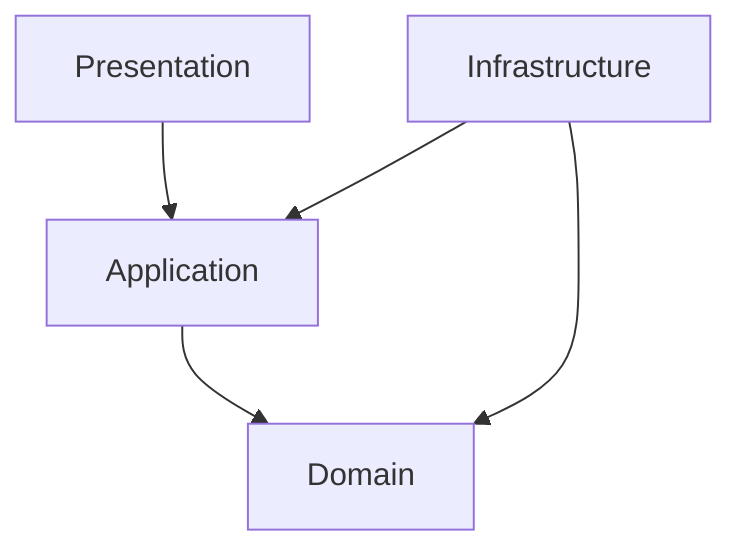

Rules:

- Domain does not include Drogon, Couchbase, Redis, Kafka, or JSON types.
- Application depends on domain and abstract ports.
- Infrastructure implements repository and port interfaces.
- Presentation depends on application DTOs and use cases.
- Bootstrap wires concrete implementations.

---

## 9. Data Ownership

| Data | Owner | Source of Truth |
|---|---|---|
| Organization policy | Organization module | Couchbase |
| Resource metadata | Resource Catalog | Couchbase |
| Reservation state | Reservation module | Couchbase |
| Availability | Derived | Reservation + Resource data |
| Idempotency result | Reservation application boundary | Durable store |
| Cache entry | Infrastructure | Rebuildable |
| Notification status | Notification module | Consumer store |
| Reporting record | Reporting module | Derived projection |
| Domain event outbox | Reservation infrastructure | Couchbase if outbox adopted |

No two modules may independently mutate the same authoritative business concept.

---

## 10. Create Reservation Flow

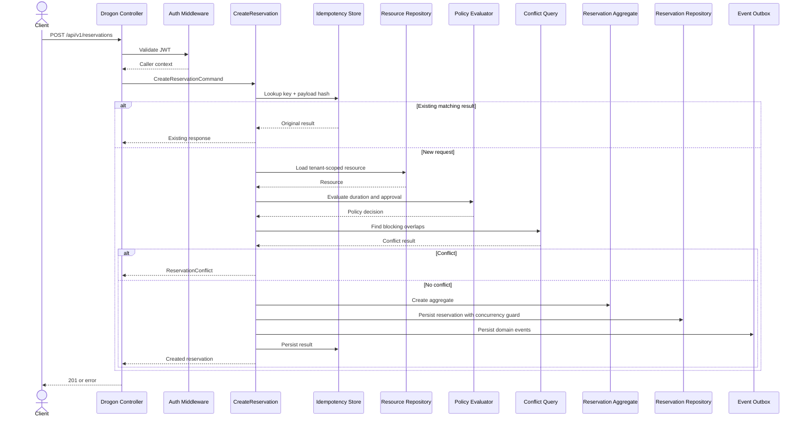

### 10.1 Authoritative Point

A request wins only when its protected persistence operation succeeds.

A prior search result does not grant ownership.

### 10.2 Approval Path

- Ordinary resource: persist as `CONFIRMED`.
- Priority resource: persist as `PENDING_APPROVAL`.
- Approval later rechecks conflicts before changing to `CONFIRMED`.

---

## 11. Search Available Resources Flow

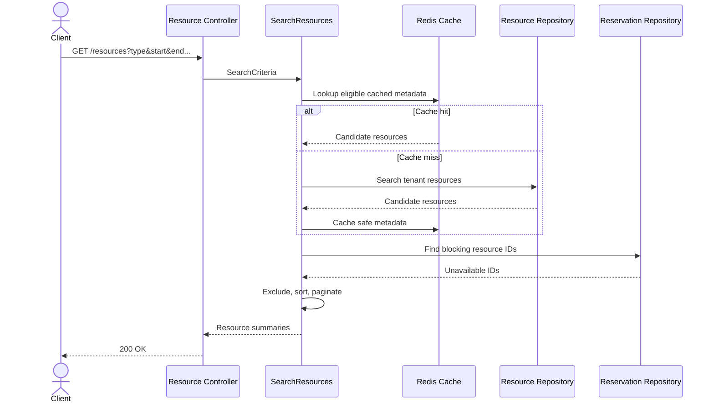

Search is eventually consistent by nature. Final allocation remains authoritative in the write path.

---

## 12. Approval Flow

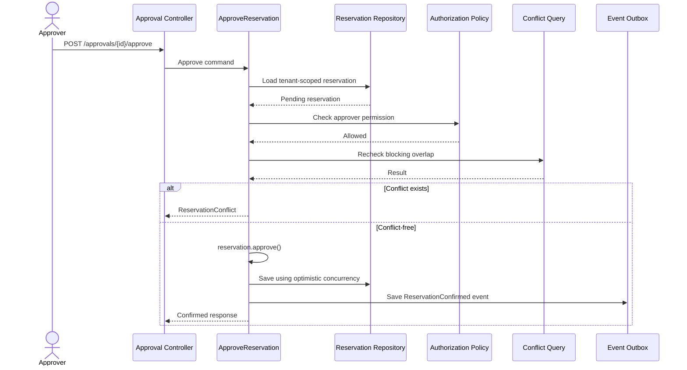

---

## 13. Event Flow

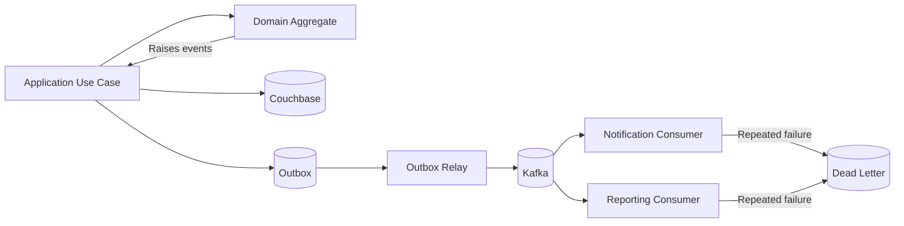

The preferred high-level strategy is a transactional outbox or equivalent durable publication mechanism. The detailed choice is documented later.

---

## 14. Persistence Architecture

### 14.1 Couchbase Role

Couchbase stores:

- Organizations
- Resources
- Reservations
- Idempotency records
- Outbox records if selected
- Supporting indexes

### 14.2 Repository Pattern

Repositories expose domain-oriented operations, such as:

- Find reservation by ID
- Find blocking overlaps
- Find user reservations
- Find pending approvals
- Save aggregate with expected version

They do not expose generic database clients to application code.

### 14.3 Optimistic Concurrency

Couchbase CAS protects updates to existing reservation documents.

Conflict prevention for new reservations requires an atomic persistence design that cannot rely only on a pre-insert query. The exact design is finalized in the concurrency and database documents.

---

## 15. Caching Architecture

Redis is used for selected derived or slow-changing data:

- Resource metadata search fragments
- Organization policy snapshots
- Rate-limit counters
- Optional short-lived query results

Redis does not become the source of truth for confirmed reservation allocation.

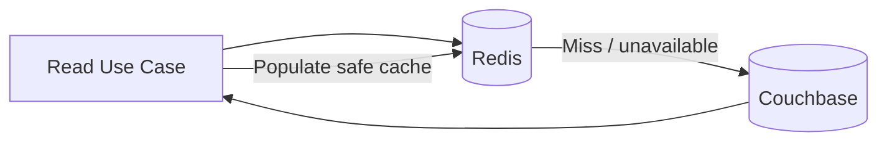

---

## 16. Security Architecture

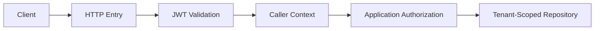

Security is enforced at multiple layers:

- Transport authentication
- Application authorization
- Tenant-scoped repositories
- Cache key isolation
- Event tenant identity
- Audit logging

---

## 17. Observability Architecture

Every request should establish:

- Request ID
- Trace ID
- Caller context
- Operation name
- Start time

Telemetry spans:

```text
HTTP -> use case -> repository/cache -> messaging
```

Core metrics include:

- Request rate and latency
- Reservation conflicts
- Idempotency hits
- CAS conflicts
- Couchbase latency
- Redis hit rate
- Kafka publication lag
- Consumer failure count

Business outcomes such as `409 Conflict` are measured separately from technical errors.

---

## 18. Deployment Architecture

### 18.1 Local Development

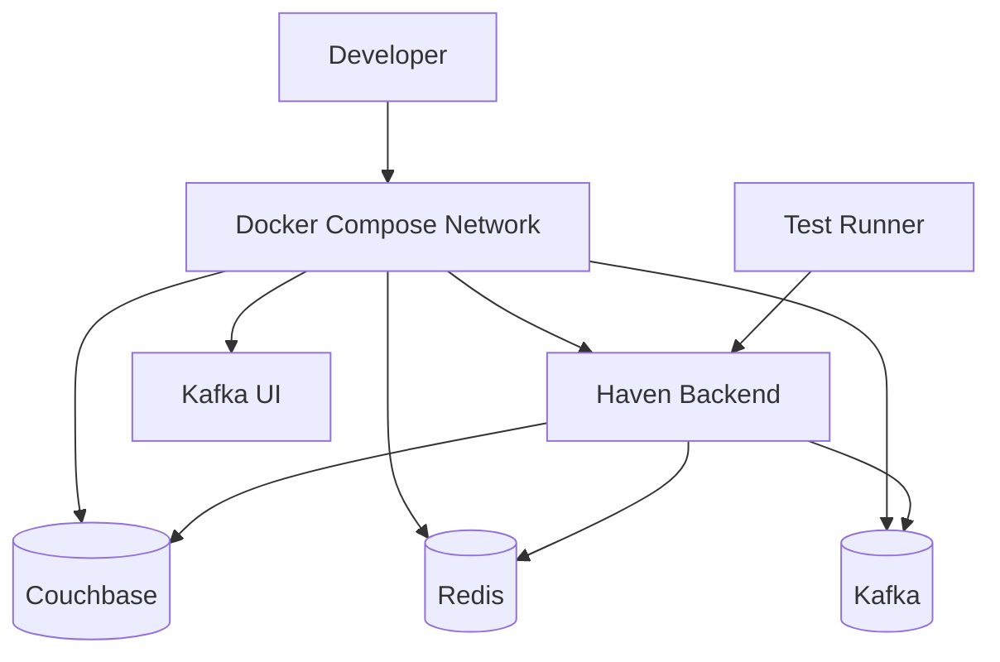

### 18.2 Future Production Topology

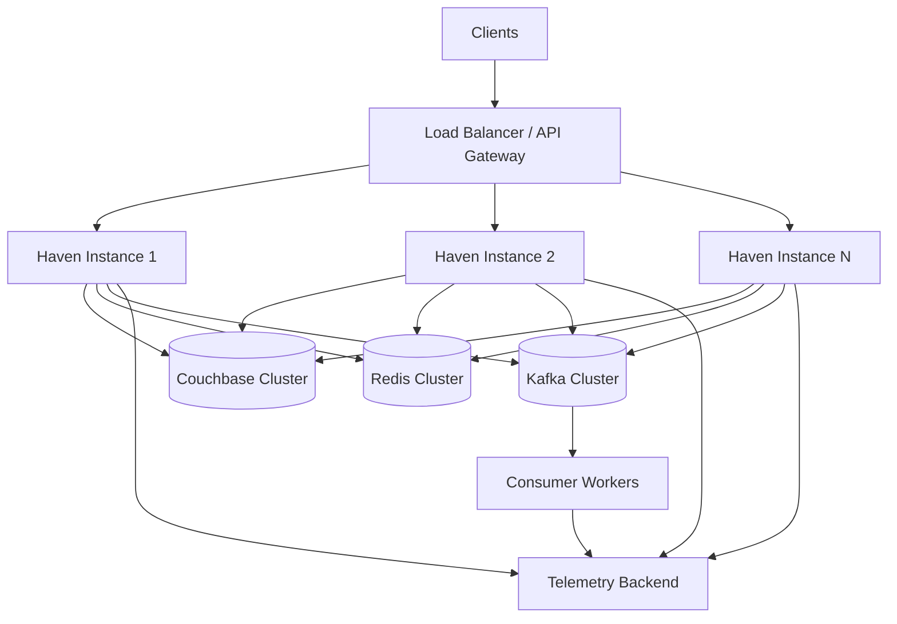

Application instances remain stateless with respect to authoritative reservation state.

---

## 19. Scalability Model

### 19.1 Read Scaling

- Horizontal Haven instances
- Tenant and resource-type scoped queries
- Secondary indexes
- Redis cache for safe read optimization
- Bounded pagination
- Future read projections if measured need appears

### 19.2 Write Scaling

- Partition contention by resource
- Avoid global lock
- Optimistic concurrency
- Bounded retry
- Tenant-scoped data access
- Kafka partition keys preserving related event order

### 19.3 Hot Resource Behavior

A small subset of resources may experience high contention.

The system should:

- Fail conflicts quickly
- Avoid unbounded retry loops
- Record contention metrics
- Preserve fairness only if future requirements justify it

---

## 20. Failure and Degradation Model

| Dependency | Failure Behavior |
|---|---|
| Couchbase | Readiness false; authoritative reads/writes fail safely |
| Redis | Bypass cache when possible; latency may increase |
| Kafka | Persist events durably for later publication; no silent loss |
| Notification consumer | Retry; dead-letter after policy limit |
| Identity provider | Existing token validation may continue depending on local key strategy |
| Telemetry backend | Business path should continue with bounded local logging behavior |

The system must never acknowledge an unsafe reservation success because a dependency is degraded.

---

## 21. Availability vs Consistency

Haven prioritizes consistency for resource allocation.

- Search may be stale.
- Notifications may be delayed.
- Reporting may lag.
- Reservation confirmation must remain correct.

This is a deliberate separation between:

- User-facing read freshness
- Authoritative write correctness

---

## 22. Major Alternatives Considered

### 22.1 Microservices

Rejected for MVP because:

- One primary developer
- High local operational burden
- Distributed transaction complexity
- Slower iteration
- Limited current scale need

Reconsider when independent scaling or deployment becomes necessary.

### 22.2 Separate Availability Store

Deferred because:

- Introduces consistency lag
- Requires replay and reconciliation
- Core query can initially derive availability
- Read pressure has not yet been measured

### 22.3 Distributed Redis Lock as Primary Correctness Mechanism

Rejected as the default because:

- Creates correctness dependency on Redis
- Requires expiry and ownership handling
- Adds operational failure modes
- Database concurrency guarantees should remain authoritative

### 22.4 Embed Reservations in Resource Documents

Rejected because:

- Unbounded growth
- Hot document contention
- Different lifecycle and write patterns
- Poor query flexibility

---

## 23. Key Architecture Decisions

| Decision | Rationale |
|---|---|
| Modular monolith | Strong boundaries with manageable operations |
| Clean dependency rule | Protect business logic from infrastructure |
| Separate Resource and Reservation aggregates | Scalability and concurrency |
| Availability derived | Single source of truth |
| Optimistic concurrency | Avoid global locking |
| Kafka for events | Durable asynchronous fan-out |
| Redis as optional optimization | Preserve correctness during cache failure |
| JWT caller context | Stateless application scaling |
| Task-oriented endpoints for actions | Express business transitions clearly |

---

## 24. Risks

- Atomic conflict prevention for new reservations must be designed carefully.
- Pending approval semantics may affect utilization and UX.
- Couchbase indexing may become complex for broad searches.
- Event outbox implementation adds operational work.
- Framework leakage can erode architecture boundaries.
- Over-documentation may slow implementation if not kept decision-focused.

---

## 25. Validation Strategy

The HLD is validated through:

- Architecture review against requirements
- Sequence review for core flows
- Concurrency proof and tests
- Couchbase integration tests
- API contract tests
- Failure injection
- Performance benchmarks
- Documentation-to-code traceability

---

## 26. Interview Discussion Notes

### Why does the modular monolith still use domain events?

Domain events decouple modules logically. The same event contracts can later cross process boundaries without changing domain behavior.

### Why not guarantee search availability?

Guaranteeing search output requires holds or locks. Haven instead provides a current snapshot and guarantees correctness at confirmation.

### Why is Couchbase not accessed from controllers?

Controllers should be transport adapters. Direct database access couples HTTP to persistence and prevents isolated domain testing.

### How does the system scale horizontally?

Application instances are stateless. Shared authoritative state lives in Couchbase, shared cache in Redis, and events in Kafka.

### What is the most important unresolved HLD issue?

The exact atomic write strategy preventing concurrent insertion of conflicting new reservations. This is resolved in the concurrency and database design documents.

---

## 27. Summary

Haven uses a modular monolith with explicit bounded contexts and inward-pointing dependencies.

The reservation write path is authoritative and consistency-sensitive. Search, caching, notification, and reporting may tolerate bounded staleness.

Couchbase stores authoritative business data, Redis accelerates safe reads, Kafka distributes durable lifecycle events, and Drogon remains confined to the presentation layer.

---

## 28. Next Document

The next document is:

```text
docs/03-low-level-design.md
```

It will define:

- Layer contracts
- Module layout
- Application use cases
- Domain abstractions
- Repository interfaces
- Dependency injection
- Error model
- Class collaboration rules
- Implementation conventions
