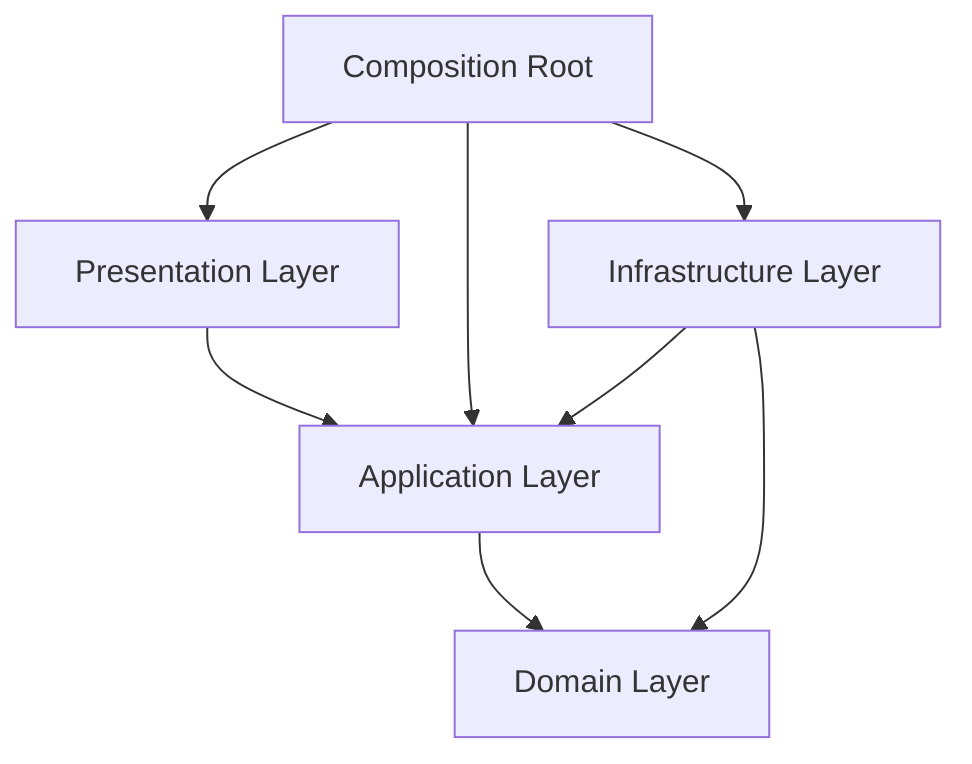
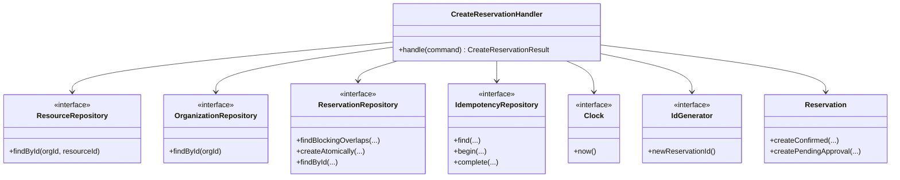
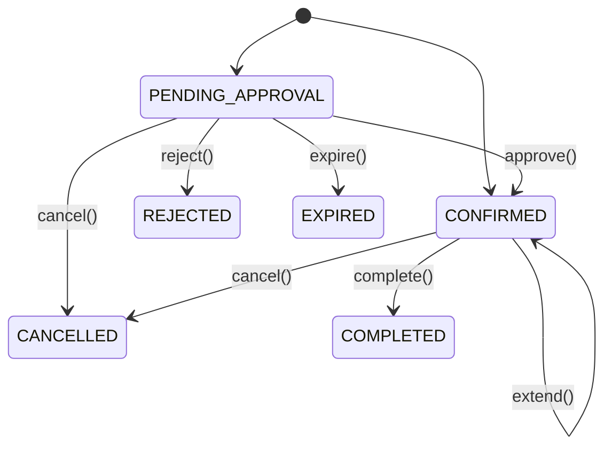
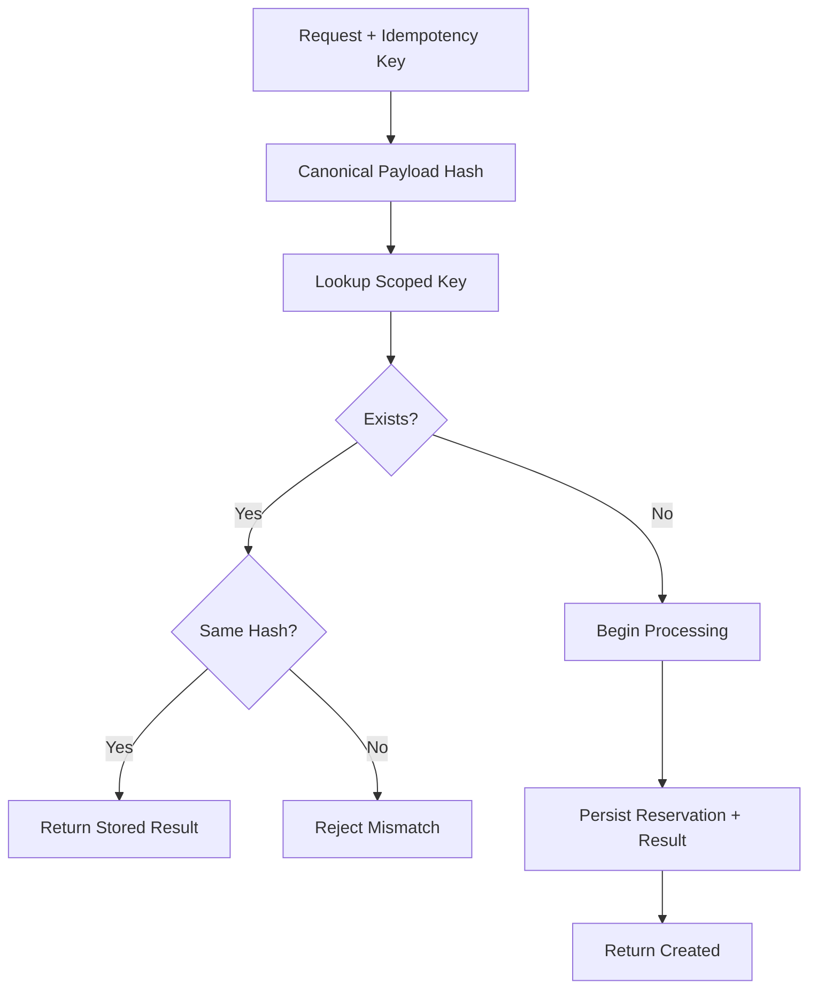

# Haven — Low-Level Design

## 1. Overview

This document defines the implementation blueprint for Haven.

It translates the high-level architecture into:

- Source-code modules
- Layer contracts
- Core classes and responsibilities
- Application commands and queries
- Repository and infrastructure ports
- Dependency injection rules
- Error boundaries
- Object ownership
- Concurrency responsibilities
- Testing seams
- Extensibility rules

Detailed domain semantics are defined in `04-domain-model.md`.

---

## 2. LLD Principles

1. Model behavior before storage.
2. Every class must have one clear reason to change.
3. Domain objects protect their invariants.
4. Application use cases orchestrate but do not own business rules.
5. Infrastructure implements contracts owned inward.
6. Presentation translates transport concerns only.
7. Generic abstractions are rejected unless multiple concrete needs exist.
8. State transitions use named operations, never generic setters.
9. Dependencies are explicit and constructor-injected.
10. Persistence and event publication failures are classified and observable.

---

## 3. Layer Model



### 3.1 Presentation

Allowed:

- Drogon requests and responses
- JSON parsing
- Header extraction
- Transport validation
- HTTP status mapping
- DTO mapping
- Trace-context initialization

Forbidden:

- Couchbase calls
- Conflict detection
- Reservation state changes
- Approval decisions
- Cache policy
- Kafka publication

### 3.2 Application

Allowed:

- Commands and queries
- Use-case orchestration
- Authorization orchestration
- Repository coordination
- Transaction boundaries
- Idempotency workflow
- Mapping domain results to application outputs

Forbidden:

- Drogon types
- Couchbase SDK types
- Raw Kafka clients
- Business invariants duplicated from domain
- Formatting HTTP errors

### 3.3 Domain

Allowed:

- Aggregates
- Entities
- Value objects
- Domain services
- Policies
- Domain events
- Repository contracts required by domain behavior
- Domain errors

Forbidden:

- HTTP
- JSON libraries
- Database SDKs
- Cache clients
- Message brokers
- Logging framework dependencies
- Environment variables

### 3.4 Infrastructure

Allowed:

- Couchbase adapters
- Redis adapters
- Kafka adapters
- JWT verification
- Clock and ID implementations
- Configuration loading
- Telemetry integration

Forbidden:

- Business decisions
- State transitions implemented outside aggregates
- Cross-tenant bypasses
- Public exposure of SDK-specific errors

---

## 4. Source Layout

```text
src/
├── domain/
│   ├── shared/
│   │   ├── identifiers/
│   │   ├── time/
│   │   ├── errors/
│   │   └── events/
│   ├── organization/
│   ├── resource/
│   ├── reservation/
│   └── approval/
│
├── application/
│   ├── shared/
│   │   ├── auth/
│   │   ├── idempotency/
│   │   ├── pagination/
│   │   └── ports/
│   ├── reservations/
│   │   ├── create/
│   │   ├── get/
│   │   ├── list/
│   │   ├── cancel/
│   │   └── extend/
│   ├── resources/
│   │   ├── search/
│   │   └── get/
│   └── approvals/
│       ├── list/
│       ├── approve/
│       └── reject/
│
├── infrastructure/
│   ├── couchbase/
│   │   ├── repositories/
│   │   ├── documents/
│   │   ├── mappers/
│   │   ├── queries/
│   │   └── migrations/
│   ├── redis/
│   ├── kafka/
│   ├── auth/
│   ├── telemetry/
│   ├── config/
│   └── system/
│
├── presentation/
│   ├── rest/
│   │   ├── controllers/
│   │   ├── dto/
│   │   ├── mappers/
│   │   ├── middleware/
│   │   └── errors/
│   └── openapi/
│
└── bootstrap/
    ├── ApplicationBootstrap.*
    └── main.cpp
```

Tests mirror production structure.

---

## 5. Core Domain Types

### 5.1 Strong Identifiers

- `OrganizationId`
- `UserId`
- `ResourceId`
- `ReservationId`
- `EventId`
- `IdempotencyKey`

Requirements:

- Immutable
- Explicit construction
- Validated format
- Equality and hashing
- No implicit conversion among identifier types

### 5.2 TimeInterval

Responsibilities:

- Validate `start < end`
- Expose duration
- Detect overlap
- Preserve half-open semantics
- Remain immutable

Conceptual API:

```cpp
class TimeInterval final {
public:
    static Result<TimeInterval> create(TimePoint start, TimePoint end);

    [[nodiscard]] TimePoint start() const noexcept;
    [[nodiscard]] TimePoint end() const noexcept;
    [[nodiscard]] Duration duration() const noexcept;
    [[nodiscard]] bool overlaps(const TimeInterval& other) const noexcept;
};
```

### 5.3 Purpose

A bounded free-text value object.

It validates length and normalization but has no workflow semantics.

---

## 6. Aggregate Design Summary

### 6.1 Reservation Aggregate

Responsibilities:

- Hold reservation identity and ownership
- Protect time and lifecycle invariants
- Confirm, approve, reject, cancel, extend, expire, complete
- Record approval metadata
- Raise domain events
- Track persistence version

Public behavior:

```text
createConfirmed
createPendingApproval
approve
reject
cancel
extend
expire
complete
pullDomainEvents
```

No public setters.

### 6.2 Resource Aggregate

Responsibilities:

- Represent a reservable resource
- Protect active state
- Validate supported resource type
- Expose capability and policy data

Does not own reservations.

### 6.3 Organization Aggregate

Responsibilities:

- Own tenant-level policies
- Resolve maximum duration
- Resolve maintenance allowances
- Resolve approval requirement rules

---

## 7. Application Commands and Queries

### 7.1 Command Pattern

Commands represent intended state changes.

Examples:

- `CreateReservationCommand`
- `CancelReservationCommand`
- `ExtendReservationCommand`
- `ApproveReservationCommand`
- `RejectReservationCommand`

Commands contain application-level values and caller context. They do not contain Drogon objects.

### 7.2 Query Pattern

Queries retrieve data without changing domain state.

Examples:

- `SearchResourcesQuery`
- `GetResourceQuery`
- `GetReservationQuery`
- `ListMyReservationsQuery`
- `ListPendingApprovalsQuery`

### 7.3 Handler Naming

One handler per use case:

```text
CreateReservationHandler
CancelReservationHandler
SearchResourcesHandler
ApproveReservationHandler
```

Handlers should not become generic service containers.

---

## 8. Create Reservation Class Collaboration



---

## 9. Repository Contracts

Repositories are aggregate-oriented and tenant-aware.

### 9.1 ReservationRepository

Conceptual responsibilities:

```cpp
class ReservationRepository {
public:
    virtual ~ReservationRepository() = default;

    virtual Result<std::optional<Reservation>>
    findById(OrganizationId organizationId,
             ReservationId reservationId) const = 0;

    virtual Result<std::vector<ReservationSummary>>
    findByUser(const ReservationSearchCriteria& criteria) const = 0;

    virtual Result<std::vector<ResourceId>>
    findBlockingResourceIds(
        OrganizationId organizationId,
        std::span<const ResourceId> candidates,
        const TimeInterval& interval) const = 0;

    virtual Result<CreateReservationPersistenceResult>
    createAtomically(const Reservation& reservation,
                     const IdempotencyRecord& idempotency,
                     std::span<const DomainEvent> events) = 0;

    virtual Result<SaveResult>
    save(const Reservation& reservation,
         Version expectedVersion,
         std::span<const DomainEvent> events) = 0;
};
```

Exact signatures may change during implementation, but responsibilities remain stable.

### 9.2 ResourceRepository

Responsibilities:

- Load one tenant-scoped resource
- Search candidate resources
- Exclude inactive resources
- Support pagination
- Avoid availability ownership

### 9.3 OrganizationRepository

Responsibilities:

- Load effective tenant policy
- Support safe caching through an adapter
- Return domain types, not JSON documents

### 9.4 IdempotencyRepository

Responsibilities:

- Resolve existing result
- Detect payload mismatch
- Reserve or begin processing
- Complete with stable response
- Handle expiry

---

## 10. Application Ports

Infrastructure-neutral ports include:

- `Clock`
- `IdGenerator`
- `EventPublisher` or outbox relay boundary
- `MetricsRecorder`
- `Tracer`
- `AuthorizationPolicy`
- `RateLimiter`
- `TransactionRunner` only if required by concrete persistence model

Ports must be introduced only when the application genuinely needs an external capability.

---

## 11. Error Model

### 11.1 Domain Errors

Examples:

- `InvalidTimeInterval`
- `ReservationDurationExceeded`
- `InvalidReservationTransition`
- `ReservationAlreadyTerminal`
- `ApprovalNotRequired`
- `ApprovalRequired`
- `ReservationConflict`

### 11.2 Application Errors

Examples:

- `ResourceNotFound`
- `ReservationNotFound`
- `Forbidden`
- `IdempotencyKeyMismatch`
- `DependencyUnavailable`
- `ConcurrentModification`
- `RetryExhausted`

### 11.3 Infrastructure Errors

SDK-specific failures are mapped to internal categories:

- Timeout
- Unavailable
- Conflict
- Serialization failure
- Authentication failure
- Unknown infrastructure failure

### 11.4 Presentation Mapping

| Error | HTTP |
|---|---:|
| Invalid transport input | 400 |
| Unauthenticated | 401 |
| Forbidden | 403 |
| Not found / hidden cross-tenant | 404 |
| Reservation conflict | 409 |
| Idempotency mismatch | 409 |
| Business policy violation | 422 |
| Rate limited | 429 |
| Essential dependency unavailable | 503 |
| Unexpected error | 500 |

---

## 12. Result and Exception Strategy

Expected business outcomes should use explicit result types.

Examples:

- Conflict
- Invalid transition
- Policy violation
- Not found

Exceptions are reserved for exceptional technical failures where normal recovery is not local.

If `std::expected` support is unavailable in the selected compiler baseline, a project-local `Result<T, E>` abstraction may be used.

No layer should throw raw Couchbase or Drogon exceptions across boundaries.

---

## 13. Dependency Injection

### 13.1 Constructor Injection

Dependencies are supplied through constructors.

```cpp
CreateReservationHandler(
    ReservationRepository& reservationRepository,
    ResourceRepository& resourceRepository,
    OrganizationRepository& organizationRepository,
    IdempotencyRepository& idempotencyRepository,
    Clock& clock,
    IdGenerator& idGenerator);
```

### 13.2 Composition Root

`bootstrap/` owns:

- Configuration loading
- SDK client creation
- Repository adapter creation
- Handler creation
- Controller wiring
- Consumer startup
- Graceful shutdown

### 13.3 Lifetime Rules

- Domain values: value semantics
- Shared infrastructure clients: owned by bootstrap
- Handlers/controllers: reference or shared immutable dependency graph
- No service locator
- No mutable global singleton

---

## 14. DTO Design

Transport DTOs are separate from domain objects.

Example flow:

```text
JSON
 -> CreateReservationRequestDto
 -> CreateReservationCommand
 -> Reservation
 -> CreateReservationResult
 -> ReservationResponseDto
 -> JSON
```

DTO validation covers format and required fields.

Domain validation covers business meaning.

---

## 15. Mapping Rules

- Mapping code is explicit and testable.
- Domain entities are not serialized directly.
- API enums have stable external names.
- Internal enum reordering must not change wire contracts.
- Timestamps serialize as UTC ISO-8601.
- Unknown future enum values are handled deliberately.

---

## 16. State Transition Design



Every mutation:

1. Checks current state.
2. Validates operation-specific rules.
3. Updates immutable replacement values.
4. Updates audit metadata.
5. Raises domain events.
6. Increments or relies on persistence version.

---

## 17. Concurrency Responsibilities

### Domain

- Knows conflict semantics.
- Protects lifecycle invariants.
- Does not acquire distributed locks.

### Application

- Chooses retry boundaries.
- Re-executes safe reads when needed.
- Rejects unsafe retries.
- Coordinates idempotency.

### Infrastructure

- Implements CAS and atomic persistence.
- Maps concurrency failures.
- Enforces bounded timeout and retry configuration.
- Provides diagnostics.

---

## 18. Idempotency Design Boundary

Create reservation flow:



The persistence design must prevent two concurrent requests using the same key from both creating a reservation.

---

## 19. Event Handling

Aggregates raise in-memory domain events.

Application or repository infrastructure persists them with the business change.

Consumers must not receive mutable domain objects.

Event envelopes include:

- Event ID
- Type
- Version
- Timestamp
- Tenant
- Aggregate ID
- Correlation ID
- Payload

---

## 20. Logging and Telemetry Placement

- Presentation: request boundary and HTTP outcome
- Application: use-case outcome and retry classification
- Infrastructure: dependency timing and failures
- Domain: no direct spdlog dependency

Domain outcomes may be recorded by application observers.

Sensitive values are excluded.

---

## 21. Thread Safety

- Handlers should be stateless after construction.
- Repositories must document whether SDK clients are thread-safe.
- Domain aggregates are not shared mutable objects across requests.
- Request-local aggregates use normal value/object ownership.
- Shared caches and clients are accessed through thread-safe adapters.
- Static mutable state is forbidden.

---

## 22. Testing Seams

### Domain

Construct aggregates and value objects directly.

### Application

Use fake repositories, fake clock, deterministic ID generator, and fake authorization.

### Infrastructure

Run Couchbase, Redis, and Kafka integration tests against containers.

### Presentation

Use Drogon test clients and contract assertions.

### Concurrency

Coordinate multiple threads/processes against real persistence adapters.

---

## 23. Design Patterns Used

| Pattern | Use |
|---|---|
| Repository | Aggregate persistence abstraction |
| Adapter | Drogon, Couchbase, Redis, Kafka integration |
| Command | State-changing application use cases |
| Query | Read-only application use cases |
| Strategy/Policy | Approval and reservation policy |
| Factory/static creation | Valid aggregate construction |
| Specification-like criteria | Resource and reservation filtering |
| Dependency Injection | Explicit composition |
| Domain Events | Decoupled business facts |
| Outbox | Reliable event publication |

Patterns are introduced only where requirements justify them.

---

## 24. Extensibility Rules

### Add Resource Type

Expected changes:

- Resource type definition
- Metadata schema
- Search mapping
- Optional policy configuration

Conflict logic should remain unchanged if the type uses fixed intervals.

### Add Notification Channel

Expected changes:

- Notification adapter
- Template/channel configuration
- Consumer tests

Reservation code remains unchanged.

### Replace Drogon

Expected changes:

- Presentation controllers
- Middleware
- DTO binding
- Bootstrap wiring

Domain and application remain stable.

### Replace Couchbase

Expected changes:

- Repository adapters
- Persistence mappers
- Migrations/index setup
- Concurrency implementation

Domain behavior remains stable.

---

## 25. Forbidden Designs

- Generic `BaseRepository<T>`
- God `ReservationService`
- Public aggregate setters
- Repository returning Couchbase documents
- Controller calling Kafka
- Domain including Drogon headers
- Redis lock as unexplained default
- Mutable process-global configuration
- Business decisions in DTO validation
- Catch-all exception swallowing
- Unbounded retry
- Unbounded list APIs

---

## 26. Implementation Order

Recommended order:

1. Shared domain primitives
2. `TimeInterval`
3. Resource and organization read models
4. Reservation aggregate
5. Repository contracts
6. Create reservation handler
7. In-memory fakes and unit tests
8. Health API
9. Presentation DTOs and error mapper
10. Couchbase adapters
11. Search resources
12. Concurrency and idempotency
13. Event outbox
14. Cancellation and approval
15. Redis optimization
16. Observability hardening

---

## 27. Review Checklist

Before implementation approval:

- Are invariants explicit?
- Are dependencies inward?
- Are repository methods use-case driven?
- Are DTOs separate?
- Is ownership clear?
- Are retries bounded?
- Are concurrency boundaries explicit?
- Are failure categories mapped?
- Are tests possible without infrastructure?
- Is the design simpler than its alternatives?

---

## 28. Interview Discussion Notes

### Why one handler per use case?

It prevents feature accumulation in generic service classes and makes dependencies, tests, and transaction boundaries explicit.

### Why can application depend on repository interfaces?

Use cases need persistence capabilities, but concrete storage belongs to infrastructure. The interface expresses the inward layer's needs.

### Why not inject a logger into every domain object?

Logging is an operational concern. Domain behavior should return outcomes and raise events; outer layers decide how to record them.

### Why strong IDs?

They prevent accidentally passing a `UserId` where a `ResourceId` is expected and centralize validation and hashing.

### Why explicit result types for business errors?

Conflicts and policy violations are expected outcomes, not exceptional process failures.

---

## 29. Summary

The Haven LLD uses small aggregates, explicit use-case handlers, tenant-aware repository contracts, strong domain types, constructor injection, and adapter-based infrastructure.

The design prevents framework leakage and creates clear seams for testing, concurrency control, and future infrastructure replacement.

---

## 30. Next Document

The next document is:

```text
docs/04-domain-model.md
```

It defines the ubiquitous language, aggregate boundaries, value objects, domain services, events, invariants, and relationships in detail.
