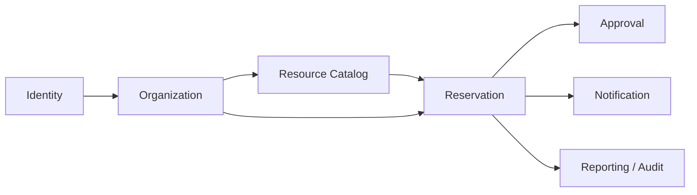
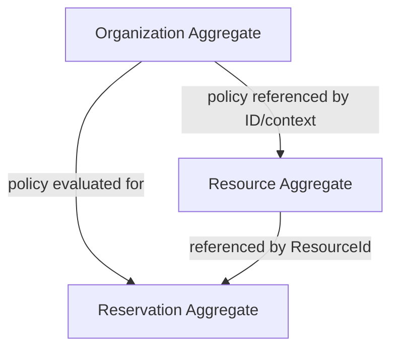
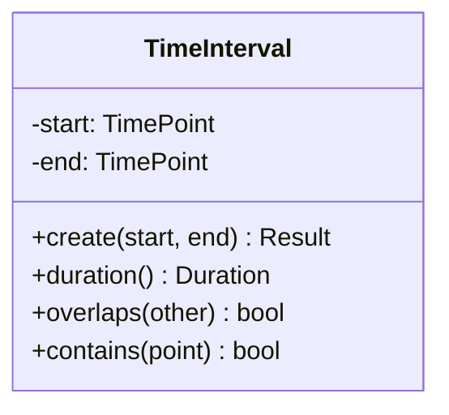
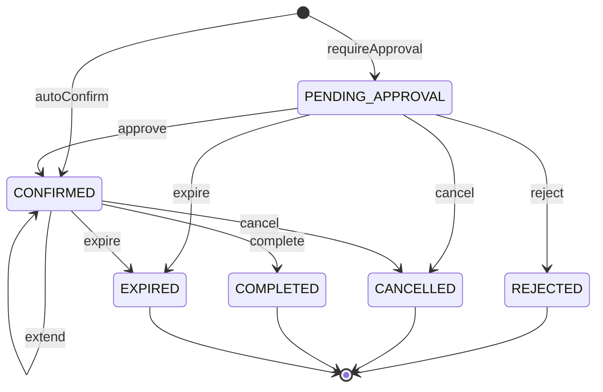
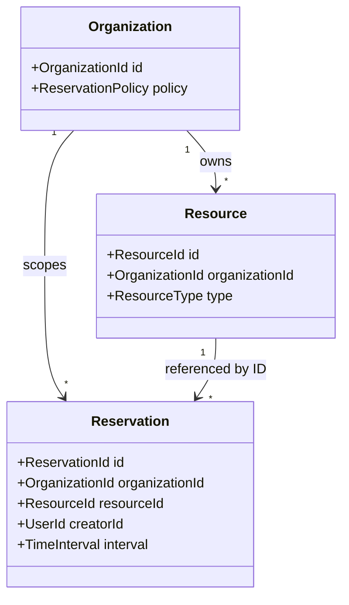

# Haven — Domain Model

## 1. Overview

This document defines Haven's ubiquitous language and domain model.

It identifies:

- Bounded contexts
- Aggregates and aggregate roots
- Entities
- Value objects
- Domain services
- Policies
- Repository contracts
- Domain events
- Invariants
- Relationships
- State transitions
- Deliberate modeling exclusions

The domain model is technology-independent.

---

## 2. Ubiquitous Language

| Term | Definition |
|---|---|
| Organization | Tenant that owns users, resources, policies, and reservations |
| User | Authenticated actor operating within an organization |
| Resource | A reservable asset with metadata, location, and policy |
| Resource Type | Classification such as meeting room, desk, parking slot, hotel room, or game zone |
| Reservation | Allocation request for one resource over a fixed time interval |
| Time Interval | Immutable half-open interval `[start, end)` |
| Availability | Derived answer indicating whether a resource can accept a reservation |
| Conflict | Existing blocking allocation overlapping the requested interval |
| Approval | Decision required before selected reservations become confirmed |
| Policy | Business rule owned by organization or resource configuration |
| Idempotency Key | Client-supplied token identifying one logical create request |
| Domain Event | Immutable fact describing a completed domain state change |
| Calendar | View over reservations, not an authoritative model |
| Maintenance Reservation | Authorized reservation allowed to exceed standard duration up to 24 hours |

The project uses `Reservation` consistently instead of mixing booking, allocation, and slot terminology.

---

## 3. Bounded Contexts



### 3.1 Identity Context

Provides trusted caller identity and claims.

### 3.2 Organization Context

Owns tenant policy and configuration.

### 3.3 Resource Catalog Context

Owns resource metadata and discoverability.

### 3.4 Reservation Context

Owns allocation and lifecycle correctness.

### 3.5 Approval Context

Owns approval actions and authorization. For MVP, approval persistence remains closely coupled to reservation state.

### 3.6 Notification Context

Consumes reservation facts and sends messages.

### 3.7 Reporting Context

Builds derived audit and analytical views.

---

## 4. Aggregate Map



Rules:

- Aggregates reference one another by identifier.
- Reservation history is not embedded in Resource.
- Organization policy is loaded separately.
- Cross-aggregate consistency is coordinated by application use cases and repositories.

---

## 5. Organization Aggregate

### 5.1 Aggregate Root

`Organization`

### 5.2 Identity

`OrganizationId`

### 5.3 State

- Name
- Status
- Default timezone for display/configuration
- Reservation policy
- Approval policy
- Working-hours policy
- Audit metadata

### 5.4 Behavior

- Activate and deactivate organization
- Replace effective reservation policy
- Evaluate whether a resource type requires approval
- Resolve standard maximum duration
- Resolve maintenance duration
- Validate whether an operation is permitted under organization status

### 5.5 Invariants

- Organization ID is valid and immutable.
- Inactive organizations cannot create new reservations.
- Standard maximum duration is positive and at most the supported product limit.
- Maintenance duration is not lower than standard duration.
- Policy values are internally consistent.

---

## 6. Resource Aggregate

### 6.1 Aggregate Root

`Resource`

### 6.2 Identity

`ResourceId`

### 6.3 State

- Organization ID
- Name
- Description
- Resource type
- Capacity
- Location
- Features
- Active state
- Approval requirement override if supported
- Audit metadata

### 6.4 Behavior

- Activate
- Deactivate
- Update metadata through controlled operations
- Determine whether it is reservable
- Expose immutable capability information

### 6.5 Invariants

- Resource belongs to exactly one organization.
- Resource type is supported.
- Capacity is valid for the resource type.
- Feature set contains normalized unique values.
- Inactive resource cannot accept new reservations.
- Resource identity and tenant ownership cannot change.

### 6.6 Excluded State

Resource does not contain:

- Reservation list
- Availability flag
- Calendar
- Current user
- Mutable lock state

---

## 7. Reservation Aggregate

### 7.1 Aggregate Root

`Reservation`

### 7.2 Identity

`ReservationId`

### 7.3 State

- Organization ID
- Resource ID
- Creator user ID
- Time interval
- Purpose
- Reservation status
- Approval information
- Reservation kind or authorization metadata for maintenance
- Created timestamp
- Updated timestamp
- Persistence version
- Pending domain events

### 7.4 Creation Modes

#### Auto-Confirmed

Created as `CONFIRMED` when:

- Resource is active
- Request is valid
- No approval is required
- No blocking conflict exists
- Atomic persistence succeeds

#### Pending Approval

Created as `PENDING_APPROVAL` when:

- Resource policy requires approval
- Request is otherwise valid
- Initial creation rules succeed

Approval later repeats authoritative conflict detection.

### 7.5 Behavior

- `approve`
- `reject`
- `cancel`
- `extend`
- `expire`
- `complete`

Creation occurs through named static creation functions or a factory.

### 7.6 Invariants

- IDs are valid and immutable.
- Reservation organization matches resource organization.
- Time interval is valid.
- Standard duration does not exceed effective policy.
- Maintenance duration does not exceed 24 hours.
- Status transition is legal.
- Terminal reservation cannot mutate.
- Extension increases end time only.
- Extension revalidation occurs before mutation.
- Approval metadata matches approval state.
- Updated timestamp never precedes created timestamp.

---

## 8. Approval Model

### 8.1 MVP Decision

Approval is modeled as workflow behavior with an `ApprovalInfo` value object inside Reservation.

It is not a separate aggregate for MVP.

### 8.2 ApprovalInfo

Possible state:

- Not required
- Pending
- Approved
- Rejected

Associated values:

- Approver user ID
- Decision timestamp
- Optional reason

### 8.3 Evolution Trigger

Approval should become a separate aggregate if requirements add:

- Multiple approvers
- Approval sequence
- Quorum
- Delegation
- Escalation
- SLA
- Independent approval history
- External workflow engine

---

## 9. Value Objects

### 9.1 Identifier Types

- `OrganizationId`
- `ResourceId`
- `ReservationId`
- `UserId`
- `EventId`
- `IdempotencyKey`

All are immutable and strongly typed.

### 9.2 TimeInterval



Overlap:

```text
existing.start < requested.end
AND existing.end > requested.start
```

### 9.3 Capacity

Validated non-negative capacity with resource-type semantics.

### 9.4 Location

May contain:

- Building
- Floor
- Zone
- Human-readable label

It is immutable and compared by value.

### 9.5 Feature

Normalized capability such as `PROJECTOR` or `EV_CHARGING`.

### 9.6 Purpose

Bounded free text. It is not parsed for authorization.

### 9.7 AuditInfo

Contains:

- Created by
- Created at
- Updated by
- Updated at

### 9.8 ReservationStatus

```text
PENDING_APPROVAL
CONFIRMED
CANCELLED
REJECTED
EXPIRED
COMPLETED
```

### 9.9 ResourceType

```text
MEETING_ROOM
DESK
PARKING_SLOT
HOTEL_ROOM
GAME_ZONE
```

---

## 10. Entity Classification

| Concept | Classification | Reason |
|---|---|---|
| Organization | Aggregate root / entity | Stable identity and lifecycle |
| Resource | Aggregate root / entity | Stable identity and mutable metadata |
| Reservation | Aggregate root / entity | Stable identity and lifecycle |
| User | External identity reference for MVP | Identity owned outside reservation domain |
| ApprovalInfo | Value object | No independent identity in MVP |
| TimeInterval | Value object | Equality by value |
| Availability | Derived concept | No identity or independent lifecycle |
| Calendar | Projection | View over reservations |
| Notification | Separate-context entity/message | Not part of reservation aggregate |
| Conflict | Domain result | A relationship between intervals and blocking data |

---

## 11. Domain Services

### 11.1 ReservationPolicyEvaluator

Inputs:

- Organization policy
- Resource
- Caller authorization context
- Requested interval
- Reservation kind

Outputs:

- Allowed or rejected
- Effective max duration
- Approval required
- Policy violation details

### 11.2 ConflictDetectionPolicy

Defines domain overlap and blocking status semantics.

Database retrieval belongs to repository infrastructure. The policy itself evaluates domain values.

### 11.3 AvailabilityService

A domain/application collaboration that derives available resources from:

- Candidate resources
- Blocking reservation identifiers
- Requested interval

It does not persist availability.

### 11.4 ApprovalAuthorizationPolicy

Determines whether a caller may approve or reject.

---

## 12. Repository Contracts

### 12.1 OrganizationRepository

- Find organization by ID
- Load effective policy
- Never return cross-tenant data

### 12.2 ResourceRepository

- Find resource by organization and ID
- Search candidate resources
- Paginate and sort
- Exclude inactive resources

### 12.3 ReservationRepository

- Find reservation by tenant and ID
- Find blocking overlaps
- Find blocking resource IDs
- List user reservations
- List pending approvals
- Atomically create reservation and idempotency/outbox data
- Save with expected version

### 12.4 Repository Rule

Repositories return domain objects or domain-oriented projections, not SDK documents.

---

## 13. Domain Events

### 13.1 Event Envelope

Every event contains:

- Event ID
- Event type
- Schema version
- Occurred-at timestamp
- Organization ID
- Aggregate ID
- Correlation ID
- Causation ID where applicable
- Immutable payload

### 13.2 Event Catalog

#### ReservationCreated

Raised for every successfully created reservation.

#### ReservationApprovalRequested

Raised when created in pending approval.

#### ReservationConfirmed

Raised when auto-confirmed or later approved.

#### ReservationRejected

Raised after rejection.

#### ReservationCancelled

Raised after cancellation.

#### ReservationExtended

Raised after successful extension.

#### ReservationExpired

Raised after expiry.

#### ReservationCompleted

Raised after completion.

### 13.3 Event Rules

- Event names use past tense.
- Events are raised only after valid domain transitions.
- Domain events do not include infrastructure-specific metadata.
- Consumers tolerate duplicates.

---

## 14. Reservation State Machine



---

## 15. State Transition Rules

| Current | Operation | Result | Notes |
|---|---|---|---|
| New | Create auto-confirmed | Confirmed | Conflict-free |
| New | Create pending | Pending approval | Approval required |
| Pending | Approve | Confirmed | Recheck conflict |
| Pending | Reject | Rejected | Record actor and reason |
| Pending | Cancel | Cancelled | Creator/admin |
| Pending | Expire | Expired | Approval deadline |
| Confirmed | Extend | Confirmed | Revalidate |
| Confirmed | Cancel | Cancelled | Policy-dependent timing |
| Confirmed | Complete | Completed | End reached |
| Terminal | Any mutation | Rejected | Invalid transition |

---

## 16. Aggregate Relationship Rules



This diagram represents business relationships, not aggregate composition.

---

## 17. Availability Model

Availability is calculated as:

```text
eligible resources
minus
resources with blocking overlapping reservations
```

It is affected by:

- Tenant
- Resource active state
- Resource type
- Search filters
- Requested interval
- Blocking status policy

Availability is not stored on Resource.

---

## 18. Conflict Semantics

### 18.1 Blocking Statuses

`CONFIRMED` blocks allocation.

The MVP recommendation is that `PENDING_APPROVAL` does not permanently block allocation. Approval must recheck.

### 18.2 Adjacent Reservation

```text
Existing: 10:00–11:00
Requested: 11:00–12:00
```

No conflict because intervals are half-open.

### 18.3 Full and Partial Overlap

All of the following conflict:

- Requested starts inside existing
- Requested ends inside existing
- Requested contains existing
- Existing contains requested
- Exact match

---

## 19. Idempotency Domain Boundary

Idempotency is an application reliability concern, not a Reservation property.

A reservation may reference the originating idempotency key in persistence metadata, but the aggregate should not expose idempotency behavior.

The idempotency record contains:

- Scoped key
- Canonical payload hash
- Processing state
- Reservation ID/result
- Created time
- Expiry time

---

## 20. Tenant Isolation Invariants

- Organization ID comes from trusted context.
- Resource lookup is scoped by organization.
- Reservation lookup is scoped by organization.
- Reservation organization equals resource organization.
- Events carry organization ID.
- Cache keys include organization ID.
- Cross-tenant identifiers do not bypass authorization.

---

## 21. Rich Domain Model Rules

Allowed:

```text
reservation.cancel(actor, now)
reservation.approve(approver, now)
reservation.extend(newInterval, now)
```

Forbidden:

```text
reservation.setStatus(CONFIRMED)
reservation.setEndTime(...)
reservation.setApprover(...)
```

Behavioral APIs make invalid state harder to represent.

---

## 22. Construction Rules

Constructors that can create invalid aggregates should be private or restricted.

Use:

- Static named constructors
- Domain factory when multiple collaborators are needed
- Rehydration constructor/factory for persistence mapping

Creation and rehydration are distinct:

- Creation enforces new-reservation rules and raises events.
- Rehydration restores an already-valid persisted aggregate without raising creation events.

---

## 23. Domain Error Catalog

- `InvalidIdentifier`
- `InvalidTimeInterval`
- `ReservationDurationExceeded`
- `ResourceInactive`
- `OrganizationInactive`
- `ReservationConflict`
- `InvalidReservationTransition`
- `ReservationAlreadyTerminal`
- `ApprovalNotRequired`
- `ApprovalAlreadyDecided`
- `ExtensionNotAllowed`
- `UnauthorizedMaintenanceDuration`

Errors contain stable machine codes and safe diagnostic context.

---

## 24. Modeling Alternatives

### 24.1 Reservation Inside Resource

Rejected due to unbounded history and hot-document contention.

### 24.2 Availability Entity

Rejected for MVP because it duplicates authoritative allocation state.

### 24.3 Approval as Boolean

Rejected because approval has behavior and metadata.

### 24.4 Approval as Separate Aggregate

Deferred until independent lifecycle complexity exists.

### 24.5 Generic Reservable Base Class Hierarchy

Rejected because resource types primarily differ by data and policy, not necessarily polymorphic behavior.

Prefer composition and policy.

---

## 25. Extensibility

### 25.1 New Fixed-Interval Resource

Add:

- New `ResourceType`
- Metadata validation
- Search mapping
- Optional policy

Do not change overlap semantics.

### 25.2 New Approval Policy

Add a policy implementation/configuration and tests.

### 25.3 Capacity-Based Partial Allocation

This would change the core conflict model and requires a new ADR and domain revision.

### 25.4 Open-Ended Lending

Out of scope and likely a separate bounded context.

---

## 26. Domain Test Matrix

| Area | Required Tests |
|---|---|
| TimeInterval | Invalid order, adjacency, overlap variations |
| Reservation creation | Confirmed, pending, invalid duration |
| Approval | Valid, conflict handled outside aggregate, duplicate decision |
| Cancellation | Valid states, terminal states |
| Extension | Longer interval, policy limit, terminal state |
| Completion | Valid transition and event |
| Tenant invariants | Mismatched organization/resource |
| Events | Correct event after each transition |

---

## 27. Interview Discussion Notes

### Why is User not necessarily an aggregate here?

Identity is owned by the identity system. Reservation needs a stable `UserId`, not the full user lifecycle.

### Why is conflict detection not simply a method on Resource?

Conflict evaluation requires existing reservations, which are outside the Resource aggregate. A domain policy and repository query coordinate the decision.

### Why separate creation and rehydration?

Rehydrating a stored reservation must not re-run new-request workflows or raise duplicate creation events.

### Why is ApprovalInfo a value object?

MVP approval has no independent identity or lifecycle beyond Reservation. That may change with multi-stage workflows.

### What is the aggregate consistency boundary?

A Reservation's interval, status, approval metadata, audit data, and events must change atomically as one unit.

---

## 28. Summary

Haven has three principal aggregates:

- Organization
- Resource
- Reservation

Reservations reference resources by ID, availability is derived, and approval remains compact within Reservation for MVP.

The model protects invariants through named behavior and strong value objects while avoiding infrastructure dependencies.

---

## 29. Next Document

The next document is:

```text
docs/05-api-design.md
```

It defines the complete MVP REST and OpenAPI contract.
