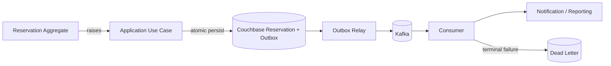

# Haven — Event-Driven Design

## 1. Overview

Haven uses domain events to decouple the reservation core from notification, reporting, audit, and future integrations.

Kafka is the selected transport.

The design must prevent silent event loss between Couchbase persistence and Kafka publication.

---

## 2. Goals

- Keep reservation writes independent of notification latency.
- Publish durable lifecycle facts.
- Support multiple consumers.
- Preserve useful event ordering.
- Tolerate duplicate delivery.
- Make failed publication and consumption observable.
- Support replay and recovery.

---

## 3. Non-Goals

- Exactly-once end-to-end delivery
- Event sourcing
- Kafka as the reservation source of truth
- Synchronous notification in the write path
- Cross-region event replication for MVP

---

## 4. Event Lifecycle



---

## 5. Event Catalog

| Event | Trigger | Primary Consumers |
|---|---|---|
| `ReservationCreated` | Reservation record created | Audit, reporting |
| `ReservationApprovalRequested` | Pending approval created | Notification, approval feed |
| `ReservationConfirmed` | Auto-confirm or approval | Notification, reporting |
| `ReservationRejected` | Approval rejected | Notification, reporting |
| `ReservationCancelled` | Reservation cancelled | Notification, reporting |
| `ReservationExtended` | End time extended | Notification, reporting |
| `ReservationExpired` | Reservation expired | Notification, reporting |
| `ReservationCompleted` | Reservation completed | Reporting |

---

## 6. Event Envelope

```json
{
  "eventId": "evt_01H...",
  "eventType": "ReservationConfirmed",
  "eventVersion": 1,
  "occurredAt": "2026-07-20T05:30:00Z",
  "organizationId": "org_01H...",
  "aggregateType": "Reservation",
  "aggregateId": "rsv_01H...",
  "correlationId": "trace_...",
  "causationId": "cmd_...",
  "payload": {}
}
```

Rules:

- Immutable
- Versioned
- Tenant-aware
- No secrets
- Consumer-safe
- Independent of C++ class layout

---

## 7. Topic Design

Recommended MVP topics:

```text
haven.reservation.events.v1
haven.notification.dlq.v1
haven.reporting.dlq.v1
```

A single reservation event topic is sufficient initially.

Consumers filter by event type.

Separate topics may be introduced when:

- Retention differs
- Access control differs
- Throughput differs substantially
- Consumer ownership requires isolation

---

## 8. Partitioning

Recommended key:

```text
organizationId + reservationId
```

This preserves order for one reservation while distributing different reservations.

Global ordering is neither required nor desirable.

---

## 9. Publication Consistency

### 9.1 Problem

This sequence is unsafe:

```text
save reservation
publish Kafka event
```

A crash between operations loses the event.

Reversing the order can publish an event for a failed reservation.

### 9.2 Decision

Use a transactional outbox or Couchbase-supported atomic transaction to persist:

- Reservation change
- Idempotency result where applicable
- Outbox event

The relay publishes outbox entries asynchronously.

### 9.3 Outbox States

- `PENDING`
- `IN_FLIGHT`
- `PUBLISHED`
- `FAILED_RETRYABLE`
- `DEAD`

State updates use CAS to prevent duplicate relay ownership where multiple relay instances run.

---

## 10. Outbox Relay

Responsibilities:

1. Poll eligible pending events.
2. Claim event using CAS/lease.
3. Publish to Kafka.
4. Mark published.
5. Retry transient failures.
6. Mark terminal failure after policy threshold.
7. Emit metrics and logs.

The relay may run:

- In the Haven process for MVP
- As a separate worker later

The domain and application contracts must not depend on deployment choice.

---

## 11. Producer Semantics

Kafka producer configuration should favor durability:

- Acknowledgment from appropriate replicas
- Idempotent producer enabled where supported
- Bounded delivery timeout
- Retry transient broker failures
- Compression selected after measurement

Producer success does not remove the need for consumer idempotency.

---

## 12. Consumer Semantics

Consumers use at-least-once processing.

Algorithm:

```text
receive event
check deduplication
perform side effect
record completion
commit offset
```

A crash after side effect but before offset commit may redeliver. The consumer must safely repeat or detect the event.

---

## 13. Consumer Idempotency

Deduplication key:

```text
consumerName + eventId
```

Notification channel may additionally use a business delivery key such as:

```text
eventId + recipient + channel
```

Reporting upserts by event ID or aggregate version.

---

## 14. Retry Policy

Classify failures:

### Retryable

- Broker timeout
- Temporary network failure
- Email provider `5xx`
- Rate limit with retry guidance
- Temporary database unavailability

### Non-Retryable

- Invalid event schema
- Unsupported event version
- Missing required payload
- Permanently invalid recipient
- Authorization/configuration error requiring operator action

Use exponential backoff with jitter and bounded attempts.

---

## 15. Dead-Letter Handling

A dead-letter record includes:

- Original envelope
- Consumer
- Failure category
- Attempt count
- First and last failure timestamp
- Safe error summary
- Trace context

Operators must be able to:

- Inspect
- Correct configuration/data where safe
- Replay
- Mark resolved

---

## 16. Schema Evolution

- Event type and version are explicit.
- Consumers support known versions.
- Additive fields are preferred.
- Breaking payload changes create a new event version.
- Old consumers must not break on unknown optional fields.
- Event schemas should be stored under version control.

Suggested location:

```text
schemas/events/reservation/
```

---

## 17. Notification Consumer

Consumes:

- Approval requested
- Confirmed
- Rejected
- Cancelled
- Extended
- Expired

Responsibilities:

- Resolve recipient through approved source
- Select template
- Send channel message
- Record idempotent delivery
- Retry transient failure
- Avoid leaking sensitive reservation data

The reservation core never sends email directly.

---

## 18. Reporting Consumer

Builds derived records for:

- Reservation counts
- Utilization
- Conflict rate
- Approval outcome
- Cancellation rate
- Organization dashboards

Reporting lag does not affect reservation correctness.

---

## 19. Observability

Metrics:

- Outbox pending count
- Oldest pending age
- Publish success/failure
- Kafka delivery latency
- Consumer lag
- Retry count
- DLQ count
- Duplicate event count
- Notification success/failure

Logs include event ID, type, aggregate ID, tenant, attempt, and trace ID.

---

## 20. Failure Scenarios

| Failure | Required Behavior |
|---|---|
| App crashes after atomic persist | Relay later publishes |
| Kafka unavailable | Outbox remains pending |
| Relay crashes after publish before marking | Event may duplicate; consumers deduplicate |
| Consumer crashes after side effect | Duplicate delivery handled |
| Invalid schema | Dead-letter and alert |
| DLQ replay | Preserve original event ID |

---

## 21. Security

- Topics require authenticated clients.
- Producers and consumers use least-privilege ACLs.
- Events exclude JWTs and secrets.
- Personally identifiable data is minimized.
- Tenant identity is validated by consumers.
- DLQ access is restricted.

---

## 22. Alternatives

### Direct Synchronous HTTP Notification

Rejected due to coupling and latency.

### Publish Directly Without Outbox

Rejected due to dual-write loss.

### RabbitMQ

A valid task-queue alternative, but Kafka is selected for durable event streams, replay, and multiple consumers.

### Event Sourcing

Rejected because Haven stores current aggregate state and does not need events as the authoritative source.

---

## 23. Test Strategy

- Event creation unit tests
- Envelope serialization tests
- Outbox atomicity integration tests
- Relay retry tests
- Duplicate publication tests
- Consumer dedup tests
- DLQ tests
- Schema compatibility tests
- Kafka container integration tests
- Failure injection

---

## 24. Interview Discussion Notes

### Why is at-least-once acceptable?

At-least-once is operationally practical when consumers are idempotent. Exactly-once across Kafka and external side effects is not generally guaranteed.

### Why use an outbox?

It converts an unsafe database/broker dual write into one durable database transaction plus retryable publication.

### Why partition by reservation?

Events for one reservation remain ordered without serializing all tenants or resources.

---

## 25. Summary

Haven raises domain events, persists them through an outbox with reservation state, publishes them to Kafka, and uses idempotent at-least-once consumers.

---

## 26. Next Document

```text
docs/08-concurrency.md
```
