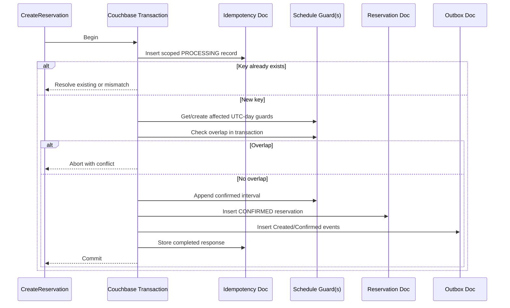

# Haven — Concurrency and Idempotency

## 1. Overview

This document defines how Haven prevents double booking, lost updates, duplicate reservations, and unsafe retries.

The core challenge is atomic creation of a new reservation. A simple overlap query followed by insert is not sufficient because two concurrent requests can both observe no conflict.

---

## 2. Correctness Guarantees

Haven must guarantee:

1. At most one conflicting confirmed reservation wins.
2. No silent lost update to an existing reservation.
3. Same idempotency key and payload returns the same result.
4. Same idempotency key with a different payload is rejected.
5. Retries are bounded.
6. Search does not acquire locks.
7. Redis is not required for correctness.
8. Events are persisted consistently with reservation state.

---

## 3. Interval Model

Reservations use half-open intervals:

```text
[start, end)
```

Overlap:

```text
existing.start < requested.end
AND existing.end > requested.start
```

Adjacent intervals are allowed.

---

## 4. Concurrency Threats

### 4.1 Check-Then-Insert Race

```text
Request A: no overlap
Request B: no overlap
Request A: insert
Request B: insert
```

Result without protection: double booking.

### 4.2 Concurrent Update

Approval and cancellation may read the same version and overwrite each other.

### 4.3 Duplicate Client Retry

A timeout may cause the client to submit the same logical create request again.

### 4.4 Event Dual Write

Reservation may persist while event publication fails.

### 4.5 Pending Approval Race

A resource may be booked while a request awaits approval. Approval must recheck before confirmation.

---

## 5. Selected Strategy

Use:

- Couchbase transactions for atomic multi-document create/update workflows
- Per-resource UTC-day schedule guard documents
- CAS for existing aggregate updates and guard ownership
- Durable idempotency records
- Transactional outbox
- Bounded retries on classified transient conflicts

This serializes only operations contending for the same resource and day bucket.

---

## 6. Schedule Guard Document

Key:

```text
schedule::<organizationId>::<resourceId>::<yyyy-mm-dd-utc>
```

Example:

```json
{
  "documentType": "resourceSchedule",
  "schemaVersion": 1,
  "organizationId": "org_01H...",
  "resourceId": "res_01H...",
  "utcDate": "2026-08-01",
  "confirmedIntervals": [
    {
      "reservationId": "rsv_01H...",
      "startTime": "2026-08-01T10:00:00Z",
      "endTime": "2026-08-01T11:00:00Z"
    }
  ],
  "updatedAt": "2026-07-20T05:30:00Z"
}
```

The guard is a compact concurrency projection, not the authoritative reservation history.

Authoritative state remains the Reservation document.

---

## 7. Why Daily Buckets

Maximum duration is 12 hours, or 24 hours for maintenance.

A reservation therefore touches at most two UTC date buckets.

Benefits:

- Narrow contention
- Bounded document size
- Efficient in-transaction overlap check
- No global resource lock
- Direct key access
- Simple cleanup/rebuild from reservations

Trade-off:

- Cross-midnight operations touch two guard documents.
- Hot resources can still create contention within one day.
- Guard consistency requires transactional updates.

---

## 8. Auto-Confirmed Create Algorithm



The conflict decision and allocation claim occur inside one transaction.

---

## 9. Pending Approval Create

Pending approval does not claim the schedule guard in the recommended MVP policy.

Transaction persists:

- `PENDING_APPROVAL` reservation
- Idempotency result
- `ReservationCreated`
- `ReservationApprovalRequested`

Approval later claims the guard transactionally.

This avoids long-lived holds but means approval can fail due to intervening conflict.

---

## 10. Approval Algorithm

```text
begin transaction
load reservation
validate expected pending state and approver
load affected guard documents
check overlap
if conflict: abort with reservation conflict
append interval to guards
update reservation to confirmed using transaction/CAS
insert ReservationConfirmed outbox event
commit
```

Concurrent cancellation or another approval is detected through transactional read/write conflict or CAS.

---

## 11. Cancellation Algorithm

For a confirmed reservation:

```text
begin transaction
load reservation
validate cancellable state
load affected guards
remove interval matching reservationId
update reservation to CANCELLED
insert ReservationCancelled outbox event
commit
```

The historical Reservation remains.

If guard data is missing or inconsistent, fail safely and alert rather than silently release unknown allocation.

For pending approval, no guard removal is needed.

---

## 12. Extension Algorithm

```text
begin transaction
load confirmed reservation
validate new end > old end
resolve old and new affected guard keys
remove existing interval from old guards
check new interval against remaining guard intervals
if conflict: abort
insert updated interval into new guards
update reservation
insert ReservationExtended event
commit
```

All touched guard documents must be sorted by key before transaction access where the SDK recommends consistent ordering.

---

## 13. Existing Reservation CAS

Repository rehydration captures the Couchbase CAS/version.

Updates require expected version.

If CAS differs:

- Do not overwrite.
- Reload.
- Re-evaluate operation if safely retryable.
- Return concurrent modification if no longer valid.

Domain objects do not know Couchbase CAS; infrastructure maps it to a neutral `Version`.

---

## 14. Idempotency Scope

Key:

```text
organizationId + userId + operation + idempotencyKey
```

Payload hash is computed over canonical business input:

- Resource ID
- Start time
- End time
- Purpose
- Relevant operation version

Headers unrelated to business content are excluded.

---

## 15. Idempotency States

### PROCESSING

Request claimed but not completed.

### COMPLETED

Stable response is stored.

### FAILED_FINAL

Stable non-retryable result may be stored where useful.

### Expired

Record removed after retention.

Because reservation and idempotency completion are committed in one transaction, an indefinitely stranded `PROCESSING` state should be rare. If pre-transaction claiming is introduced later, lease recovery is required.

---

## 16. Same-Key Behavior

| Existing State | Same Payload | Different Payload |
|---|---|---|
| Completed | Return original result | 409 mismatch |
| Processing | Wait boundedly or return retryable in-progress | 409 mismatch |
| Failed final | Return stable failure | 409 mismatch |
| Missing | Process | Process as new |

---

## 17. Retry Policy

Retry only:

- Transaction conflict
- Temporary Couchbase timeout
- CAS conflict when use case remains valid
- Transient broker publication by outbox relay

Do not retry:

- Business overlap
- Invalid state
- Authorization failure
- Payload mismatch
- Resource inactive
- Duration violation

Recommended application transaction retries:

- Small bounded count
- Exponential backoff with jitter
- Total deadline below API timeout
- Metrics for each retry and exhaustion

---

## 18. Deadlock and Livelock Avoidance

- Touch guard documents in deterministic key order.
- Bound transaction duration.
- Avoid network calls inside database transactions.
- Load policy/resource before transaction when safe, then revalidate critical state if required.
- Keep guard documents compact.
- Use jittered retry.
- Return conflict rather than endlessly retrying a hot resource.

---

## 19. Reconciliation

Guard documents are derived from confirmed reservations and can be rebuilt.

A reconciliation job should detect:

- Confirmed reservation missing from guard
- Guard interval with missing/non-confirmed reservation
- Duplicate interval reservation IDs
- Invalid interval ordering

Reconciliation initially runs as an operational tool, not the normal write path.

---

## 20. Redis Lock Alternative

Rejected as primary mechanism because:

- Adds correctness dependency on cache
- Requires expiry/renewal safety
- Lock ownership can be lost
- Database write and lock release are separate failure points
- Redlock-style guarantees require careful assumptions

Redis may still support rate limiting or performance optimization.

---

## 21. Single Resource Schedule Document Alternative

One unbounded schedule document per resource was rejected because:

- Grows indefinitely
- Hot document
- Expensive mutation
- History cleanup complexity

Daily buckets bound growth.

---

## 22. Database Transaction Alternative Concerns

Couchbase transactions add:

- Latency
- Retry complexity
- Operational dependency on transaction support
- More integration testing

They are accepted because correctness is more important than a simpler unsafe write.

---

## 23. Search Consistency

Search may use indexed Reservation documents or guard projections.

It is not authoritative.

Create/approve uses direct guard documents inside a transaction.

This avoids relying on N1QL index visibility for correctness.

---

## 24. Failure Scenarios

| Failure | Outcome |
|---|---|
| Crash before commit | No allocation |
| Crash after commit before response | Retry returns idempotent result |
| Transaction conflict | Bounded retry |
| Guard conflict | One wins |
| Kafka unavailable | Outbox remains pending |
| Redis unavailable | No correctness change |
| Duplicate event | Consumer deduplicates |
| Reconciliation finds mismatch | Alert and repair procedure |

---

## 25. Metrics

- Transaction attempts
- Transaction retries
- Transaction aborts
- Guard conflict count
- CAS conflict count
- Idempotency hit
- Idempotency mismatch
- Idempotency in-progress wait
- Retry exhausted
- Hot resource IDs sampled in logs, not metric labels
- Reconciliation mismatch count

---

## 26. Concurrency Tests

### CT-001

100 concurrent identical interval requests for one resource produce exactly one confirmed reservation.

### CT-002

Adjacent intervals both succeed.

### CT-003

Cross-midnight conflicting requests produce one winner.

### CT-004

Same idempotency key produces one reservation.

### CT-005

Same key with changed payload fails.

### CT-006

Approval racing with cancellation results in one valid terminal/confirmed outcome.

### CT-007

Extension racing with new reservation preserves no overlap.

### CT-008

Crash simulation after transaction commit returns original result on retry.

### CT-009

Outbox event exists for every committed transition.

---

## 27. Interview Discussion Notes

### Why is a pre-insert overlap query insufficient?

Read and insert are not atomic. Two writers can observe the same empty state.

### Why use guard documents if reservations are source of truth?

Guards are a concurrency projection used for atomic allocation. They are rebuildable from authoritative reservations.

### Why daily buckets?

The duration limit bounds the number of documents touched while reducing contention and document growth.

### Why not lock during search?

Search is a read snapshot. Locking would reduce throughput and create abandoned hold problems.

### Is this optimistic or pessimistic?

It is optimistic concurrency: requests attempt a transaction and conflicts cause one to retry or lose. No long-lived external lock is acquired before work.

---

## 28. Summary

Haven prevents double booking through transactional, per-resource daily schedule guards, CAS-protected aggregate updates, durable idempotency, and bounded retry.

Reservation documents remain authoritative; guards are rebuildable correctness projections.

---

## 29. Next Document

```text
docs/09-caching.md
```
