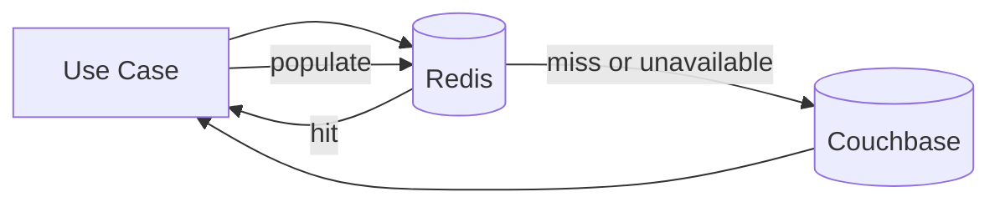

# Haven — Caching Design

## 1. Overview

Redis improves read performance and protects Couchbase from repeated access.

Redis is not authoritative for reservation correctness.

---

## 2. Goals

- Reduce repeated resource metadata reads.
- Cache slow-changing organization policies.
- Support rate limiting.
- Permit safe fallback on cache failure.
- Keep tenant data isolated.
- Avoid difficult reservation-state invalidation in MVP.

---

## 3. Non-Goals

- Redis distributed lock for reservation correctness
- Authoritative reservation storage
- Long-lived availability truth
- Write-behind persistence
- Cross-region cache coherence

---

## 4. Cacheable Data

### 4.1 Organization Policies

Key:

```text
haven:v1:org:<organizationId>:policies
```

TTL recommendation: 5–15 minutes with explicit invalidation on policy update.

### 4.2 Resource Metadata

Key:

```text
haven:v1:org:<organizationId>:resource:<resourceId>
```

TTL recommendation: 5 minutes.

### 4.3 Search Candidate Metadata

Optional key:

```text
haven:v1:org:<organizationId>:resource-search:<criteriaHash>
```

Cache only resource catalog candidates, not guaranteed availability.

TTL: short, such as 30–60 seconds.

### 4.4 Rate Limits

Keys include tenant/user/endpoint scope.

### 4.5 Negative Cache

Short-lived negative caching may be used for missing resource IDs, but cross-tenant and security semantics must remain safe.

---

## 5. Data Not Cached in MVP

- Mutable reservation aggregate
- Idempotency authoritative record
- Schedule guard documents
- Pending approval authoritative state
- Outbox publication state

This avoids correctness coupling and invalidation complexity.

---

## 6. Cache-Aside Flow



Rules:

- Cache failure is treated as miss.
- Couchbase remains authoritative.
- Cache write failure does not fail the business request.
- Timeouts are short and bounded.

---

## 7. Tenant Isolation

Every tenant-owned key includes organization ID.

Never use a resource ID alone if identifiers might collide or be guessed.

Cache adapters require organization context in method signatures.

---

## 8. Serialization

Cache payloads include:

- Schema version
- Cached-at time
- Safe data only

Example:

```json
{
  "schemaVersion": 1,
  "cachedAt": "2026-07-20T05:30:00Z",
  "resourceId": "res_01H...",
  "name": "Orion",
  "resourceType": "MEETING_ROOM",
  "capacity": 8,
  "status": "ACTIVE"
}
```

---

## 9. Invalidation

### Resource Update

Delete:

- Resource detail key
- Related search candidate keys where tracked

For MVP, short TTL may replace complex fan-out invalidation.

### Organization Policy Update

Delete exact policy key.

### Resource Deactivation

Invalidate immediately to reduce chance of stale search candidates.

The write path always revalidates authoritative resource state.

---

## 10. Stampede Protection

For hot cache misses:

- Small request coalescing may be added later.
- TTL jitter prevents synchronized expiry.
- Short Redis timeout avoids thread starvation.
- Couchbase protection relies on rate limiting and bounded concurrency.

Do not introduce distributed single-flight until measured need exists.

---

## 11. Availability Search

Recommended MVP:

1. Cache resource catalog candidate metadata.
2. Query authoritative/derived blocking reservations.
3. Exclude unavailable IDs.
4. Paginate.

Do not cache final availability for long periods.

A very short final-query cache may be evaluated later, but create reservation still performs authoritative allocation.

---

## 12. Failure Behavior

| Failure | Behavior |
|---|---|
| Redis timeout | Treat as miss |
| Redis unavailable | Bypass |
| Deserialization failure | Delete/ignore key and load DB |
| Stale active resource | Write path revalidates |
| Cache write failure | Log/metric; request succeeds |
| High latency | Circuit-break or temporary bypass |

---

## 13. Circuit Breaker

A local circuit breaker may temporarily bypass Redis after repeated failures.

States:

- Closed
- Open
- Half-open

Redis circuit state is process-local and affects only optimization.

---

## 14. Rate Limiting

Redis may implement:

- Token bucket
- Sliding window counter
- Fixed window for initial MVP

Suggested scopes:

- Per user create reservation
- Per tenant search
- Per IP authentication
- Per approver action

Rate-limit failure policy must be explicit. If Redis is unavailable, fail-open or fail-closed depends on endpoint security risk.

---

## 15. Metrics

- Cache hit/miss
- Cache bypass
- Redis latency
- Redis errors
- Circuit state
- Serialization failures
- Invalidation count
- Rate-limit allowed/denied

Avoid key values as metric labels.

---

## 16. Security

- Redis requires authentication and private network access.
- Do not store JWTs.
- Do not store secrets in values.
- Minimize personal data.
- Configure eviction policy deliberately.
- Use TLS in production where required.

---

## 17. Alternatives

### No Cache

Simplest and valid initial baseline. Redis should be introduced after measuring database load.

### Cache Reservation State

Rejected for MVP due to invalidation and correctness risk.

### Read-Through Framework Cache

Rejected initially because explicit cache-aside behavior is easier to reason about and test.

---

## 18. Tests

- Hit
- Miss
- Redis unavailable
- Stale schema
- Invalid payload
- Invalidation
- Tenant key isolation
- TTL
- Rate limit
- Circuit breaker

---

## 19. Interview Discussion Notes

### Why use Redis if the database can answer?

To reduce repeated slow-changing reads and support rate limiting, while keeping correctness in Couchbase.

### What happens during Redis outage?

Latency may rise, but reservation correctness remains unchanged.

### Why not cache availability?

Availability changes frequently and search is already a snapshot. Long-lived caching creates poor freshness with limited correctness value.

---

## 20. Summary

Redis is an optional cache-aside optimization for policies, resource metadata, search candidates, and rate limits.

It never owns confirmed allocation state.

---

## 21. Next Document

```text
docs/10-security.md
```
