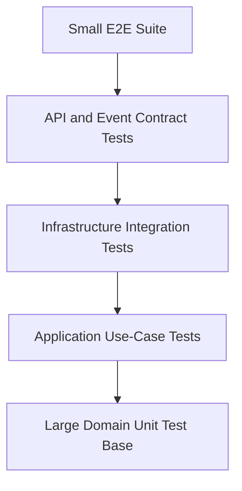

# Haven — Testing Strategy

## 1. Overview

Haven's testing strategy validates domain correctness, application orchestration, infrastructure behavior, API contracts, concurrency guarantees, failure recovery, and performance.

Tests are organized by the risk they protect against rather than by arbitrary coverage targets alone.

---

## 2. Goals

- Prove reservation invariants.
- Prove no-double-booking behavior under concurrency.
- Validate tenant isolation.
- Validate idempotency.
- Validate Couchbase mappings and indexes.
- Validate outbox and Kafka behavior.
- Validate degraded dependency behavior.
- Keep most tests fast and deterministic.
- Provide reproducible local and CI execution.

---

## 3. Test Pyramid



Most behavior should be proven below the HTTP and infrastructure boundary.

---

## 4. Test Categories

### 4.1 Domain Unit Tests

No Docker, network, framework, or database.

Targets:

- Value objects
- Aggregate state transitions
- Domain policies
- Event generation
- Invariants

### 4.2 Application Tests

Use fakes for:

- Repositories
- Clock
- ID generator
- Authorization
- Idempotency
- Event persistence boundary

Targets:

- Use-case sequencing
- Error propagation
- Authorization
- Retry decisions
- Correct dependency calls
- Stable outputs

### 4.3 Infrastructure Integration Tests

Use real containerized:

- Couchbase
- Redis
- Kafka

Targets:

- Serialization
- Queries
- CAS
- Transactions
- Cache TTL
- Kafka publication/consumption
- Outbox relay

### 4.4 API Contract Tests

Run through Drogon.

Targets:

- Routes
- Authentication
- Request validation
- Response JSON
- Error contract
- Headers
- OpenAPI compatibility

### 4.5 Concurrency Tests

Use real persistence and coordinated parallel execution.

### 4.6 End-to-End Tests

Small number of critical user journeys across all required components.

### 4.7 Performance Tests

Use Google Benchmark and load tests for selected workflows.

---

## 5. Domain Test Matrix

### TimeInterval

- Start equals end rejected
- Start after end rejected
- Exact overlap
- Partial overlap
- Containment
- Adjacency
- Cross-midnight
- Duration

### Reservation

- Auto-confirmed creation
- Pending approval creation
- Approve
- Reject
- Cancel pending
- Cancel confirmed
- Invalid terminal mutation
- Extend
- Duration violation
- Complete
- Expire
- Event generation

### Policies

- Standard 12-hour maximum
- Maintenance 24-hour maximum
- Unauthorized maintenance
- Approval rule match
- Inactive organization/resource

---

## 6. Application Test Matrix

### Create Reservation

- Existing idempotent result
- Idempotency mismatch
- Resource missing
- Cross-tenant resource hidden
- Resource inactive
- Policy violation
- Conflict
- Auto-confirm
- Pending approval
- Transaction retry
- Retry exhaustion
- Outbox result present

### Approval

- Authorized approval
- Unauthorized approver
- Missing reservation
- Already decided
- Conflict at approval
- Concurrent cancellation

### Search

- Required type
- Filters
- Cache hit
- Cache miss
- Redis unavailable
- Blocking IDs excluded
- Pagination

---

## 7. Repository Tests

### Couchbase

- Key conventions
- Organization/resource/reservation round trip
- Schema version
- Tenant predicate
- Overlap query
- User listing
- Pending approval listing
- Transaction commit
- Transaction rollback
- CAS mismatch
- Guard document update
- Idempotency atomicity
- Outbox atomicity

### Query Plans

For critical queries:

- Run `EXPLAIN`
- Verify expected index
- Record representative plan in test artifacts where practical

---

## 8. Concurrency Test Design

### Deterministic Barrier

Use a barrier so workers reach the critical operation together.

### Required Scenarios

1. 100 same-resource same-interval creates.
2. Adjacent intervals.
3. Partially overlapping intervals.
4. Cross-day guard transaction.
5. Same idempotency key.
6. Different idempotency keys.
7. Approval vs cancellation.
8. Extension vs new reservation.
9. Two application instances.
10. Transaction retry exhaustion.

Assertions:

- Exactly one conflicting confirmation.
- No duplicate reservation.
- Guards match confirmed reservations.
- Outbox event count is correct.
- Stable error category for losers.

---

## 9. Event Tests

- Envelope serialization
- Event version
- Tenant/correlation fields
- Outbox persistence
- Relay claim with CAS
- Publish retry
- Duplicate publish
- Consumer dedup
- DLQ
- Replay
- Unsupported version

---

## 10. Cache Tests

- Hit
- Miss
- TTL
- Tenant key
- Invalidation
- Corrupt value
- Redis timeout
- Circuit breaker
- Rate limit
- Fallback result equivalence

---

## 11. Security Tests

- Missing JWT
- Expired JWT
- Invalid signature
- Wrong issuer/audience
- Cross-tenant ID
- Missing approver permission
- Oversized body
- Injection attempt
- Log redaction
- Hidden object existence
- Rate limit

---

## 12. Failure Injection

Inject:

- Couchbase timeout
- Transaction conflict
- Redis outage
- Kafka outage
- Consumer crash
- Relay crash after publish
- Invalid configuration
- Clock boundary
- Graceful shutdown during work

Fakes should support deterministic failure scripts.

---

## 13. Test Data

Use builders/factories for tests:

- `OrganizationBuilder`
- `ResourceBuilder`
- `ReservationBuilder`
- `CallerContextBuilder`

Test builders belong to test code and may expose convenient mutation not allowed in production domain APIs.

Use fixed UTC timestamps and deterministic IDs.

---

## 14. Test Naming

Recommended:

```text
<Operation>_Should<Expected>_When<Condition>
```

Examples:

```text
CreateReservation_ShouldReturnConflict_WhenIntervalOverlaps
ApproveReservation_ShouldFail_WhenResourceWasBookedWhilePending
```

---

## 15. Mocking Policy

Prefer:

1. Real value objects
2. In-memory fakes
3. Handwritten test doubles
4. Mocks only for interaction-specific boundaries

Avoid over-mocking domain behavior.

Tests should assert externally visible behavior more than call order.

---

## 16. Coverage

Coverage is diagnostic, not the goal.

Recommended thresholds may be applied to:

- Domain
- Application

Critical paths require explicit scenario coverage regardless of line percentage.

Generated code and trivial adapters may be excluded with justification.

---

## 17. CI Test Stages

### Fast

- Format check
- Static analysis
- Domain tests
- Application tests

### Integration

- Start containers
- Couchbase tests
- Redis tests
- Kafka tests
- API contract tests

### Extended

- Concurrency
- Sanitizers
- Benchmarks
- Failure injection
- E2E

Extended jobs may run on main branch or scheduled CI if runtime is high.

---

## 18. Sanitizers

Use compatible builds with:

- AddressSanitizer
- UndefinedBehaviorSanitizer
- ThreadSanitizer
- LeakSanitizer where supported

ThreadSanitizer is especially important for shared adapter and consumer code.

---

## 19. Test Environment Isolation

- Unique tenant/test IDs
- Clean collections or isolated scope
- Deterministic setup
- No dependency on test order
- Bounded timeouts
- Automatic container cleanup
- Parallel-safe where possible

---

## 20. Flaky Test Policy

A flaky test is a defect.

Do not add blind retries to hide flakiness.

Diagnose:

- Timing assumptions
- Shared state
- Port conflicts
- Eventual consistency
- Non-deterministic IDs/time
- Container readiness

---

## 21. Acceptance Test Mapping

Each Must requirement in `01-requirements.md` should map to one or more tests.

Maintain a traceability table for critical requirements:

| Requirement | Test Suite |
|---|---|
| No double booking | Concurrency |
| Idempotent retry | Application + integration |
| Tenant isolation | Security + repository |
| Event durability | Outbox integration |
| Redis degradation | Cache + API |
| Approval conflict | Application + concurrency |

---

## 22. Performance Regression

Benchmarks define warning thresholds.

Do not fail CI on noisy microbenchmarks without stable infrastructure.

Track trends for:

- TimeInterval overlap
- Serialization
- Candidate filtering
- Guard interval check
- Reservation transaction
- Search query

---

## 23. Review Checklist

- Does test name describe behavior?
- Is time deterministic?
- Is tenant isolation represented?
- Are failure paths included?
- Does the test avoid implementation coupling?
- Can it run independently?
- Is concurrency assertion strong?
- Are test logs useful on failure?

---

## 24. Interview Discussion Notes

### Why not only integration tests?

They are slower and make business failures harder to localize. Domain tests provide fast proof while integration tests validate adapters.

### How do you test double booking?

Coordinate concurrent requests against real Couchbase transaction/guard infrastructure and assert exactly one winner.

### Why use fakes instead of mocks?

Fakes preserve realistic state behavior and reduce brittle interaction assertions.

---

## 25. Summary

Haven uses a broad domain test base, focused application tests, real infrastructure integration tests, API contracts, deterministic concurrency tests, failure injection, and selective E2E coverage.

---

## 26. Next Document

```text
docs/13-performance.md
```
