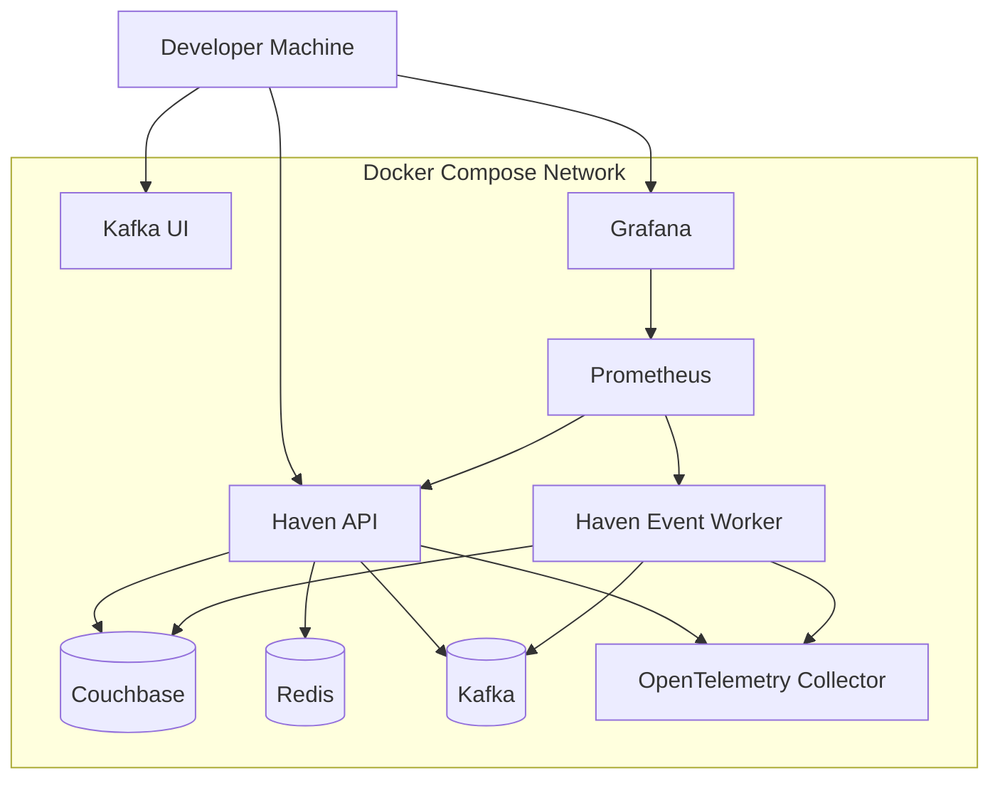
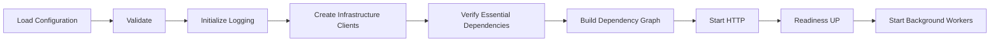
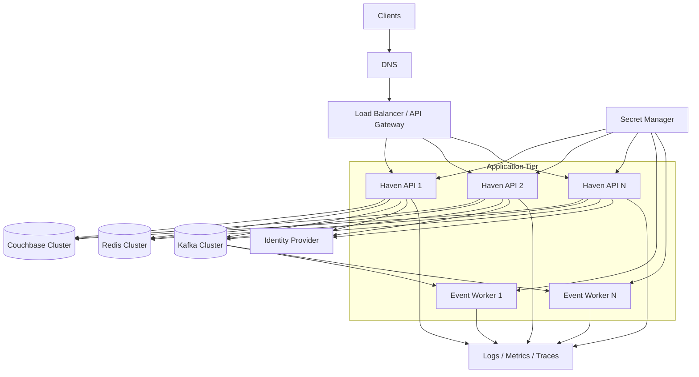

# Haven — Deployment Design

## 1. Overview

This document defines how Haven is built, configured, packaged, deployed, started, monitored, upgraded, and recovered.

The MVP is deployed as a modular monolith with external infrastructure dependencies:

- Couchbase
- Redis
- Kafka
- Optional Kafka UI
- Optional observability stack

Local development uses Docker Compose. The application may run either inside a container or directly on the developer machine while dependencies run in containers.

The production evolution path uses multiple stateless Haven instances behind a load balancer with clustered infrastructure.

---

## 2. Goals

- Provide reproducible local development.
- Keep application configuration externalized.
- Produce deterministic builds.
- Support safe startup and graceful shutdown.
- Distinguish liveness from readiness.
- Support horizontal application scaling.
- Enable rolling deployment.
- Preserve reservation correctness during deployment and dependency failure.
- Provide repeatable database and index initialization.
- Define CI/CD quality gates.
- Make rollback and recovery practical.
- Avoid production assumptions that are not required for MVP.

---

## 3. Non-Goals

The MVP deployment design does not require:

- Multi-region active-active writes
- Kubernetes implementation
- Service mesh
- Automatic database failover engineering
- Blue-green deployment infrastructure
- Zero-downtime schema migration for every possible change
- Independent microservice deployment
- Production-grade secret manager integration in local development
- Cross-cloud portability guarantees

These may be introduced later when requirements justify them.

---

## 4. Deployment Units

### 4.1 Haven API Process

Responsibilities:

- Serve HTTP APIs
- Authenticate and authorize
- Execute application use cases
- Access Couchbase and Redis
- Persist outbox records
- Expose health and telemetry endpoints

### 4.2 Outbox Relay

MVP options:

1. Run inside the Haven process as a managed background component.
2. Run as a separate worker process using the same codebase.

Recommended initial choice:

- Run in-process for local development and early MVP.
- Preserve a separate application boundary so it can be extracted later.

### 4.3 Event Consumers

Notification and reporting consumers may initially run:

- In the same process for simplicity, or
- As separate worker containers when operational isolation becomes useful.

The preferred portfolio architecture is separate worker containers because it demonstrates asynchronous deployment boundaries without converting the core application into microservices.

### 4.4 Infrastructure

- Couchbase
- Redis
- Kafka
- Kafka UI for local debugging
- Optional Prometheus
- Optional Grafana
- Optional OpenTelemetry Collector
- Optional Jaeger-compatible tracing backend

---

## 5. Local Development Topology



The minimal local profile requires only:

- Haven API
- Couchbase
- Redis
- Kafka

Observability services are optional through Docker Compose profiles.

---

## 6. Repository Deployment Structure

```text
Haven/
├── docker/
│   ├── haven/
│   │   └── Dockerfile
│   ├── couchbase/
│   │   ├── init.sh
│   │   └── indexes/
│   ├── kafka/
│   └── observability/
│
├── config/
│   ├── application.local.yaml
│   ├── application.test.yaml
│   └── application.example.yaml
│
├── scripts/
│   ├── bootstrap-local.sh
│   ├── wait-for-couchbase.sh
│   ├── create-indexes.sh
│   ├── seed-data.sh
│   ├── run-tests.sh
│   └── smoke-test.sh
│
├── .github/
│   └── workflows/
│       ├── build.yml
│       ├── integration.yml
│       ├── security.yml
│       └── release.yml
│
├── docker-compose.yml
├── Dockerfile
├── CMakeLists.txt
├── CMakePresets.json
└── vcpkg.json
```

---

## 7. Docker Image Design

Use a multi-stage build.

### 7.1 Builder Stage

Contains:

- Supported compiler
- CMake
- Ninja
- vcpkg
- Development headers
- Build dependencies
- Test tools where needed

Produces:

- Haven executable
- Worker executable if separate
- Runtime configuration schema
- Optional migration/bootstrap tools

### 7.2 Runtime Stage

Contains only:

- Runtime libraries
- CA certificates
- Haven binaries
- Default non-secret configuration
- Health-check utility if required

Rules:

- Run as non-root.
- Use read-only filesystem where practical.
- Do not include compiler or source code unnecessarily.
- Do not bake secrets into the image.
- Pin the base image by version.
- Minimize image size without sacrificing debuggability.
- Include build metadata labels.

---

## 8. Example Multi-Stage Dockerfile Shape

```dockerfile
FROM ubuntu:24.04 AS builder

RUN apt-get update && apt-get install -y \
    build-essential \
    cmake \
    ninja-build \
    git \
    curl \
    pkg-config \
    && rm -rf /var/lib/apt/lists/*

WORKDIR /workspace

COPY vcpkg.json CMakeLists.txt CMakePresets.json ./
COPY cmake ./cmake
COPY src ./src
COPY apps ./apps

RUN cmake --preset release
RUN cmake --build --preset release --parallel

FROM ubuntu:24.04 AS runtime

RUN apt-get update && apt-get install -y \
    ca-certificates \
    && rm -rf /var/lib/apt/lists/*

RUN useradd --system --uid 10001 haven

WORKDIR /app

COPY --from=builder /workspace/build/release/apps/server/haven-server /app/haven-server

USER haven

EXPOSE 8080

ENTRYPOINT ["/app/haven-server"]
```

The actual dependency installation strategy must align with vcpkg and CI caching.

---

## 9. Docker Compose Services

Recommended service set:

```yaml
services:
  haven-api:
  haven-worker:
  couchbase:
  redis:
  kafka:
  kafka-ui:
  prometheus:
  grafana:
  otel-collector:
```

### 9.1 Compose Profiles

Suggested profiles:

| Profile | Services |
|---|---|
| `core` | Couchbase, Redis, Kafka |
| `app` | Core + Haven API |
| `workers` | Event workers |
| `observability` | Prometheus, Grafana, tracing |
| `full` | All services |

This keeps the minimum local environment lightweight.

---

## 10. Service Dependencies

Container startup order is not readiness.

`depends_on` alone is insufficient.

Haven must independently retry dependency initialization with bounded backoff during startup.

Recommended startup sequence:

1. Load and validate configuration.
2. Initialize logging.
3. Initialize telemetry.
4. Connect to Couchbase.
5. Validate required collections and indexes.
6. Initialize Redis adapter.
7. Initialize Kafka producer.
8. Construct application graph.
9. Start HTTP server.
10. Mark readiness true.
11. Start background relay/consumer components if configured.

If an essential dependency is unavailable beyond the startup deadline, the process should exit or remain unready according to deployment policy.

---

## 11. Configuration Model

Configuration is externalized and validated at startup.

Categories:

- Server
- Couchbase
- Redis
- Kafka
- JWT
- Logging
- Telemetry
- Retry
- Timeout
- Rate limiting
- Feature flags
- Worker settings

### 11.1 Configuration Precedence

Recommended order:

```text
compiled safe defaults
< configuration file
< environment variables
< command-line overrides
```

Secrets should be supplied through environment variables or a secret manager.

### 11.2 Example Environment Variables

```text
HAVEN_ENVIRONMENT=local
HVN_HTTP_PORT=8080

HAVEN_COUCHBASE_CONNECTION_STRING=couchbase://couchbase
HAVEN_COUCHBASE_USERNAME=haven
HAVEN_COUCHBASE_PASSWORD=...

HAVEN_REDIS_HOST=redis
HAVEN_REDIS_PORT=6379

HAVEN_KAFKA_BROKERS=kafka:9092

HAVEN_JWT_ISSUER=https://identity.example.com/
HAVEN_JWT_AUDIENCE=haven-api

HVN_LOG_LEVEL=info
HAVEN_METRICS_ENABLED=true
HAVEN_TRACING_ENABLED=false
```

---

## 12. Configuration Validation

Startup must reject:

- Missing required secrets
- Invalid port
- Unsupported environment
- Invalid timeout hierarchy
- Negative retry count
- Empty Kafka broker list when event publication is enabled
- Invalid JWT issuer/audience
- Invalid Couchbase collection names
- Unsupported log level

Validation errors must identify the configuration key without printing secret values.

---

## 13. Environment Definitions

### 13.1 Local

- Docker Compose infrastructure
- Developer-friendly logging
- Optional Swagger UI
- Seed data
- Relaxed resource limits
- Local JWT test issuer or development token strategy

### 13.2 Test

- Isolated collections or unique prefixes
- Deterministic time and data
- Short timeouts
- Containers started by test automation
- No production credentials

### 13.3 Staging

- Production-like configuration
- Synthetic tenants
- Restricted external integrations
- Full telemetry
- Migration rehearsal
- Load and failure testing

### 13.4 Production

- TLS
- Managed secrets
- Restricted network
- Clustered dependencies
- Multiple Haven instances
- Backups
- Alerts
- Controlled rollout
- No default development credentials
- Swagger UI restricted or disabled

---

## 14. Local Bootstrap

Recommended command:

```bash
./scripts/bootstrap-local.sh
```

Responsibilities:

1. Check Docker and required tools.
2. Start core containers.
3. Wait for Couchbase management readiness.
4. Create bucket, scopes, and collections.
5. Create required indexes.
6. Seed organizations and resources.
7. Start Haven.
8. Run smoke tests.
9. Print service URLs.

The script must be idempotent.

---

## 15. Couchbase Initialization

Initialization creates:

```text
Bucket: haven

Scopes:
  core
  integration

Collections:
  core.organizations
  core.resources
  core.reservations
  core.idempotency
  core.resource_schedules
  integration.outbox
  integration.consumer_dedup
```

Initialization also creates documented indexes.

Rules:

- Initialization scripts are version-controlled.
- Index creation is repeatable.
- Production changes require review.
- Application startup should verify required schema version.
- The application should not silently create arbitrary production schema.

---

## 16. Seed Data

Local seed data should include:

- Two to three organizations
- Standard and priority resources
- Multiple resource types
- Active and inactive resources
- Representative locations and features
- Test approver and user identities
- No real personal information

Seed scripts must be safe to rerun.

---

## 17. Application Startup

Startup phases:



Readiness must remain false until the application can safely serve its required traffic.

---

## 18. Liveness and Readiness

### 18.1 Liveness

Purpose:

> Is the process alive and capable of making progress?

It should not query every dependency.

A temporary Couchbase outage must not automatically trigger endless restart loops through liveness failure.

### 18.2 Readiness

Purpose:

> Can this instance safely serve traffic now?

Readiness may require:

- Valid configuration
- Couchbase reachable
- Required bucket/scope/collection available
- Application initialization complete

Redis may report degraded without making the instance unready if fallback works.

Kafka readiness depends on the selected outbox capacity and policy. A short Kafka outage should not necessarily make reservation writes unavailable when events are safely persisted.

---

## 19. Graceful Shutdown

On `SIGTERM` or equivalent:

1. Mark readiness false.
2. Stop accepting new requests.
3. Allow in-flight requests to complete within a bounded grace period.
4. Stop polling new outbox work.
5. Stop accepting new Kafka records.
6. Complete or safely abandon in-progress consumer work.
7. Flush telemetry within a bounded timeout.
8. Close clients through RAII.
9. Exit.

The process must not wait indefinitely.

---

## 20. Stateless Application Instances

Haven API instances must not store authoritative session or reservation state in process memory.

Process-local state may include:

- Connection pools
- Immutable configuration
- Circuit-breaker state
- Short-lived request coalescing
- Metrics
- In-flight work

Losing an instance must not lose committed reservations or idempotency results.

---

## 21. Production Topology



---

## 22. Load Balancing

Requirements:

- Health-aware routing
- No sticky sessions required
- Request ID propagation
- TLS termination or pass-through
- Bounded request body
- Connection timeout
- Idle timeout
- Optional rate limiting

Because the application is stateless, any healthy instance may serve any request.

---

## 23. Horizontal Scaling

Scale API instances based on:

- CPU
- Memory
- Request latency
- In-flight requests
- Request rate
- Couchbase saturation
- Transaction retry rate

Scale workers based on:

- Kafka consumer lag
- Outbox backlog
- Oldest pending event age
- Delivery latency

Scaling application instances cannot remove serialization for a single hot resource.

---

## 24. Resource Requests and Limits

Every production container should define:

- CPU request
- CPU limit where appropriate
- Memory request
- Memory limit
- File descriptor limit
- Thread/concurrency configuration

Memory limits must account for:

- Drogon worker threads
- Couchbase SDK buffers
- Redis clients
- Kafka producer buffers
- JSON serialization
- In-flight requests
- Telemetry queues

Out-of-memory termination is treated as an operational defect requiring investigation.

---

## 25. CI Pipeline

```mermaid
flowchart LR
    Commit[Commit / Pull Request]
    Format[Format Check]
    Build[Build]
    Static[Static Analysis]
    Unit[Unit Tests]
    Integration[Integration Tests]
    Security[Security Scan]
    Image[Container Build]
    Smoke[Container Smoke Test]
    Publish[Publish Artifact]
    Deploy[Deploy]
    Verify[Post-Deploy Verification]

    Commit --> Format --> Build --> Static --> Unit --> Integration --> Security --> Image --> Smoke --> Publish --> Deploy --> Verify
```



### 25.1 Pull Request Gates

- `clang-format`
- `clang-tidy`
- Build with supported compiler
- Domain/application tests
- Integration tests where practical
- OpenAPI diff
- Documentation review
- Dependency scan
- Container build

### 25.2 Main Branch

- Full integration suite
- Concurrency tests
- Sanitizer builds
- Image publication
- Optional staging deployment

### 25.3 Scheduled

- Extended performance suite
- Dependency vulnerability scan
- Backup restore drill
- Long-running soak tests

---

## 26. Build Reproducibility

Build inputs must be pinned:

- Compiler version
- Base container image
- vcpkg baseline
- Dependency versions
- CMake version range
- Build flags

The build should expose metadata:

```text
version
git commit
build timestamp
compiler
environment
```

An endpoint or startup log may report non-sensitive build metadata.

---

## 27. Artifact Versioning

Recommended version:

```text
semantic version + git commit
```

Example:

```text
1.0.0+abc1234
```

Container tag policy:

- Immutable commit tag
- Release tag
- Optional environment promotion tag

Do not deploy only mutable `latest` without an immutable reference.

---

## 28. Database Migration Strategy

Haven uses document schema versions and explicit initialization scripts.

Migration categories:

### Additive

- Add optional field
- Add index
- Add collection

Usually backward compatible.

### Transformative

- Change field shape
- Change key structure
- Rebuild schedule guards
- Change event schema

Requires:

- Migration tool
- Compatibility window
- Verification
- Rollback or forward-fix plan
- Operational metrics

### Destructive

- Remove field
- Drop collection
- Delete old index

Performed only after all running versions no longer depend on it.

---

## 29. Rolling Deployment Compatibility

During rolling deployment, old and new instances may run simultaneously.

Therefore:

- New readers tolerate old document shape.
- Old readers tolerate additive fields.
- New writers avoid immediately requiring fields unknown to old readers unless rollout is coordinated.
- Event consumers support compatible versions.
- API changes remain backward compatible within `/v1`.
- Index migration occurs before code that requires it.

Use an expand-and-contract approach.

---

## 30. Deployment Sequence

Recommended release sequence:

1. Create required additive database/index changes.
2. Deploy compatible application version to staging.
3. Run smoke and contract tests.
4. Deploy a small production canary.
5. Verify health, latency, conflicts, retries, and outbox.
6. Continue rolling deployment.
7. Monitor through defined observation window.
8. Remove deprecated schema only in a later release.

---

## 31. Canary Deployment

A canary receives a small percentage of traffic.

Compare:

- Error rate
- p95/p99 latency
- Transaction retry rate
- Reservation conflict classification
- Memory
- Couchbase errors
- Outbox backlog
- Consumer lag

Rollback if canary violates safety thresholds.

---

## 32. Rollback Strategy

Application rollback must use a previously tested immutable image.

Before rollback, verify:

- Database changes are backward compatible.
- Event schemas remain readable.
- New data written by the new version is accepted by the old version.
- No destructive migration occurred.

When rollback is unsafe, use forward-fix with traffic reduction or feature disablement.

---

## 33. Feature Flags

Feature flags may control:

- Redis cache enablement
- Outbox relay activation
- New resource type
- New search strategy
- Tracing
- New approval policy

Rules:

- Flags have owners and expiry dates.
- Security or correctness invariants are not disabled casually.
- Flag checks do not spread throughout domain code.
- Remove stale flags.

---

## 34. Secrets Rotation

Rotation plan:

1. Create new credential.
2. Deploy configuration supporting new credential.
3. Verify connectivity.
4. Revoke old credential.
5. Confirm no errors.
6. Audit logs.

JWT signing-key rotation must support overlapping valid keys during transition.

---

## 35. Backup and Restore

Production Couchbase requires:

- Scheduled backups
- Retention policy
- Encrypted storage
- Restricted access
- Periodic restore test
- Recovery point objective
- Recovery time objective

A backup that has never been restored is not considered validated.

Outbox and idempotency retention must be understood during restore.

---

## 36. Disaster Recovery Foundations

MVP documentation should define:

- Where backups live
- Who may restore
- How indexes are recreated
- How schedule guards are reconciled
- How outbox events are replayed
- How consumer deduplication behaves after restore
- How traffic remains blocked until consistency checks pass

Multi-region disaster recovery is future work.

---

## 37. Dependency Failure During Deployment

### Couchbase Unavailable

- New instances remain unready.
- Existing healthy instances continue if possible.
- Writes fail safely.
- Deployment pauses.

### Redis Unavailable

- New instances may become ready if fallback is validated.
- Cache bypass metrics increase.

### Kafka Unavailable

- Deployment may proceed only if outbox persistence remains healthy and backlog capacity is safe.
- Worker readiness may fail separately.

### Identity Provider Unavailable

Behavior depends on local JWT key verification:

- Cached/local keys may continue validating existing tokens.
- Token issuance remains external.
- Key refresh failure is monitored.

---

## 38. Observability During Deployment

Track deployment annotations with:

- Version
- Commit
- Start time
- Environment
- Instance count

Dashboards must make it possible to compare old and new versions during rollout.

Logs include application version.

---

## 39. Smoke Tests

After startup or deployment:

1. Liveness returns UP.
2. Readiness returns UP.
3. Resource search returns seeded/known data.
4. Create reservation succeeds.
5. Idempotent retry returns same reservation.
6. Conflicting create returns `409`.
7. Reservation retrieval succeeds.
8. Outbox event appears.
9. Worker consumes event.
10. Cancellation succeeds.

Production smoke tests use isolated synthetic tenant data.

---

## 40. Operational Runbooks

Required runbooks:

- Couchbase unavailable
- Redis degraded
- Kafka unavailable
- Outbox backlog
- Consumer lag
- DLQ growth
- Elevated reservation conflict rate
- Transaction retry spike
- High latency
- Memory growth
- Failed deployment
- JWT key rotation
- Backup restore
- Schedule guard reconciliation

Each runbook contains:

- Symptoms
- Impact
- Diagnosis
- Immediate mitigation
- Recovery
- Verification
- Escalation
- Follow-up

---

## 41. Local Developer Workflow

Recommended workflow:

```bash
git clone <repository>
cd Haven

cp .env.example .env
docker compose --profile core up -d

cmake --preset dev
cmake --build --preset dev --parallel
ctest --preset dev

./build/dev/apps/server/haven-server
```

Alternative full-container workflow:

```bash
docker compose --profile full up --build
```

The README should document both.

---

## 42. Developer Reset

Provide a controlled reset command:

```bash
./scripts/reset-local.sh
```

It may:

- Stop containers
- Delete local volumes after confirmation
- Recreate infrastructure
- Reapply indexes
- Reseed data

The script must clearly warn about destructive actions.

---

## 43. Port Allocation

Illustrative local ports:

| Service | Port |
|---|---:|
| Haven API | 8080 |
| Couchbase UI | 8091 |
| Redis | 6379 |
| Kafka | 9092 |
| Kafka UI | 8081 |
| Prometheus | 9090 |
| Grafana | 3000 |
| OpenTelemetry gRPC | 4317 |

Ports should be configurable to avoid local conflicts.

---

## 44. Network Security

Production:

- Public traffic reaches only load balancer/API gateway.
- Couchbase, Redis, and Kafka are private.
- Worker management ports are private.
- Telemetry endpoints are protected.
- Security groups/firewalls enforce least connectivity.
- TLS is used where required.
- Administrative UIs are not public.

---

## 45. Container Security

- Non-root user
- Read-only root filesystem where practical
- Drop unnecessary Linux capabilities
- No privileged mode
- Minimal base image
- Vulnerability scanning
- Signed images when productionized
- Immutable filesystem except designated writable paths
- No secrets in layers
- Resource limits

---

## 46. Deployment Testing

Before production deployment capability is considered complete, test:

- Fresh local bootstrap
- Idempotent bootstrap rerun
- Startup without Redis
- Startup without Couchbase
- Kafka outage with outbox
- Graceful shutdown with in-flight request
- Rolling two-version compatibility
- Rollback
- Index migration
- Secret rotation
- Container restart
- Backup restore
- Worker duplication and rebalance

---

## 47. Architecture Alternatives

### Deploy Everything in One Container

Rejected because infrastructure lifecycle, resource limits, and diagnostics become coupled.

### Microservices for Every Module

Rejected because operational complexity exceeds current needs.

### Application-Created Production Schema

Rejected as the only mechanism because uncontrolled startup mutations are risky. Schema changes should be explicit and reviewed.

### Mutable `latest` Deployment

Rejected because rollback and traceability require immutable artifacts.

### Liveness Depending on Every Dependency

Rejected because temporary dependency failure would create restart loops.

---

## 48. Risks

| Risk | Impact | Mitigation |
|---|---|---|
| Heavy local stack | Developer friction | Compose profiles and minimal mode |
| Couchbase initialization timing | Flaky startup | Explicit readiness and bootstrap |
| In-process worker failure | API impact | Separate worker extraction path |
| Bad migration | Data incompatibility | Expand-contract and staging rehearsal |
| Outbox backlog | Delayed notifications | Capacity alert and relay scaling |
| Secret leakage | Security incident | External secret supply and scanning |
| Image drift | Non-reproducible rollout | Immutable tags and pinned builds |
| Graceful shutdown too short | Failed requests | Measure and configure grace period |

---

## 49. Interview Discussion Notes

### Why use Docker Compose before Kubernetes?

Docker Compose provides reproducible local infrastructure with far lower operational overhead. The application remains container-ready and stateless, so Kubernetes can be introduced when orchestration requirements justify it.

### Why separate liveness and readiness?

Liveness determines whether the process should be restarted. Readiness determines whether it should receive traffic. Conflating them can cause restart loops during dependency outages.

### How do you deploy schema changes safely?

Use additive changes first, deploy code compatible with both old and new schemas, migrate data, then remove deprecated fields in a later release.

### What happens if Kafka is down during deployment?

Reservation events remain in the durable outbox. Deployment proceeds only if the outbox remains healthy and backlog capacity is safe.

### How does rollback work?

Deploy a previously tested immutable image, provided database and event changes remain backward compatible. Otherwise use a forward fix.

### Why no sticky sessions?

All authoritative state is externalized. Any healthy Haven instance can serve any request.

---

## 50. Review Checklist

- Is local bootstrap reproducible?
- Are dependencies health-checked?
- Is configuration validated?
- Are secrets externalized?
- Does the application run as non-root?
- Are artifacts immutable and traceable?
- Is readiness correctness-aware?
- Is shutdown graceful and bounded?
- Are migrations backward compatible?
- Is rollback tested?
- Are smoke tests automated?
- Are runbooks defined?
- Are telemetry and version annotations present?
- Can the application scale horizontally?
- Are dependency failures handled safely?

---

## 51. Summary

Haven is deployed initially as a containerized modular monolith with Couchbase, Redis, Kafka, and optional worker and observability services.

Local development uses Docker Compose profiles. Production evolution uses multiple stateless Haven instances behind a load balancer with clustered infrastructure, immutable artifacts, validated configuration, rolling deployment, health-aware routing, graceful shutdown, and explicit recovery procedures.

---

## 52. Next Documentation Area

The main numbered architecture documents are now complete.

The next directory is:

```text
docs/15-architecture-decisions/
```

The first ADR is:

```text
ADR-001-ModularMonolith.md
```
