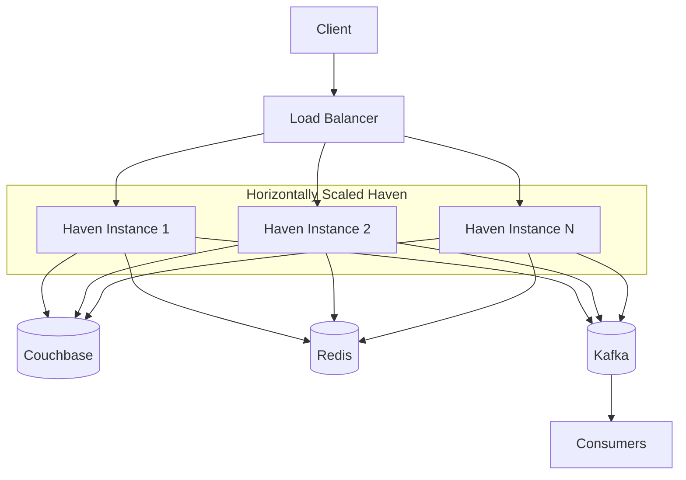
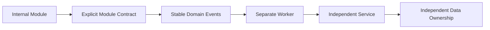

# ADR-001: Adopt a Modular Monolith

## 1. Status

**Accepted**

---

## 2. Context

Haven is a multi-tenant reservation platform for fixed time-bound resources such as meeting rooms, desks, parking slots, hotel-style rooms, and game zones.

The system contains several logical capabilities:

- Identity and caller context
- Organization policy
- Resource catalog
- Reservation creation and lifecycle
- Approval workflow
- Notification
- Reporting and audit
- Event publication
- Caching
- Observability

These capabilities have distinct responsibilities and should not become tightly coupled. However, Haven is initially developed by a small team and does not yet require independent service deployment, per-module scaling, or separate operational ownership.

The architecture must therefore balance two competing goals:

1. Preserve clean module boundaries and future extraction paths.
2. Avoid unnecessary distributed-system complexity during the MVP.

The decision is whether Haven should begin as:

- A modular monolith
- A microservices architecture
- A traditional layered monolith without strict module boundaries
- A collection of independently deployable services from the beginning

---

## 3. Problem Statement

What deployment and code-organization architecture should Haven use for the MVP while preserving production-quality engineering, maintainability, and future evolution?

The chosen architecture must support:

- Clear bounded contexts
- Framework-independent domain logic
- Reservation correctness under concurrency
- Asynchronous notification and reporting
- Horizontal scaling of the application
- Reproducible local development
- Testability
- Operational simplicity
- A credible future service-extraction path

---

## 4. Decision Drivers

The following drivers are ranked by importance.

| Priority | Driver | Importance |
|---:|---|---|
| 1 | Reservation correctness | Critical |
| 2 | Maintainable module boundaries | Critical |
| 3 | Development speed for a small team | High |
| 4 | Testability | High |
| 5 | Operational simplicity | High |
| 6 | Local developer experience | High |
| 7 | Horizontal application scaling | Medium |
| 8 | Future service extraction | Medium |
| 9 | Independent module deployment | Low for MVP |
| 10 | Independent team ownership | Low for MVP |

---

## 5. Options Considered

### Option A — Modular Monolith

One deployable backend process containing strongly separated internal modules.

Characteristics:

- One application artifact
- One deployment lifecycle
- Explicit internal boundaries
- Clean Architecture layers
- Shared process
- Shared observability
- Shared infrastructure clients
- Domain events between modules where useful

### Option B — Microservices

Separate independently deployable services such as:

- Identity service
- Resource service
- Reservation service
- Approval service
- Notification service
- Reporting service

Characteristics:

- Network boundaries
- Independent deployment
- Separate data ownership
- Distributed tracing
- Service discovery
- More operational infrastructure

### Option C — Traditional Layered Monolith

One deployable application organized primarily by technical layers:

```text
controllers/
services/
repositories/
models/
```

Characteristics:

- Simple startup
- Low initial structure cost
- Weak domain/module boundaries
- High risk of generic service classes
- Difficult future extraction

### Option D — Service-Oriented Hybrid

Reservation core remains one application, while notification and reporting start as separate services.

Characteristics:

- Partial operational separation
- More deployment complexity than a modular monolith
- Less complexity than full microservices
- Early asynchronous process boundaries

---

## 6. Evaluation

| Criteria | Modular Monolith | Microservices | Layered Monolith | Hybrid |
|---|---|---|---|---|
| Initial development speed | High | Low | High | Medium |
| Operational simplicity | High | Low | High | Medium |
| Domain boundary quality | High when enforced | High | Low–Medium | High |
| Local setup complexity | Medium | High | Low | Medium–High |
| Distributed failure modes | Low | High | Low | Medium |
| Independent deployment | Low | High | Low | Partial |
| Horizontal API scaling | High | High | High | High |
| Independent module scaling | Low | High | Low | Partial |
| Testing simplicity | High | Medium–Low | Medium | Medium |
| Future extraction path | High | Already extracted | Low | High |
| Portfolio value | High | High but risk of overengineering | Medium | High |
| MVP suitability | High | Low | Medium | Medium |

---

## 7. Decision

Haven will be implemented as a **modular monolith** for the MVP.

The application will be one primary deployable backend with strict internal module and dependency boundaries.

The architecture will separate:

- Presentation
- Application
- Domain
- Infrastructure
- Bootstrap/composition root

Logical business modules will include:

- Identity
- Organization
- Resource Catalog
- Reservation
- Approval
- Notification integration
- Reporting integration

Kafka consumers may run as separate worker processes later without changing the reservation domain.

---

## 8. Rationale

A modular monolith provides the strongest balance between engineering quality and delivery practicality.

### 8.1 The Current Team Does Not Justify Microservices

Microservices solve organizational and operational scaling problems as much as technical scaling problems.

Haven initially has:

- A small development team
- One repository
- One coordinated release process
- No need for independent service ownership
- No demonstrated requirement for per-module scaling

Introducing microservices immediately would add:

- Network failure modes
- Distributed transactions
- Service discovery
- Multiple CI/CD pipelines
- Cross-service contract management
- More containers
- More difficult local debugging
- More complex observability
- More deployment overhead

These costs do not solve a current requirement.

### 8.2 Strong Boundaries Do Not Require Network Boundaries

The project can maintain:

- Bounded contexts
- Repository ownership
- Application use cases
- Domain events
- Explicit module APIs
- Independent tests

without putting each module in a separate process.

A network boundary is not a substitute for good code boundaries.

### 8.3 Reservation Correctness Is Easier to Reason About

The core reservation workflow coordinates:

- Resource validation
- Organization policy
- Conflict detection
- Idempotency
- Reservation persistence
- Event outbox persistence

Keeping these capabilities in one application simplifies:

- Transaction boundaries
- Error classification
- Request tracing
- Testing
- Failure recovery

Couchbase remains the authoritative consistency boundary.

### 8.4 The Application Can Still Scale Horizontally

A modular monolith does not mean one server instance.

Haven API instances are stateless with respect to authoritative reservation state and can scale horizontally behind a load balancer.

Shared state resides in:

- Couchbase
- Redis
- Kafka

### 8.5 Future Extraction Remains Possible

Module boundaries and event contracts are designed so that selected capabilities can later be extracted.

Likely candidates:

1. Notification
2. Reporting and analytics
3. Approval, if workflow complexity grows
4. Resource search, if read scaling becomes independent
5. Reservation core only if team and scale justify it

---

## 9. Architectural Rules

The modular monolith is acceptable only if these rules are enforced.

### 9.1 Dependency Direction

```text
Presentation → Application → Domain
Infrastructure → Application/Domain interfaces
Bootstrap → all concrete components
```

### 9.2 Module Ownership

Each module owns its:

- Domain concepts
- Use cases
- Repository contracts
- Persistence mapping
- Public application API
- Tests

### 9.3 No Direct Cross-Module Persistence Access

A module must not directly mutate another module's owned data.

### 9.4 No Generic God Services

The design must avoid classes such as:

```text
ReservationManager
ApplicationService
CommonRepository
SystemHelper
```

that accumulate unrelated responsibilities.

### 9.5 No Framework Leakage

Drogon, Couchbase, Redis, and Kafka types must not enter domain objects.

### 9.6 Internal Contracts

Modules collaborate through:

- Application interfaces
- Domain identifiers
- Immutable data contracts
- Domain events
- Explicit repository ports where appropriate

### 9.7 Build Enforcement

Where practical, CMake targets should reflect module boundaries so prohibited dependencies fail at build time.

---

## 10. Proposed Module Layout

```text
src/
├── domain/
│   ├── organization/
│   ├── resource/
│   ├── reservation/
│   ├── approval/
│   └── shared/
│
├── application/
│   ├── organization/
│   ├── resources/
│   ├── reservations/
│   ├── approvals/
│   └── shared/
│
├── infrastructure/
│   ├── couchbase/
│   ├── redis/
│   ├── kafka/
│   ├── auth/
│   └── telemetry/
│
├── presentation/
│   └── rest/
│
└── bootstrap/
```

This may evolve into module-oriented top-level folders if that better enforces compilation boundaries:

```text
modules/
├── reservation/
│   ├── domain/
│   ├── application/
│   └── infrastructure/
├── resource/
├── organization/
└── approval/
```

The final physical layout should prioritize enforceable dependency rules over visual preference.

---

## 11. Runtime View



The modular monolith remains horizontally scalable.

---

## 12. Consequences

### 12.1 Positive

- Faster MVP development
- Simpler local environment
- Easier end-to-end debugging
- Fewer distributed failure modes
- One coordinated deployment
- Clear transaction and consistency boundaries
- Lower operational cost
- Easier refactoring while the domain evolves
- Strong testing support
- Future extraction path remains available

### 12.2 Negative

- All modules share one deployment lifecycle.
- One module's resource usage can affect others.
- Independent module scaling is limited.
- Poor discipline could degrade the design into a tightly coupled monolith.
- Large codebase build times may grow.
- A failure in one process can affect all in-process modules.
- Teams cannot independently deploy module changes.

### 12.3 Neutral

- Kafka remains useful for asynchronous integration even within a modular monolith.
- Separate worker processes may coexist with the modular monolith.
- Shared infrastructure does not imply shared domain ownership.

---

## 13. Risks and Mitigations

| Risk | Likelihood | Impact | Mitigation |
|---|---|---|---|
| Module boundary erosion | Medium | High | CMake targets, code review, dependency tests |
| God service growth | Medium | High | One use-case handler per capability |
| Shared database coupling | Medium | High | Explicit collection and repository ownership |
| Large deployment blast radius | Medium | Medium | Canary rollout, health checks, rollback |
| Build time growth | Medium | Medium | Incremental targets and caching |
| Premature service extraction | Medium | Medium | Require measurable trigger and ADR |
| Resource contention between modules | Low–Medium | Medium | Metrics and worker separation |

---

## 14. Rejected Alternatives

### 14.1 Full Microservices

Rejected for MVP because the operational and development costs exceed current requirements.

Microservices become preferable when:

- Multiple teams need independent ownership.
- Independent deployments are routinely blocked.
- Module-specific scaling materially reduces cost.
- Failure isolation becomes essential.
- Regulatory or security boundaries require separate processes.
- Technology stacks need to diverge.

### 14.2 Traditional Layered Monolith

Rejected because technical-layer organization alone tends to create:

- Broad service classes
- Weak domain ownership
- Cross-feature coupling
- Repository leakage
- Difficult extraction

### 14.3 Hybrid From Day One

Deferred because separate workers can be introduced incrementally once event workflows are implemented.

---

## 15. Migration and Evolution Strategy

If a module requires extraction:



Recommended extraction process:

1. Identify a measured reason.
2. Document current module dependencies.
3. Define explicit module API/events.
4. Remove direct data access from other modules.
5. Run module as a separate in-repository worker where useful.
6. Introduce network contract only when required.
7. Establish independent data ownership.
8. Add separate deployment and observability.
9. Migrate traffic incrementally.
10. Remove old in-process path.

---

## 16. Reconsideration Triggers

Revisit this ADR when one or more conditions occur:

- Multiple independent engineering teams own different modules.
- More than 20 engineers regularly modify the backend.
- Notification or reporting workload materially impacts API resources.
- A module requires independent release frequency.
- A module requires independent scaling by more than an order of magnitude.
- Security or compliance requires process/data isolation.
- The deployment blast radius becomes unacceptable.
- Build and test times become a sustained delivery bottleneck.
- Different availability requirements emerge across modules.
- Cross-module changes become the dominant development cost.

A trigger does not automatically require microservices. It requires a new evaluation.

---

## 17. Implementation Impact

### Source Code

- Create explicit layer and module targets.
- Introduce application use-case handlers.
- Keep domain technology-independent.
- Centralize wiring in bootstrap.

### Build

- CMake targets enforce allowed dependencies.
- Tests may link only required modules.
- Avoid one giant source target where possible.

### Persistence

- Collections and repository ownership are explicit.
- Modules do not bypass repository contracts.

### Deployment

- One primary API image.
- Optional event-worker image from the same repository.
- One coordinated application release.

### Documentation

- HLD and LLD reflect modular monolith boundaries.
- Future extraction requires ADR update or superseding ADR.

---

## 18. Validation

The decision is considered successful when:

- New features remain localized to one or a small number of modules.
- Domain tests run without infrastructure.
- Cross-module dependencies remain explicit.
- API instances scale horizontally.
- Local setup remains manageable.
- Reservation correctness remains understandable.
- Independent workers can be added without rewriting the domain.
- Code review can identify ownership boundaries quickly.

Warning signals:

- Controllers directly accessing repositories.
- Modules querying one another's collections.
- Shared generic service classes.
- Circular CMake dependencies.
- Broad DTOs reused across unrelated modules.
- Every feature changing the same files.
- Notification failures affecting reservation creation.

---

## 19. Follow-Up Tasks

- [ ] Define CMake target boundaries.
- [ ] Create source folder structure.
- [ ] Add dependency-direction checks.
- [ ] Define module ownership in `03-low-level-design.md`.
- [ ] Keep event consumers behind explicit interfaces.
- [ ] Add architecture review checks to pull requests.
- [ ] Add ADR references to README.
- [ ] Define extraction criteria for notification workers.
- [ ] Review module boundaries after the first three APIs.

---

## 20. Interview Notes

### Why did you choose a modular monolith?

The current team and scale do not justify microservice operational complexity. A modular monolith preserves domain boundaries and horizontal scaling while simplifying transactions, debugging, testing, and deployment.

### Is a modular monolith just a monolith with folders?

No. It requires enforceable module ownership, explicit dependencies, independent application contracts, and no unrestricted cross-module persistence access.

### How would you evolve it?

First stabilize module contracts and domain events, then extract a module only when independent scaling, deployment, ownership, or isolation provides measurable value.

### Can it scale?

Yes. Multiple stateless Haven instances can scale horizontally. The main shared limits are Couchbase, Redis, Kafka, and per-resource contention—not the fact that modules share a process.

### What is the biggest risk?

Boundary erosion. Without build and review enforcement, a modular monolith can degrade into a tightly coupled monolith.

### Why not use microservices for portfolio value?

Using microservices without a justified operational need demonstrates tool usage more than engineering judgment. The decision should solve a real problem.

---

## 21. Summary

**Decision:** Build Haven as a modular monolith.

**Reason:** It provides strong internal architecture, easier correctness reasoning, simpler deployment, and faster development without premature distributed-system complexity.

**Accepted trade-off:** Modules cannot be independently deployed or scaled during the MVP.

**Future evolution:** Extract modules only when measurable team, scaling, isolation, or deployment needs justify the additional complexity.

---

## 22. Completion Checklist

- [x] Problem clearly defined
- [x] Decision drivers identified
- [x] Multiple alternatives evaluated
- [x] Trade-offs documented
- [x] Risks and mitigations documented
- [x] Migration strategy included
- [x] Reconsideration triggers defined
- [x] Implementation impact described
- [x] Interview notes included
