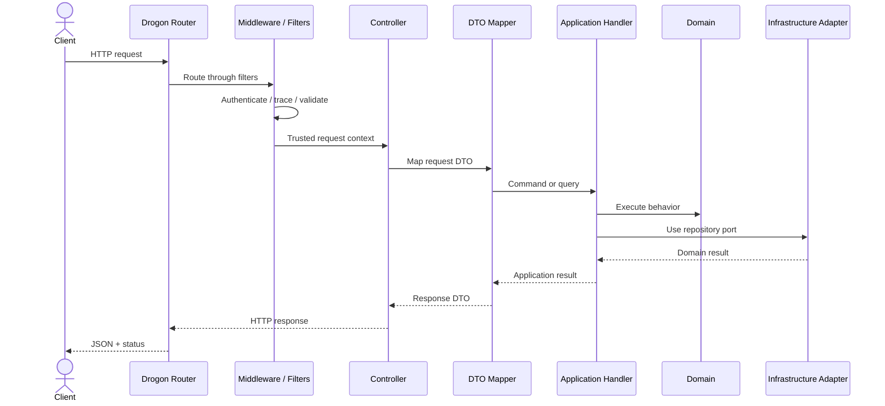

# ADR-003: Use Drogon as the HTTP Framework

## 1. Status

**Accepted**

---

## 2. Context

Haven requires a production-oriented C++ HTTP framework for:

- REST endpoint routing
- HTTP request and response handling
- Middleware
- Authentication integration
- JSON DTO binding
- Asynchronous request processing
- Health endpoints
- OpenAPI integration
- Structured error mapping
- High-concurrency network I/O
- Graceful startup and shutdown
- Containerized deployment

The framework must remain confined to the presentation layer.

Haven's domain and application layers must not depend on:

- HTTP request objects
- HTTP response objects
- Router types
- Framework-specific JSON types
- Framework lifecycle callbacks
- Framework dependency injection facilities

The framework choice affects:

- Developer productivity
- Runtime model
- Integration effort
- Testability
- Performance
- Observability
- Documentation
- Long-term maintainability

The main options evaluated were:

- Drogon
- Crow
- oat++
- Pistache
- Boost.Beast
- A custom HTTP layer over Asio/Beast

---

## 3. Problem Statement

Which C++ HTTP framework should Haven use for the MVP and early production-oriented implementation?

The selected framework must provide enough production capability to avoid spending the project primarily on low-level HTTP plumbing, while still allowing the architecture to keep transport concerns outside the domain.

---

## 4. Decision Drivers

| Priority | Driver | Importance |
|---:|---|---|
| 1 | Production-oriented HTTP capabilities | Critical |
| 2 | Async and high-concurrency support | High |
| 3 | Middleware and routing maturity | High |
| 4 | Maintainability | High |
| 5 | Ease of presentation-layer isolation | High |
| 6 | Testing support | High |
| 7 | Documentation and ecosystem | Medium |
| 8 | JSON and REST ergonomics | Medium |
| 9 | Performance | Medium |
| 10 | Build and dependency complexity | Medium |
| 11 | OpenAPI integration | Medium |
| 12 | Learning value | Medium |

---

## 5. Options Considered

### Option A — Drogon

A production-oriented asynchronous C++ web framework providing:

- HTTP server
- Routing
- Middleware and filters
- JSON support
- Asynchronous handlers
- WebSocket support
- Plugin system
- Database integrations
- Session support
- Testing facilities
- Mature runtime model

Haven will use only the required presentation capabilities and will not couple domain logic to Drogon plugins or ORM features.

### Option B — Crow

A lightweight C++ microframework with a Flask-like API.

Strengths:

- Simple routing
- Low ceremony
- Easy initial setup
- Good for small REST services

Concerns:

- Smaller production feature surface
- More infrastructure must be assembled separately
- Less suitable for demonstrating a complete production backend platform

### Option C — oat++

A modular C++ framework with:

- REST APIs
- Object mapping
- OpenAPI support
- Dependency injection concepts
- Async capabilities

Strengths:

- Strong API modeling
- Built-in OpenAPI ergonomics
- Structured framework ecosystem

Concerns:

- More framework conventions and generated/object-mapping patterns
- Potential for framework concepts to leak into application code
- Less aligned with the desired explicit Clean Architecture mapping style

### Option D — Pistache

A C++ REST framework with straightforward APIs.

Concerns:

- Smaller ecosystem
- Lower confidence in long-term maintenance and production maturity for this project
- Fewer high-level capabilities than Drogon

### Option E — Boost.Beast

A low-level HTTP and WebSocket library built on Boost.Asio.

Strengths:

- Fine-grained control
- Strong networking foundation
- High performance
- Minimal high-level framework coupling

Concerns:

- Requires custom routing, middleware, error mapping, lifecycle handling, and request infrastructure
- Large implementation burden unrelated to Haven's core reservation problem
- Higher risk of security and correctness mistakes in HTTP plumbing

### Option F — Custom Server

Build a custom server over Asio, Beast, or sockets.

Rejected unless low-level networking itself becomes a project objective.

---

## 6. Evaluation

| Criteria | Drogon | Crow | oat++ | Pistache | Boost.Beast |
|---|---|---|---|---|---|
| Production feature set | High | Medium | High | Medium | Low-level only |
| Async support | High | Medium–High | High | Medium | High |
| Routing and middleware | High | Medium | High | Medium | Must build |
| OpenAPI ergonomics | Medium | Low | High | Low | Must build |
| Testing support | Good | Basic–Good | Good | Basic | Must build |
| Initial setup | Medium | Easy | Medium | Easy–Medium | Complex |
| Framework isolation | Good with discipline | Good | Medium–Good | Good | Excellent |
| Performance potential | High | High | High | Medium–High | Very high |
| Ecosystem maturity | Strong | Moderate | Strong | Moderate | Very strong library foundation |
| Amount of custom plumbing | Low | Medium | Low | Medium | Very high |
| MVP suitability | High | Medium | High | Medium | Low |
| Portfolio value | High | Medium | High | Medium | High but distracts from domain |

---

## 7. Decision

Haven will use **Drogon** as its HTTP framework.

Drogon will be restricted to the presentation and bootstrap layers.

It will provide:

- HTTP server lifecycle
- Routing
- Controllers
- Middleware and filters
- Request/response handling
- Transport-level JSON handling
- Health endpoints
- OpenAPI serving integration
- Request-context propagation

Haven will not use Drogon as the source of domain architecture.

---

## 8. Rationale

### 8.1 Production-Oriented Capability

Drogon provides a broad runtime and HTTP feature set without requiring Haven to implement:

- Router infrastructure
- HTTP parsing
- Connection management
- Middleware chain
- Async request lifecycle
- Response serialization plumbing
- Server shutdown behavior

This keeps engineering effort focused on:

- Reservation correctness
- Concurrency
- Domain modeling
- Database design
- Idempotency
- Event-driven workflows
- Testing and observability

### 8.2 Asynchronous Runtime

Haven is network and storage intensive.

Requests may involve:

- JWT verification
- Couchbase access
- Redis access
- Transaction execution
- JSON serialization

Drogon's asynchronous server model is suitable for high-concurrency backend workloads.

The implementation must still avoid blocking Drogon event-loop threads with long synchronous operations.

### 8.3 Mature Routing and Middleware

Drogon supports the presentation concerns Haven needs:

- Authentication filters
- Request IDs
- Trace context
- Rate limiting integration
- Error mapping
- Content-type validation
- Route registration
- Health endpoints

These concerns can be implemented consistently without entering application handlers.

### 8.4 Framework Isolation Is Practical

Drogon is suitable if the project enforces this mapping flow:

```text
Drogon request
→ request DTO
→ application command/query
→ application result
→ response DTO
→ Drogon response
```

Only the outer adapter knows Drogon types.

### 8.5 Better Fit Than Low-Level Beast

Boost.Beast would provide more control, but the project would spend substantial effort implementing infrastructure that is not central to Haven's business problem.

Using a mature framework demonstrates stronger engineering prioritization than rebuilding HTTP abstractions unnecessarily.

### 8.6 More Complete Than a Minimal Microframework

Crow is attractive for simplicity, but Haven requires production concerns beyond route syntax.

Drogon provides a stronger foundation for:

- Middleware
- Lifecycle management
- Testing
- Async processing
- Operational endpoints

### 8.7 Portfolio Value

Drogon allows the project to demonstrate a realistic C++ backend framework while preserving room to discuss:

- Event-loop safety
- Blocking vs non-blocking work
- Middleware
- framework isolation
- dependency injection
- observability
- graceful shutdown
- performance tuning

---

## 9. Architectural Boundaries

### 9.1 Allowed Drogon Usage

Drogon may appear in:

```text
src/presentation/
src/bootstrap/
apps/server/
tests/contract/
```

Examples:

- `HttpRequestPtr`
- `HttpResponsePtr`
- Route decorators or registration
- Filters
- Server startup
- Framework test clients

### 9.2 Forbidden Drogon Usage

Drogon must not appear in:

```text
src/domain/
src/application/
```

Forbidden examples:

- Domain methods accepting `HttpRequestPtr`
- Application handlers returning `HttpResponsePtr`
- Domain errors using HTTP status codes
- Repository interfaces using Drogon JSON
- Aggregates including Drogon headers

### 9.3 Infrastructure Interaction

Controllers do not call Couchbase, Redis, or Kafka directly.

They invoke application use cases.

---

## 10. Request Processing Model



---

## 11. Controller Responsibilities

Controllers may:

- Read path, query, and header values
- Read caller context established by middleware
- Parse request DTO
- Invoke one application use case
- Map result to response DTO
- Set HTTP status and headers
- Return trace ID

Controllers may not:

- Check reservation overlap
- Decide approval
- Enforce duration policy
- Build N1QL
- Access Redis
- Publish Kafka events
- Change reservation state directly
- Implement retries

---

## 12. Middleware and Filter Responsibilities

Recommended middleware/filter chain:

1. Request ID
2. Trace-context extraction
3. Access logging
4. Content-type and body-size enforcement
5. JWT authentication
6. Rate limiting
7. Route execution
8. Error translation
9. Response telemetry

Ordering must be documented.

Authentication should produce a neutral application `CallerContext`.

---

## 13. DTO Strategy

Transport DTOs are presentation-layer types.

Example:

```cpp
struct CreateReservationRequestDto {
    std::string resourceId;
    std::string startTime;
    std::string endTime;
    std::optional<std::string> purpose;
};
```

Mapping produces validated application/domain values.

Rules:

- DTOs do not own business behavior.
- Domain entities are not serialized directly.
- API enums have stable external strings.
- Unknown JSON fields follow a documented compatibility policy.
- Validation errors map to the common API error contract.

---

## 14. Error Handling

Drogon exceptions and response errors must not escape inward.

Application errors map outward:

| Application Error | HTTP |
|---|---:|
| Validation | 400 |
| Unauthenticated | 401 |
| Forbidden | 403 |
| Not found | 404 |
| Reservation conflict | 409 |
| Concurrent modification | 409 |
| Policy violation | 422 |
| Rate limited | 429 |
| Dependency unavailable | 503 |
| Unexpected | 500 |

The public response uses the standard Haven error body.

Internal stack traces are logged safely and never returned to clients.

---

## 15. Dependency Injection

Haven will not rely on a global service locator.

The bootstrap layer constructs:

- Infrastructure clients
- Repositories
- Application handlers
- Controllers
- Middleware
- Telemetry

Controllers receive explicit handler dependencies or use a controlled composition mechanism.

Drogon's plugin mechanism may be used only for framework infrastructure when it does not obscure ownership or create hidden global dependencies.

---

## 16. Async and Blocking Work

Drogon's event-loop threads must not be blocked by:

- Long Couchbase operations
- Kafka waits
- File I/O
- Slow cryptographic key refresh
- External notification calls
- Artificial sleeps
- Unbounded CPU work

Guidelines:

- Use async SDK APIs where practical.
- Use bounded worker execution for blocking adapters.
- Preserve request deadlines.
- Propagate cancellation where supported.
- Record queueing and dependency latency.
- Avoid thread-per-request design.

---

## 17. Thread Safety

Controllers and handlers should be stateless after construction.

Shared dependencies must be:

- Immutable, or
- Thread-safe by contract, or
- Protected by an adapter

Request-local data must not be stored in mutable controller members.

Drogon callback captures must preserve object lifetimes safely.

---

## 18. OpenAPI Strategy

Drogon is not the authoritative API design source.

The authoritative public contract is the version-controlled OpenAPI specification.

Implementation must be tested against that specification.

Drogon may serve:

- Swagger UI locally
- OpenAPI JSON/YAML
- API documentation endpoints

Production Swagger UI may be restricted or disabled.

---

## 19. Health Endpoints

Drogon exposes:

```text
GET /health/live
GET /health/ready
```

Liveness:

- Process-level
- Minimal
- No broad dependency checks

Readiness:

- Delegates to application/infrastructure health model
- Reflects essential dependency availability
- Can report degraded optional dependencies

---

## 20. Observability Integration

Drogon request boundaries initialize:

- Request ID
- Trace ID
- Route template
- Start timestamp
- Caller context after authentication

Metrics include:

- Request count
- Response status
- Route latency
- In-flight requests
- Request/response size
- Authentication outcome
- Rate-limit outcome

Raw resource IDs must not be embedded in metric route labels.

---

## 21. Testing Strategy

### 21.1 Controller Tests

Validate:

- Route registration
- Header requirements
- Request parsing
- Response status
- Error body
- Response DTO
- Trace header

### 21.2 Middleware Tests

Validate:

- Missing JWT
- Invalid JWT
- Caller-context creation
- Rate limit
- Request ID
- Log redaction
- Body-size enforcement

### 21.3 Contract Tests

Compare runtime API behavior against OpenAPI.

### 21.4 Application Tests

Do not require Drogon.

This is a critical success criterion for framework isolation.

---

## 22. Deployment Impact

The Haven container must include Drogon's runtime dependencies.

Startup responsibilities:

- Initialize configuration
- Create dependency graph
- Register routes
- Start server
- Set readiness after required initialization
- Handle graceful shutdown

Deployment configuration controls:

- Port
- Worker thread count
- Request size
- Timeouts
- Keep-alive
- TLS placement
- Logging

---

## 23. Performance Considerations

Drogon performance should be measured within Haven's real workload.

Relevant measurements:

- Routing overhead
- JSON parsing
- JSON serialization
- Middleware cost
- Event-loop saturation
- Worker queue delay
- Connection count
- Memory per in-flight request

Framework benchmark results alone do not predict reservation API latency because Couchbase transactions dominate the write path.

---

## 24. Security Considerations

- Enforce body-size limits.
- Validate content type.
- Reject malformed JSON.
- Keep CORS restrictive.
- Use TLS in production.
- Do not trust proxy headers unless the proxy is configured.
- Protect Swagger UI.
- Redact authorization headers.
- Apply rate limits.
- Keep detailed health data private.
- Update Drogon and transitive dependencies.

---

## 25. Consequences

### 25.1 Positive

- Mature production-oriented HTTP framework
- Async request handling
- Routing and middleware support
- Less custom HTTP plumbing
- Strong C++ backend learning value
- Good fit for REST APIs
- Practical health and lifecycle support
- Sufficient performance headroom
- Allows focus on domain and distributed-system concerns

### 25.2 Negative

- Adds a significant framework dependency.
- Build times and dependency setup increase.
- Drogon APIs may leak inward without discipline.
- The plugin system can encourage hidden dependencies.
- Developers must understand event-loop and callback lifetimes.
- OpenAPI integration is less central than in oat++.
- Framework upgrades require compatibility testing.
- Async code can become difficult to read if poorly structured.

### 25.3 Neutral

- Drogon does not determine the domain model.
- Drogon database integrations will not replace Haven repositories.
- Drogon ORM is not required.
- WebSocket support exists but is not an MVP requirement.

---

## 26. Risks and Mitigations

| Risk | Likelihood | Impact | Mitigation |
|---|---|---|---|
| Framework leakage | Medium | High | Layer rules and build targets |
| Blocking event loop | Medium | High | Async adapters, profiling, review |
| Hidden plugin dependencies | Medium | Medium | Explicit bootstrap ownership |
| Callback lifetime bug | Medium | High | RAII, safe captures, tests |
| Framework-specific DTOs spread | Medium | Medium | Explicit mapper layer |
| Upgrade breakage | Low–Medium | Medium | Pin version and integration tests |
| Incomplete OpenAPI sync | Medium | Medium | Contract tests and CI diff |
| Overusing framework features | Medium | Medium | Use only justified capabilities |

---

## 27. Rejected Alternatives

### 27.1 Crow

Crow was not selected because Haven needs a broader production feature set and would otherwise assemble more middleware, lifecycle, and operational infrastructure manually.

Crow remains suitable for:

- Smaller services
- Prototypes
- Simple internal APIs
- Minimal dependency preferences

### 27.2 oat++

oat++ is a strong alternative, especially for object mapping and OpenAPI ergonomics.

It was not selected because:

- Haven prefers explicit DTO/application/domain mapping.
- The team wants Drogon's runtime model and ecosystem.
- There is concern about framework object conventions spreading inward.

Reconsider if OpenAPI generation and structured DTO tooling become more important than current runtime preferences.

### 27.3 Pistache

Not selected because of lower confidence in ecosystem and long-term project fit.

### 27.4 Boost.Beast

Not selected because it is too low-level for Haven's current goals.

Beast becomes preferable when:

- Maximum protocol control is required.
- A custom protocol stack is part of the product.
- Framework overhead is proven to be a bottleneck.
- The team is prepared to own routing, middleware, and lifecycle infrastructure.

### 27.5 Custom HTTP Server

Rejected due to security, maintenance, and delivery risk.

---

## 28. Portability Strategy

Framework portability is preserved through:

- Presentation-only Drogon types
- Application commands and results
- Neutral caller context
- Neutral error model
- Explicit DTO mappers
- Framework-independent tests
- Centralized route/bootstrap code
- No domain serialization through Drogon types

Replacing Drogon would require rewriting the presentation adapter and bootstrap, not business behavior.

---

## 29. Migration Strategy

If Drogon is replaced:

1. Freeze the OpenAPI contract.
2. Implement the new presentation adapter.
3. Reuse application handlers.
4. Reuse domain and infrastructure ports.
5. Run contract tests against both adapters.
6. Compare latency and error behavior.
7. Shift traffic or deployment.
8. Remove Drogon-specific code.
9. Update deployment and observability integration.

The OpenAPI specification serves as the compatibility boundary.

---

## 30. Reconsideration Triggers

Revisit this ADR when:

- Drogon becomes unmaintained.
- Security vulnerabilities cannot be resolved promptly.
- Required protocol support is unavailable.
- Framework behavior blocks graceful shutdown or observability.
- Async SDK integration proves impractical.
- OpenAPI tooling cost becomes excessive.
- Measured framework overhead materially affects performance.
- A company/platform standard mandates another framework.
- Build or portability requirements change significantly.

---

## 31. Implementation Impact

### Presentation

- Add Drogon controllers, filters, DTOs, and mappers.
- Add common exception/error response mapping.
- Add request context propagation.

### Application

- No Drogon dependency.
- Use-case handlers expose neutral interfaces.

### Domain

- No Drogon dependency.

### Infrastructure

- No controller-driven SDK calls.
- Adapters remain independent of HTTP.

### Build

- Add Drogon through vcpkg.
- Pin version.
- Link only presentation/server targets where possible.

### Testing

- Add controller and middleware tests.
- Add OpenAPI contract tests.
- Keep domain/application tests framework-free.

### Deployment

- Configure worker/event-loop counts.
- Validate graceful shutdown.
- Expose health endpoints.
- Measure event-loop saturation.

---

## 32. Validation Criteria

The decision is successful when:

- Domain and application targets compile without Drogon.
- Controllers remain thin.
- API contract tests pass.
- Health endpoints behave correctly.
- Event-loop threads are not blocked.
- Request tracing propagates correctly.
- Graceful shutdown works under in-flight load.
- Framework errors map to Haven error contracts.
- Initial latency targets are met.
- Replacing controller implementation does not require domain changes.

Warning signs:

- `HttpRequestPtr` in application handlers
- N1QL inside controllers
- Domain errors represented as HTTP status codes
- Global access to handler dependencies
- Controller classes containing reservation rules
- Long synchronous work on event-loop threads

---

## 33. Follow-Up Tasks

- [ ] Add Drogon dependency through vcpkg.
- [ ] Create presentation CMake target.
- [ ] Define controller conventions.
- [ ] Implement request ID middleware.
- [ ] Implement JWT middleware.
- [ ] Implement common error mapper.
- [ ] Add liveness and readiness endpoints.
- [ ] Define DTO mapping utilities.
- [ ] Add OpenAPI serving for local development.
- [ ] Add controller contract tests.
- [ ] Add graceful shutdown tests.
- [ ] Benchmark JSON and middleware overhead.
- [ ] Document event-loop blocking rules in code review checklist.

---

## 34. Interview Notes

### Why Drogon?

It provides a mature asynchronous C++ HTTP runtime, routing, middleware, and lifecycle support, allowing the project to focus on reservation correctness and system design rather than rebuilding HTTP infrastructure.

### Why not Boost.Beast?

Beast offers lower-level control but would require Haven to build routing, middleware, error mapping, and lifecycle management. That work does not solve the main product problem.

### How do you avoid framework lock-in?

Drogon is restricted to the presentation layer. Application handlers use neutral commands and results, and OpenAPI defines the external contract.

### What is the biggest implementation risk?

Blocking Drogon's event-loop threads with synchronous database or external calls.

### Why not use Drogon's ORM directly?

Haven uses Couchbase and explicit repositories. More importantly, domain persistence contracts should not depend on framework ORM abstractions.

### How would you replace Drogon?

Implement another presentation adapter against the same application handlers and verify it with the OpenAPI contract tests.

---

## 35. Summary

**Decision:** Use Drogon as Haven's HTTP framework.

**Reason:** Drogon offers a production-oriented asynchronous HTTP runtime, mature routing and middleware, and enough operational capability to avoid unnecessary low-level networking work.

**Accepted trade-offs:** Additional dependency complexity, async programming discipline, and risk of framework leakage.

**Strong alternatives:** oat++ for OpenAPI/object-mapping ergonomics and Boost.Beast for low-level control.

**Boundary:** Drogon remains exclusively in the presentation and bootstrap layers.

---

## 36. Completion Checklist

- [x] Context documented
- [x] Problem defined
- [x] Decision drivers identified
- [x] Alternatives evaluated
- [x] Decision stated
- [x] Architectural boundary defined
- [x] Async and thread-safety impact included
- [x] Security impact included
- [x] Testing strategy included
- [x] Risks documented
- [x] Migration strategy included
- [x] Reconsideration triggers defined
- [x] Interview notes included
