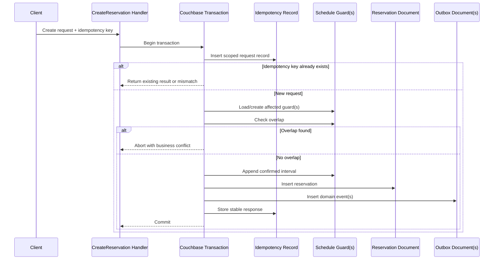

# ADR-004: Use Optimistic Concurrency Control

## 1. Status

**Accepted**

---

## 2. Context

Haven must preserve reservation correctness when multiple users or application instances attempt to:

- Reserve the same resource for overlapping intervals
- Approve and cancel the same reservation concurrently
- Extend a reservation while another reservation is created
- Retry a request after a timeout
- Publish events consistently with committed business state
- Update shared resource schedule projections

A reservation platform cannot rely on a normal read-then-write flow because two requests may both observe an available resource before either writes.

Example unsafe sequence:

```text
Request A checks availability → available
Request B checks availability → available
Request A writes reservation
Request B writes reservation
```

Without an atomic concurrency boundary, the system can double-book the resource.

The system needs a concurrency strategy that:

- Prevents conflicting confirmed reservations
- Detects stale updates
- Avoids silent overwrites
- Supports multiple stateless application instances
- Keeps lock scope narrow
- Avoids Redis as a correctness dependency
- Provides bounded retry behavior
- Works with Couchbase

The principal alternatives are:

- Optimistic concurrency using Couchbase transactions and CAS
- Pessimistic database locking
- Redis-based distributed locking
- Application-level in-memory mutexes
- Single-threaded reservation command processing
- Database-only overlap query followed by insert

---

## 3. Problem Statement

Which concurrency control strategy should Haven use to preserve reservation correctness and lifecycle consistency under concurrent access?

The strategy must address both:

1. Creation of new reservations, where no reservation document exists yet.
2. Updates to existing reservations, where stale writes must be detected.

---

## 4. Decision Drivers

| Priority | Driver | Importance |
|---:|---|---|
| 1 | Prevent double booking | Critical |
| 2 | Prevent lost updates | Critical |
| 3 | Work across multiple application instances | Critical |
| 4 | Avoid cache-based correctness dependency | High |
| 5 | Keep contention scoped to one resource/time bucket | High |
| 6 | Support idempotent retries | High |
| 7 | Preserve event/outbox consistency | High |
| 8 | Provide predictable failure semantics | High |
| 9 | Support horizontal scaling | Medium |
| 10 | Minimize operational complexity | Medium |
| 11 | Preserve acceptable latency | Medium |
| 12 | Maintain clear testability | High |

---

## 5. Options Considered

### Option A — Optimistic Concurrency with Couchbase Transactions and CAS

Use:

- Couchbase transactions for atomic multi-document reservation workflows
- Per-resource daily schedule guard documents
- CAS/version checks for updates to existing reservation documents
- Durable idempotency records
- Transactional outbox persistence
- Bounded retries on transient transaction conflicts

### Option B — Pessimistic Database Locking

Acquire a database lock before checking and writing reservation state.

Possible forms:

- Resource-level lock row/document
- Long-lived transaction lock
- Explicit lock document with ownership and lease

### Option C — Redis Distributed Lock

Use Redis to acquire a lock such as:

```text
lock:<organizationId>:<resourceId>
```

before conflict detection and persistence.

### Option D — In-Memory Mutex

Use a process-local mutex keyed by resource ID.

### Option E — Single-Threaded Reservation Queue

Serialize reservation commands through one logical worker or partitioned queue.

### Option F — Query Then Insert

Run overlap query and insert reservation when no conflict is found.

---

## 6. Evaluation

| Criteria | Optimistic Couchbase | Pessimistic DB Lock | Redis Lock | In-Memory Mutex | Serialized Queue | Query Then Insert |
|---|---|---|---|---|---|---|
| Prevents cross-instance conflict | Yes | Yes | Potentially | No | Yes | No |
| Prevents lost update | Yes | Yes | Only with DB checks | No | Yes | No |
| Correctness dependency count | Couchbase | Couchbase | Couchbase + Redis | App process | Queue + DB | Couchbase |
| Failure complexity | Medium | High | High | High at scale | High | Low but unsafe |
| Hot-resource behavior | Retry/abort | Blocking | Lease contention | Process-local only | Queue delay | Double booking |
| Horizontal scaling | Yes | Yes | Yes | No | Yes | Yes but unsafe |
| Deadlock risk | Low–Medium | Medium–High | Lease risk | Low | Low | Low |
| Operational simplicity | Medium | Medium | Low–Medium | High but incorrect | Low | High but incorrect |
| Event/outbox atomicity | Yes | Yes | Requires DB transaction | No | Requires DB transaction | No |
| MVP suitability | High | Medium | Low | Rejected | Medium–Low | Rejected |

---

## 7. Decision

Haven will use **optimistic concurrency control**.

The implementation will combine:

1. **Couchbase transactions** for atomic workflows involving multiple documents.
2. **Per-resource UTC-day schedule guard documents** to serialize conflicting allocation decisions at a narrow boundary.
3. **CAS/version checks** for updates to existing reservation and outbox documents.
4. **Durable idempotency records** for duplicate request handling.
5. **Transactional outbox records** for reliable event publication.
6. **Bounded, classified retries** with jitter.

Haven will not use Redis distributed locks as the primary reservation correctness mechanism.

---

## 8. Rationale

### 8.1 Most Resources Are Not Continuously Contended

The expected workload contains:

- Many resources
- Relatively sparse writes across the entire catalog
- A small number of hot resources

Optimistic concurrency allows uncontended requests to proceed without acquiring long-lived locks.

### 8.2 Narrow Contention Is Better Than Global Serialization

A reservation affects one resource and at most two UTC-day buckets due to the 12-hour standard and 24-hour maintenance limits.

Per-resource daily schedule guards localize contention to:

```text
organization + resource + UTC day
```

Requests for unrelated resources proceed independently.

### 8.3 Couchbase Remains the Correctness Boundary

Using Couchbase transactions and CAS means:

- The authoritative datastore detects conflicts.
- Redis failure cannot compromise correctness.
- Multiple application instances observe the same persistence boundary.
- Reservation, guard, idempotency, and outbox state can commit atomically.

### 8.4 CAS Protects Existing Aggregate Updates

For actions such as:

- Approve
- Reject
- Cancel
- Extend
- Complete
- Expire

the repository persists using the expected version.

A stale writer cannot silently overwrite a newer reservation state.

### 8.5 Transactions Solve the New-Reservation Problem

CAS on a new reservation ID alone does not prevent two different reservation IDs from claiming the same resource interval.

The guard document provides a shared transactional object representing the resource/day allocation boundary.

### 8.6 Bounded Retry Produces Clear Operational Behavior

Transient conflicts may be retried, but business conflicts are returned immediately.

The system can distinguish:

- Transaction retry
- Business overlap
- Stale state
- Dependency timeout
- Retry exhaustion

This improves both correctness and observability.

---

## 9. Concurrency Model

### 9.1 Reservation Interval

Intervals use half-open semantics:

```text
[startTime, endTime)
```

Overlap exists when:

```text
existing.startTime < requested.endTime
AND
existing.endTime > requested.startTime
```

Adjacent intervals do not conflict.

### 9.2 Blocking State

`CONFIRMED` reservations block allocation.

For MVP, `PENDING_APPROVAL` does not permanently claim the schedule guard.

Approval performs a new authoritative allocation attempt.

### 9.3 Schedule Guard Key

```text
schedule::<organizationId>::<resourceId>::<yyyy-mm-dd-utc>
```

### 9.4 Guard Contents

A guard contains compact confirmed interval entries:

```json
{
  "organizationId": "org_01H...",
  "resourceId": "res_01H...",
  "utcDate": "2026-08-01",
  "confirmedIntervals": [
    {
      "reservationId": "rsv_01H...",
      "startTime": "2026-08-01T10:00:00Z",
      "endTime": "2026-08-01T11:00:00Z"
    }
  ]
}
```

The guard is a rebuildable concurrency projection.

Reservation documents remain the source of truth.

---

## 10. Create Reservation Workflow

### 10.1 Auto-Confirmed Reservation



### 10.2 Pending Approval Reservation

Pending creation transaction persists:

- Reservation in `PENDING_APPROVAL`
- Idempotency result
- `ReservationCreated`
- `ReservationApprovalRequested`

It does not claim the schedule guard under the selected MVP policy.

---

## 11. Approval Workflow

Approval performs:

```text
begin transaction
load pending reservation
validate expected state
authorize approver outside/inside appropriate boundary
load affected schedule guard documents
check overlap
if conflict:
    abort with RESERVATION_CONFLICT
append interval to guard documents
update reservation to CONFIRMED
insert ReservationConfirmed outbox event
commit
```

If another request books the resource while approval is pending, approval fails deterministically.

---

## 12. Cancellation Workflow

For a confirmed reservation:

```text
begin transaction
load reservation
validate cancellable state
load affected guard documents
remove interval matching reservationId
update reservation to CANCELLED
insert ReservationCancelled outbox event
commit
```

For a pending reservation:

- No guard removal is required.
- Reservation moves to `CANCELLED`.
- Cancellation event is persisted.

---

## 13. Extension Workflow

```text
begin transaction
load confirmed reservation
validate new end time
determine old and new guard keys
load guard documents in deterministic key order
remove current reservation interval
check proposed extended interval against remaining intervals
if conflict:
    abort
insert updated interval
update reservation end time
insert ReservationExtended event
commit
```

The extension is atomic from the client's perspective.

---

## 14. CAS and Versioning

### 14.1 Neutral Domain Version

Couchbase CAS must not leak into domain APIs.

Infrastructure maps CAS to a neutral type such as:

```cpp
class Version final {
public:
    explicit Version(std::uint64_t value);
};
```

### 14.2 Save Contract

Conceptual repository contract:

```cpp
Result<SaveResult> save(
    const Reservation& reservation,
    Version expectedVersion,
    std::span<const DomainEvent> events);
```

### 14.3 CAS Conflict Behavior

On version mismatch:

1. Do not overwrite.
2. Reload current state.
3. Re-evaluate if operation is safely retryable.
4. Return `CONCURRENT_MODIFICATION` if the operation is no longer valid.
5. Record metrics.

---

## 15. Idempotency

### 15.1 Scope

```text
organizationId
+ authenticatedUserId
+ operation
+ idempotencyKey
```

### 15.2 Payload Hash

Canonical payload includes:

- Resource ID
- Start time
- End time
- Purpose
- Operation version
- Any policy-relevant explicit input

### 15.3 Behavior

| Existing Record | Same Payload | Different Payload |
|---|---|---|
| Completed | Return original response | Reject with 409 |
| Processing | Wait boundedly or return in-progress result | Reject with 409 |
| Final failure | Return stable failure | Reject with 409 |
| Missing | Process request | Process request |

### 15.4 Atomicity

For create reservation, idempotency completion must be committed atomically with:

- Reservation
- Schedule guard
- Outbox

This prevents a successful reservation without a retrievable idempotent result.

---

## 16. Retry Policy

### 16.1 Retryable

- Couchbase transaction conflict
- Temporary timeout
- CAS conflict when operation can be safely re-evaluated
- Temporary dependency unavailability within request deadline

### 16.2 Non-Retryable

- Reservation overlap
- Invalid transition
- Authorization failure
- Resource inactive
- Duration violation
- Idempotency payload mismatch
- Malformed request

### 16.3 Retry Constraints

- Small maximum attempt count
- Exponential backoff
- Jitter
- Shared request deadline
- No unbounded loop
- Metrics per retry
- Trace annotations
- Final retry-exhausted error

---

## 17. Deadlock and Livelock Prevention

Although the selected strategy is optimistic, transactions touching multiple guards must follow deterministic ordering.

Rules:

- Sort guard keys before transaction access.
- Keep transactions short.
- Avoid external calls inside transactions.
- Use bounded retries.
- Use jitter.
- Fail fast on business conflicts.
- Keep guard documents compact.
- Avoid global guard documents.
- Do not wait indefinitely for another request.

---

## 18. Hot-Resource Behavior

A hot resource may produce:

- Higher transaction conflicts
- Increased retries
- Higher p99 latency
- More `409` outcomes
- Guard document contention

The system should:

- Measure hot-resource contention.
- Keep retry count bounded.
- Return conflicts quickly.
- Avoid turning all requests into a global queue.
- Sample resource IDs in logs rather than metric labels.
- Reconsider the strategy only when measurements justify it.

Possible future options:

- Per-resource command queue
- Finer time buckets
- Fair scheduling
- Short-lived reservation holds
- Dedicated hot-resource partition

Each requires a new decision.

---

## 19. Reconciliation

Schedule guards are derived and must be recoverable.

A reconciliation process compares:

- Confirmed Reservation documents
- Schedule guard interval entries

It detects:

- Missing guard interval
- Orphaned guard interval
- Duplicate reservation ID
- Mismatched interval
- Invalid date bucket
- Terminal reservation still blocking

Reconciliation may:

- Report only
- Repair automatically after confidence improves
- Require operator approval for ambiguous cases

Normal requests must not silently ignore guard corruption.

---

## 20. Failure Semantics

| Failure Point | Result |
|---|---|
| Before transaction commit | No business state committed |
| After commit before HTTP response | Client retries and receives stored idempotent result |
| Transaction conflict | Bounded retry |
| Business overlap | Immediate 409 |
| CAS mismatch | Reload/re-evaluate or 409 |
| Redis unavailable | No correctness impact |
| Kafka unavailable | Outbox remains pending |
| Application instance crashes | Committed state remains in Couchbase |
| Guard inconsistency | Fail safely and alert |
| Retry exhausted | Retryable technical error, typically 503 or classified 409 |

---

## 21. Security Considerations

- Tenant identity is part of every guard and transaction key.
- Callers cannot choose organization identity.
- Idempotency keys are hashed or safely encoded for persistence keys.
- Lock/guard details are not exposed publicly.
- Transaction errors do not reveal other tenants' reservations.
- Raw Couchbase CAS values need not appear in public APIs.
- Logs do not contain full idempotency keys.
- Authorization remains separate from concurrency control.

---

## 22. Observability

### Metrics

- `reservation_transaction_attempt_total`
- `reservation_transaction_retry_total`
- `reservation_transaction_abort_total`
- `reservation_business_conflict_total`
- `reservation_cas_conflict_total`
- `reservation_retry_exhausted_total`
- `idempotency_hit_total`
- `idempotency_mismatch_total`
- `schedule_guard_reconciliation_error_total`

### Trace Attributes

- Operation
- Attempt number
- Number of guard documents
- Same-day vs cross-day
- Outcome category
- Transaction duration
- Retry cause

Avoid high-cardinality resource IDs as metric labels.

### Logs

Include:

- Organization ID
- Reservation ID where available
- Resource ID
- Trace ID
- Attempt
- Conflict category
- Transaction duration

Do not log another user's reservation details in public-facing paths.

---

## 23. Performance Considerations

Optimistic concurrency performs well when contention is low.

Costs include:

- Transaction coordination
- Multiple document reads/writes
- Retry amplification
- Cross-midnight guard access
- Guard interval scanning

Measure separately:

- No-contention create
- Same-resource contention
- Same-key idempotent retry
- Cross-day reservation
- Approval under conflict
- Extension under conflict
- Cancellation

The design accepts some transaction latency in exchange for correctness.

---

## 24. Testing Requirements

### Unit Tests

- Half-open overlap semantics
- Guard interval overlap logic
- Retry classification
- Payload canonicalization
- Idempotency mismatch
- Version conflict mapping

### Integration Tests

- Atomic reservation + guard + outbox + idempotency commit
- Rollback leaves no partial state
- CAS mismatch
- Two-day transaction
- Pending approval without guard
- Approval guard claim
- Cancellation guard removal
- Extension guard replacement

### Concurrency Tests

- 100 concurrent identical requests produce exactly one confirmed reservation.
- Adjacent intervals both succeed.
- Different resources proceed independently.
- Same idempotency key creates one reservation.
- Approval racing with cancellation produces one legal outcome.
- Extension racing with create never produces overlap.
- Multiple Haven instances preserve correctness.
- Retry exhaustion remains bounded.

### Failure Injection

- Crash after transaction commit
- Couchbase timeout
- Transaction conflict
- Redis outage
- Kafka outage
- Guard corruption detection

---

## 25. Consequences

### 25.1 Positive

- Prevents double booking
- Prevents lost updates
- Works across horizontally scaled instances
- Avoids Redis correctness dependency
- Localizes contention
- Supports atomic idempotency and outbox
- Provides deterministic loser behavior
- Allows search to remain lock-free
- Keeps reservation history authoritative
- Supports bounded recovery and reconciliation

### 25.2 Negative

- More complex than query-then-insert
- Couchbase transactions add latency
- Schedule guard documents require maintenance
- Hot resources can cause retry amplification
- Cross-midnight requests touch multiple documents
- Reconciliation tooling is required
- Correct testing requires real infrastructure
- Developers must understand transaction and CAS semantics

### 25.3 Neutral

- Search remains eventually consistent.
- Pending approval may later fail at approval time.
- Redis can still be used for cache and rate limiting.
- Kafka consumers still need idempotency.

---

## 26. Risks and Mitigations

| Risk | Likelihood | Impact | Mitigation |
|---|---|---|---|
| Transaction implementation bug | Medium | Critical | Integration and concurrency tests |
| Guard/reservation divergence | Low–Medium | Critical | Atomic transaction and reconciliation |
| Hot-resource retries | Medium | High | Bounded retries and metrics |
| Cross-day ordering bug | Medium | High | Deterministic key ordering |
| Idempotency inconsistency | Low–Medium | High | Commit in same transaction |
| CAS leakage into domain | Medium | Medium | Neutral Version abstraction |
| Retrying business conflict | Medium | Medium | Explicit error taxonomy |
| Retry storm | Medium | High | Backoff, jitter, deadline |
| Pending approval UX surprise | Medium | Medium | Clear API status and recheck behavior |
| Guard growth | Low–Medium | Medium | Daily buckets and retention review |

---

## 27. Rejected Alternatives

### 27.1 Redis Distributed Lock

Rejected as the primary strategy because:

- Correctness would depend on Redis availability and lease semantics.
- Lock expiry can occur while work is still running.
- Ownership renewal adds complexity.
- Database commit and lock lifecycle are separate.
- Failure assumptions are difficult to explain and test rigorously.
- Couchbase already provides transactions and CAS.

Redis locking may be reconsidered only for a narrowly defined optimization, never as an unexplained default.

### 27.2 In-Memory Mutex

Rejected because it protects only one process.

Multiple Haven instances would bypass one another's locks.

Application restart also loses lock state.

### 27.3 Query Then Insert

Rejected because it is fundamentally racy.

No amount of application-level timing makes it safe.

### 27.4 Long-Lived Pessimistic Lock

Rejected because:

- Blocks other requests.
- Requires timeout and recovery.
- Can reduce throughput for ordinary uncontended resources.
- Introduces deadlock/lease concerns.
- Is unnecessary when optimistic transactions are available.

### 27.5 Global Single-Threaded Queue

Rejected for MVP because:

- Creates a central throughput bottleneck.
- Increases latency for unrelated resources.
- Adds queue durability and command lifecycle complexity.
- Makes overload behavior harder.
- Is unnecessary for mostly independent resources.

A partitioned queue may become viable for extreme hot-resource workloads.

---

## 28. Migration and Evolution

If optimistic guard-based concurrency becomes insufficient:

1. Measure contention and retry distribution.
2. Identify whether the issue is global or limited to hot resources.
3. Preserve current reservation and guard correctness.
4. Introduce an alternative behind the repository/application port.
5. Shadow-test decisions.
6. Compare correctness and latency.
7. Migrate selected resource partitions first.
8. Retain reconciliation.
9. Supersede this ADR if the primary strategy changes.

Potential future strategies:

- Partitioned reservation command processor
- Dedicated resource scheduler
- Database-native exclusion model in another datastore
- Slot-based allocation for fixed-slot products
- Short-lived holds

---

## 29. Reconsideration Triggers

Revisit this ADR when:

- Transaction retry rate exceeds an agreed threshold.
- Hot-resource p99 latency becomes unacceptable.
- Couchbase transaction limits block required scale.
- Guard documents become too large.
- Reservation duration expands beyond the two-bucket assumption.
- Capacity-based partial allocation is introduced.
- Recurring reservations are introduced.
- Pending approvals must hold resources.
- Fair ordering becomes a business requirement.
- A datastore change offers stronger native exclusion constraints.
- Reconciliation detects repeated divergence.

---

## 30. Implementation Impact

### Domain

- Defines overlap semantics.
- Protects legal reservation transitions.
- Does not know transactions, locks, or CAS.

### Application

- Defines transaction use-case boundary.
- Coordinates idempotency.
- Classifies retries.
- Applies one request deadline.

### Infrastructure

- Implements Couchbase transactions.
- Manages schedule guard documents.
- Maps CAS to neutral Version.
- Persists outbox and idempotency atomically.
- Exposes concurrency metrics.

### API

- Returns `409` for business conflicts and concurrent modification where appropriate.
- Supports idempotent replay.
- Returns `503` when safe write processing is unavailable.

### Testing

- Requires deterministic concurrency test harness.
- Requires Couchbase integration environment.
- Requires failure injection.

### Operations

- Monitor transaction retries.
- Monitor hot-resource contention.
- Run guard reconciliation.
- Maintain recovery runbook.

---

## 31. Validation Criteria

The decision is successful when:

- Concurrent conflicting requests produce at most one confirmed reservation.
- Adjacent intervals succeed.
- Same-key retries return the original result.
- No partial transaction state remains after failure.
- Reservation and guard data remain consistent.
- Existing reservation updates never silently overwrite.
- Multiple Haven instances preserve the same guarantees.
- Redis outage does not change correctness.
- Kafka outage does not lose committed events.
- Retry behavior remains bounded and observable.
- Initial latency targets remain acceptable.

---

## 32. Follow-Up Tasks

- [ ] Define schedule guard persistence schema.
- [ ] Implement interval overlap unit tests.
- [ ] Implement Couchbase transaction wrapper.
- [ ] Implement deterministic guard-key ordering.
- [ ] Implement idempotency payload canonicalization.
- [ ] Implement neutral Version type.
- [ ] Add CAS repository save behavior.
- [ ] Persist outbox in reservation transaction.
- [ ] Add concurrency stress test harness.
- [ ] Add cross-midnight tests.
- [ ] Add retry metrics and traces.
- [ ] Add schedule guard reconciliation command.
- [ ] Document operator recovery procedure.
- [ ] Benchmark contention and transaction retries.

---

## 33. Interview Notes

### Why optimistic concurrency?

Most resources are not highly contended. Optimistic transactions allow independent requests to proceed without long-lived locks while guaranteeing one winner at the shared schedule guard.

### Why is CAS alone not enough?

CAS protects updates to one existing document. Two new reservations have different IDs, so a shared allocation boundary is required. The schedule guard provides that boundary.

### Why not use Redis locks?

It would add another correctness dependency and difficult lease semantics. Couchbase already owns authoritative state and supports transactions and CAS.

### What happens when two requests conflict?

Both may begin optimistically. One transaction commits. The other encounters a transaction conflict, retries if appropriate, then observes the committed interval and returns `409`.

### What happens if the server crashes after commit but before responding?

The client retries with the same idempotency key and receives the response stored in the committed idempotency record.

### Is the schedule guard the source of truth?

No. Reservation documents are authoritative. Guards are rebuildable concurrency projections used for atomic allocation.

### How do pending approvals work?

They do not hold the resource in MVP. Approval rechecks and claims the schedule guard. Approval can fail if another reservation was confirmed meanwhile.

### What is the biggest trade-off?

The system accepts transaction complexity and some latency to obtain correct concurrent allocation without distributed cache locks.

---

## 34. Summary

**Decision:** Use optimistic concurrency based on Couchbase transactions, per-resource daily schedule guards, CAS version checks, durable idempotency, and transactional outbox persistence.

**Reason:** This strategy prevents double booking and lost updates across multiple application instances while keeping contention narrow and avoiding Redis as a correctness dependency.

**Accepted trade-offs:** Transaction complexity, retry amplification for hot resources, guard reconciliation, and additional integration testing.

**Rejected default:** Query-then-insert and Redis distributed locking.

**Future evolution:** Reconsider only with measured contention, changed reservation semantics, or datastore limitations.

---

## 35. Completion Checklist

- [x] Concurrency problem defined
- [x] Creation and update races covered
- [x] Alternatives evaluated
- [x] Decision stated
- [x] Transaction boundary described
- [x] CAS role described
- [x] Idempotency integrated
- [x] Outbox atomicity integrated
- [x] Retry rules documented
- [x] Failure semantics documented
- [x] Risks and mitigations included
- [x] Reconciliation included
- [x] Migration strategy included
- [x] Reconsideration triggers defined
- [x] Interview notes included
