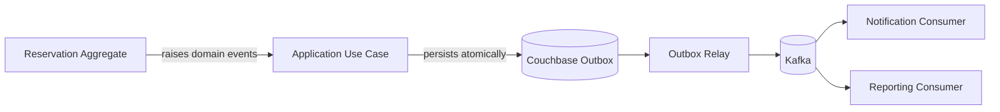

# ADR-005: Use Kafka for Asynchronous Domain Event Distribution

## 1. Status

**Accepted**

---

## 2. Context

Haven's reservation core must remain focused on authoritative reservation behavior:

- Create reservations
- Enforce conflict rules
- Protect lifecycle transitions
- Persist idempotent outcomes
- Preserve tenant isolation
- Raise meaningful domain events

Several capabilities need to react to reservation state changes without becoming part of the synchronous reservation transaction:

- Notification
- Reporting
- Audit
- Analytics
- Future integrations
- Operational projections

Examples of relevant business facts include:

- `ReservationCreated`
- `ReservationApprovalRequested`
- `ReservationConfirmed`
- `ReservationRejected`
- `ReservationCancelled`
- `ReservationExtended`
- `ReservationExpired`
- `ReservationCompleted`

The system needs an asynchronous transport that can:

- Deliver durable event streams
- Support multiple independent consumers
- Preserve useful ordering
- Support replay
- Scale horizontally
- Tolerate duplicate delivery
- Integrate with a transactional outbox
- Remain observable and recoverable

The main alternatives considered were:

- Kafka
- RabbitMQ
- Direct synchronous HTTP calls
- In-process event dispatch only
- Database polling without a broker
- Cloud-specific pub/sub services

---

## 3. Problem Statement

Which event transport should Haven use for asynchronous distribution of reservation lifecycle events?

The selected mechanism must decouple the reservation write path from downstream processing while preserving durability, replayability, and operational visibility.

---

## 4. Decision Drivers

| Priority | Driver | Importance |
|---:|---|---|
| 1 | No silent event loss | Critical |
| 2 | Multiple independent consumers | Critical |
| 3 | Durable event retention | High |
| 4 | Replay capability | High |
| 5 | Per-reservation ordering | High |
| 6 | Horizontal consumer scaling | High |
| 7 | Observable lag and backlog | High |
| 8 | At-least-once delivery support | High |
| 9 | Integration with outbox pattern | High |
| 10 | Operational simplicity for local development | Medium |
| 11 | Technology learning value | Medium |
| 12 | Cloud independence | Medium |

---

## 5. Options Considered

### Option A — Kafka

A distributed event-streaming platform supporting:

- Durable ordered partitions
- Consumer groups
- Replay
- Retention
- Horizontal scale
- Producer acknowledgments
- Idempotent producer support
- Observable consumer lag
- Multiple independent subscribers

### Option B — RabbitMQ

A message broker optimized for:

- Task queues
- Flexible routing
- Acknowledgment-based delivery
- Dead-letter exchanges
- Per-message consumption semantics
- Lower operational overhead for some workloads

### Option C — Direct Synchronous HTTP Calls

The reservation service directly calls notification or reporting APIs before completing the user request.

### Option D — In-Process Event Bus

Application modules publish and consume events in the same process.

### Option E — Database Polling Only

Consumers poll Couchbase collections for new or changed reservations without an external broker.

### Option F — Cloud-Managed Pub/Sub

Examples include cloud-provider event or queue services.

This option is operationally attractive in a specific cloud but introduces provider-specific assumptions.

---

## 6. Evaluation

| Criteria | Kafka | RabbitMQ | Synchronous HTTP | In-Process Bus | DB Polling | Cloud Pub/Sub |
|---|---|---|---|---|---|---|
| Durable retention | Excellent | Good | No | No | Database-dependent | Excellent |
| Replay | Excellent | Limited/model-dependent | No | No | Manual | Good–Excellent |
| Multiple consumer groups | Excellent | Good | Manual fan-out | In-process only | Manual | Excellent |
| Ordering | Partition ordering | Queue ordering | Call order only | Process order | Query order issues | Service-dependent |
| Backpressure | Strong | Strong | Couples caller | Weak | Polling-based | Strong |
| Consumer lag visibility | Strong | Good | No | No | Custom | Strong |
| Local development | Medium | Medium | Easy | Easy | Easy–Medium | Weak |
| Operational complexity | Medium–High | Medium | Low initially | Low | Medium | Low managed / high coupling |
| Event-stream fit | Excellent | Good | Poor | Poor | Poor–Medium | Excellent |
| Replay for reporting | Excellent | Limited | No | No | Custom | Good |
| MVP suitability | High | High | Low | Low as sole mechanism | Low | Medium |

---

## 7. Decision

Haven will use **Kafka** as the asynchronous transport for domain event distribution.

Kafka will carry versioned reservation lifecycle events from a durable outbox relay to independent consumers.

The initial topic strategy will use a shared reservation event topic:

```text
haven.reservation.events.v1
```

Initial consumers include:

- Notification
- Reporting and audit

Dead-letter topics may include:

```text
haven.notification.dlq.v1
haven.reporting.dlq.v1
```

Kafka is the transport, not the domain model and not the source of truth for reservation state.

---

## 8. Rationale

### 8.1 Durable Event Streams

Haven needs downstream consumers to process business events even when they are temporarily unavailable.

Kafka retains events independently of consumer availability.

This enables:

- Delayed consumption
- Recovery after outage
- Replay
- New consumer onboarding
- Operational inspection

### 8.2 Multiple Independent Consumers

One reservation event may be used by:

- Notification
- Reporting
- Audit
- Analytics
- Future calendar integration
- Future webhooks

Kafka consumer groups allow each capability to consume independently without coupling their processing lifecycle.

### 8.3 Replay Supports Derived State

Reporting and analytics are derived from reservation facts.

Kafka retention allows these projections to be:

- Rebuilt
- Reprocessed
- Corrected after consumer bugs
- Backfilled for new consumers

### 8.4 Partition Ordering Is Sufficient

Haven does not require global event ordering.

It requires useful ordering for one reservation.

Partitioning by a key derived from:

```text
organizationId + reservationId
```

preserves order for one reservation while distributing unrelated reservations.

### 8.5 Consumer Lag Is Observable

Kafka provides a clear operational model for:

- Consumer offsets
- Lag
- Partition ownership
- Backlog
- Replay position

This is valuable for production diagnosis and portfolio discussion.

### 8.6 Kafka Fits the Project's Learning Goals

Haven is intended to demonstrate event-driven backend engineering.

Kafka enables meaningful implementation of:

- Outbox pattern
- At-least-once processing
- Consumer idempotency
- Schema evolution
- Partition strategy
- Retry
- Dead-letter handling
- Lag monitoring

This learning value is justified because the requirements genuinely benefit from durable asynchronous fan-out.

---

## 9. Architectural Boundary

Kafka must remain outside the domain layer.

The domain raises in-memory facts.

The application and infrastructure layers coordinate durable persistence and publication.



The domain must not depend on:

- Kafka producer APIs
- Topic names
- Broker configuration
- Consumer offsets
- Serialization frameworks specific to Kafka

---

## 10. Event Publication Model

### 10.1 Domain Event

A domain event is an immutable business fact raised by an aggregate.

Example:

```text
ReservationConfirmed
```

### 10.2 Outbox Record

The application persists a versioned event envelope in Couchbase as part of the same atomic transaction as the reservation state change.

### 10.3 Outbox Relay

The relay:

1. Polls pending events.
2. Claims an event using CAS or a lease.
3. Publishes to Kafka.
4. Marks it published.
5. Retries transient failures.
6. Marks terminal failure when policy is exhausted.
7. Emits logs, metrics, and traces.

### 10.4 Kafka Consumer

A consumer:

1. Receives event.
2. Validates envelope and version.
3. Checks consumer idempotency.
4. Executes side effect.
5. Records completion.
6. Commits offset.
7. Retries or dead-letters failure.

---

## 11. Delivery Semantics

Haven uses **at-least-once delivery**.

Reasons:

- Producer/relay crashes may cause duplicate publication.
- Consumer crashes may occur after the side effect but before offset commit.
- Network acknowledgments can be ambiguous.
- End-to-end exactly-once behavior across Kafka and external providers is not generally guaranteed.

Therefore:

- Every consumer must be idempotent.
- Event IDs are globally unique.
- Consumer completion is tracked.
- Duplicate processing is measured.

Haven does not claim exactly-once delivery.

---

## 12. Event Envelope

```json
{
  "eventId": "evt_01H...",
  "eventType": "ReservationConfirmed",
  "eventVersion": 1,
  "occurredAt": "2026-07-20T05:30:00Z",
  "organizationId": "org_01H...",
  "aggregateType": "Reservation",
  "aggregateId": "rsv_01H...",
  "correlationId": "trace_01H...",
  "causationId": "cmd_01H...",
  "payload": {
    "reservationId": "rsv_01H...",
    "resourceId": "res_01H...",
    "startTime": "2026-08-01T10:00:00Z",
    "endTime": "2026-08-01T11:00:00Z",
    "status": "CONFIRMED"
  }
}
```

Envelope rules:

- Immutable
- Versioned
- Tenant-aware
- Safe for external consumption
- Independent of C++ object layout
- No JWT or secret data
- Minimal personally identifiable information
- Stable event type names

---

## 13. Topic Strategy

### 13.1 Initial Topic

```text
haven.reservation.events.v1
```

A single topic is sufficient initially because:

- Event volume is manageable.
- Events share lifecycle and retention characteristics.
- Consumers can filter by event type.
- Operational setup remains simple.
- Per-reservation ordering remains straightforward.

### 13.2 Topic Separation Triggers

Create separate topics when:

- Access control differs.
- Retention differs.
- Throughput differs substantially.
- Consumer ownership requires isolation.
- Event payload sensitivity differs.
- A consumer should not see unrelated event types.
- Operational blast radius becomes unacceptable.

### 13.3 Dead-Letter Topics

Dead-letter topics are consumer-specific because failures and replay ownership differ.

---

## 14. Partition Strategy

Recommended message key:

```text
organizationId + ":" + reservationId
```

Benefits:

- Preserves order for one reservation.
- Distributes unrelated reservations.
- Avoids global serialization.
- Supports tenant-aware diagnosis.

Alternative key:

```text
organizationId + ":" + resourceId
```

This would preserve order for all events affecting one resource but can create hot partitions for popular resources.

The reservation-based key is selected for the initial event stream because reservation lifecycle order is the primary requirement.

---

## 15. Producer Configuration

Production-oriented producer settings should include:

- Idempotent producer enabled where supported
- Strong acknowledgment policy
- Bounded delivery timeout
- Retry of transient errors
- Compression after measurement
- Batching after measurement
- Restricted topic permissions
- TLS and authentication in production

Producer retries do not remove the need for the outbox or consumer idempotency.

---

## 16. Consumer Groups

Suggested groups:

```text
haven-notification-v1
haven-reporting-v1
```

Each logical consumer owns its offset progression.

Multiple instances within one group share partitions for horizontal scaling.

Independent groups receive the same event stream.

---

## 17. Consumer Idempotency

Deduplication key:

```text
consumerName + eventId
```

For notification delivery, a more specific key may be:

```text
eventId + recipient + channel
```

For reporting:

- Upsert by event ID, or
- Apply only when aggregate event/version is newer

A duplicate must not:

- Send duplicate user notifications unexpectedly
- Increment reporting counts twice
- Create duplicate audit entries
- Trigger repeated external side effects

---

## 18. Retry Strategy

### 18.1 Retryable Consumer Failures

- Temporary network failure
- Provider timeout
- HTTP `5xx`
- Rate limit with retry guidance
- Temporary database unavailability
- Temporary Kafka infrastructure failure

### 18.2 Non-Retryable Failures

- Invalid schema
- Unsupported event version
- Missing required field
- Permanently invalid recipient
- Invalid configuration requiring operator action
- Unauthorized external provider request
- Corrupt payload

### 18.3 Retry Behavior

- Exponential backoff
- Jitter
- Bounded attempts
- Failure classification
- Attempt metrics
- Trace correlation
- Dead-letter after exhaustion

Retries must not block one consumer partition indefinitely without a documented policy.

---

## 19. Dead-Letter Design

Dead-letter records include:

- Original event envelope
- Consumer name
- Failure category
- Failure summary
- Attempt count
- First failure timestamp
- Last failure timestamp
- Correlation ID
- Replay metadata

Operators must be able to:

- Inspect
- Correct configuration
- Replay safely
- Mark resolved
- Audit manual action

Replayed events retain their original `eventId`.

---

## 20. Schema Evolution

### 20.1 Versioning

Every event includes:

```text
eventType
eventVersion
```

### 20.2 Compatible Changes

Preferred:

- Add optional fields
- Add new event types
- Add safe metadata

### 20.3 Breaking Changes

Require:

- New event version
- Consumer compatibility plan
- Parallel support window
- Schema tests
- Rollout sequencing

### 20.4 Schema Storage

Suggested repository location:

```text
schemas/events/reservation/
├── reservation-created.v1.json
├── reservation-confirmed.v1.json
├── reservation-cancelled.v1.json
└── ...
```

A schema registry may be introduced later if operational needs justify it.

---

## 21. Ordering Guarantees

Kafka guarantees order only within one partition.

Haven guarantees:

- Events with the same selected message key are published in partition order.
- Consumers process partition records in order unless they explicitly implement concurrent handling.
- Global ordering across reservations is not guaranteed.
- Reporting must not depend on global order.

Consumers should use:

- Event occurred time
- Aggregate ID
- Event version
- Idempotency
- Current-state validation where needed

---

## 22. Retention

Initial event retention should be long enough to support:

- Consumer outage recovery
- Debugging
- Replay
- New consumer development
- Reporting rebuild

Exact duration is environment-dependent.

Illustrative policy:

- Local: short retention
- Staging: several days
- Production: multiple days or weeks based on cost and recovery needs

Kafka retention does not replace authoritative Reservation persistence.

---

## 23. Security

### 23.1 Network

- Kafka is private.
- TLS is used in production.
- Broker authentication is required.
- Administrative interfaces are restricted.

### 23.2 Authorization

Separate credentials and ACLs for:

- Haven producer
- Notification consumer
- Reporting consumer
- Operations/replay tooling

Consumers receive only required topic permissions.

### 23.3 Data Minimization

Events exclude:

- JWT
- Password
- Infrastructure secrets
- Full raw request body
- Purpose text unless explicitly required
- Unnecessary email or phone data
- Internal exception stack traces

### 23.4 Tenant Context

Every event includes `organizationId`.

Consumers validate tenant context before downstream persistence or delivery.

---

## 24. Observability

### Producer and Relay Metrics

- Outbox pending count
- Oldest pending age
- Outbox claim conflicts
- Publish attempts
- Publish success
- Publish failure
- Publish latency
- Retry count
- Dead outbox count

### Consumer Metrics

- Consumer lag
- Processing latency
- Success
- Retry
- Dead-letter count
- Duplicate event count
- Unsupported schema count
- External provider failure

### Logs

Include:

- Event ID
- Event type
- Version
- Aggregate ID
- Organization ID
- Consumer
- Partition
- Offset
- Attempt
- Trace ID
- Outcome

Do not expose sensitive payloads unnecessarily.

---

## 25. Failure Scenarios

| Failure | Required Outcome |
|---|---|
| Application crashes after reservation commit | Outbox remains and publishes later |
| Kafka unavailable | Outbox backlog grows; no silent loss |
| Relay crashes before publish | Another relay retries |
| Relay publishes then crashes before marking | Duplicate publication possible |
| Consumer crashes before side effect | Event redelivered |
| Consumer crashes after side effect before commit | Duplicate delivery handled idempotently |
| Invalid schema | Dead-letter and alert |
| Consumer offline | Kafka retains events |
| New consumer starts later | Replays from selected offset |
| DLQ replay | Original event ID preserved |

---

## 26. Performance Considerations

Kafka is not on the synchronous reservation response path when the outbox is used.

Performance-sensitive areas:

- Outbox poll interval
- Poll batch size
- Relay concurrency
- Kafka producer batching
- Compression
- Partition count
- Consumer worker count
- External notification provider latency
- Dead-letter throughput
- Consumer deduplication storage

Metrics should distinguish:

- Reservation commit latency
- Event publication delay
- Consumer processing delay
- End-to-end notification delay

---

## 27. Local Development

Docker Compose should provide:

- Kafka broker
- Required coordination mode
- Kafka UI
- Topic bootstrap
- Test consumer/producer configuration

Local startup should be deterministic.

Topics may be created by:

- Explicit bootstrap script, or
- Controlled broker auto-creation in local only

Production topic creation must be explicit and reviewed.

---

## 28. Testing Strategy

### Unit Tests

- Event creation
- Envelope mapping
- Partition key
- Retry classification
- Schema version selection
- Consumer idempotency logic

### Integration Tests

- Outbox persistence
- Outbox relay claim
- Kafka publication
- Consumer receipt
- Duplicate publication
- Offset behavior
- DLQ routing
- Replay

### Failure Tests

- Broker unavailable
- Relay crash after publish
- Consumer crash after side effect
- Poison event
- Unsupported version
- Deduplication-store timeout

### Contract Tests

- Event schema validation
- Backward-compatible additive fields
- Consumer support for expected versions

---

## 29. Consequences

### 29.1 Positive

- Durable asynchronous fan-out
- Multiple independent consumers
- Replay support
- Observable lag
- Horizontal consumer scaling
- Per-reservation ordering
- Strong fit for outbox pattern
- Decoupled notification and reporting
- Clear event-driven engineering experience
- Future integration path

### 29.2 Negative

- Additional infrastructure and operational burden
- Local development becomes heavier
- At-least-once delivery requires idempotency
- Topic and schema governance are required
- Consumer lag and DLQ need operational ownership
- Partitioning decisions can create hot spots
- Kafka upgrades and security configuration require expertise
- Small workloads may not strictly require Kafka

### 29.3 Neutral

- Kafka does not own Reservation state.
- Kafka does not provide end-to-end exactly-once side effects.
- Kafka does not eliminate the outbox.
- Kafka does not replace API-level idempotency.
- Consumers may still use Couchbase or other stores for their own state.

---

## 30. Risks and Mitigations

| Risk | Likelihood | Impact | Mitigation |
|---|---|---|---|
| Event loss from dual write | High without outbox | Critical | Transactional outbox |
| Duplicate delivery | High | Medium–High | Consumer idempotency |
| Poison event blocks partition | Medium | High | Retry policy and DLQ |
| Schema incompatibility | Medium | High | Versioned schemas and contract tests |
| Consumer lag unnoticed | Medium | High | Metrics and alerts |
| Hot partition | Low–Medium | Medium | Reservation-based key and monitoring |
| Sensitive data in events | Medium | High | Data minimization and review |
| Local environment complexity | Medium | Medium | Compose profiles and scripts |
| Outbox backlog | Medium | High | Relay scaling and age alert |
| Replay duplicates side effects | Medium | High | Preserve event ID and deduplicate |

---

## 31. Rejected Alternatives

### 31.1 RabbitMQ

RabbitMQ is a strong alternative for task-oriented messaging and routing.

It was not selected because Haven values:

- Durable replayable event history
- Multiple independent consumer groups
- Reporting rebuild
- Stream-oriented operational model
- Consumer lag visibility

RabbitMQ may be preferable if the workload becomes primarily short-lived command/task queues rather than durable event streams.

### 31.2 Direct Synchronous HTTP

Rejected because:

- Notification latency would affect reservation latency.
- Downstream failure could fail the core reservation request.
- Fan-out becomes tightly coupled.
- Retry and partial failure become difficult.
- Reporting and audit should not be synchronous dependencies.

### 31.3 In-Process Event Bus Only

Useful for internal dispatch, but insufficient as the durable cross-process transport.

It cannot survive process failure and does not support independent consumers or replay.

### 31.4 Database Polling Without Kafka

Rejected as the primary design because:

- Every consumer would implement polling.
- Fan-out and replay ownership become custom.
- Lag and partitioning are less explicit.
- Database load increases.
- Consumer coordination becomes application-specific.

The outbox relay itself still polls Couchbase, but Kafka becomes the shared downstream distribution mechanism.

### 31.5 Cloud-Specific Pub/Sub

Deferred because Haven currently prioritizes local Docker development and cloud-neutral architecture.

A managed cloud event platform may later replace Kafka behind the event publisher/consumer adapters.

---

## 32. Portability Strategy

Kafka-specific types remain in infrastructure.

Portability mechanisms:

- Neutral event envelope
- Domain events independent of broker
- Event publisher/relay interfaces
- Consumer application handlers independent of Kafka record types
- Schema files in version control
- Topic configuration externalized
- Error classification independent of Kafka client exceptions

Replacing Kafka still requires infrastructure and operational work, but domain and reservation application behavior remain stable.

---

## 33. Migration Strategy

If Kafka is replaced:

1. Freeze event schemas.
2. Implement the new producer adapter.
3. Implement consumer adapters.
4. Preserve event IDs and partition/order semantics where needed.
5. Run dual publication if necessary.
6. Compare consumer outputs.
7. Migrate consumer groups incrementally.
8. Retain replay and deduplication compatibility.
9. Stop Kafka publication after validation.
10. Update deployment and observability.

A transport migration must not alter the meaning of domain events.

---

## 34. Reconsideration Triggers

Revisit this ADR when:

- Kafka operational cost exceeds its value.
- Event volume remains permanently trivial.
- A managed platform substantially reduces complexity.
- Stronger task-queue semantics become more important than replay.
- Multi-region event replication becomes required.
- Topic partition limits block scale.
- Consumer replay is no longer needed.
- Security or compliance requires a different broker.
- The organization standardizes on another platform.
- Kafka client support in the chosen C++ stack becomes problematic.

---

## 35. Implementation Impact

### Domain

- Raises broker-neutral domain events.
- No Kafka dependency.

### Application

- Persists events through outbox transaction boundary.
- Uses neutral event contracts.

### Infrastructure

Must implement:

- Event serialization
- Outbox relay
- Kafka producer
- Kafka consumers
- Retry
- DLQ
- Consumer deduplication
- Health and metrics
- Topic bootstrap

### Deployment

Requires:

- Kafka broker/cluster
- Topic configuration
- Credentials and ACLs
- Monitoring
- Worker deployment
- Capacity planning

### Testing

Requires:

- Kafka container
- Producer/consumer integration tests
- Failure and replay tests
- Schema compatibility tests
- Duplicate handling tests

---

## 36. Validation Criteria

The decision is successful when:

- Every committed reservation event is eventually publishable.
- Kafka outage does not lose committed events.
- Consumers process events independently.
- Duplicate events do not duplicate side effects.
- Per-reservation lifecycle order is preserved.
- Consumer lag is visible.
- DLQ failures are inspectable and replayable.
- Event schemas evolve compatibly.
- Reservation API latency is independent of normal consumer processing.
- Domain and application layers compile without Kafka.

Warning signs:

- Controllers publishing directly to Kafka
- Reservation success depending on notification response
- Consumers without deduplication
- Unversioned payload changes
- Sensitive request bodies copied into events
- Global partition key
- Silent DLQ accumulation
- Outbox events deleted before confirmed publication

---

## 37. Follow-Up Tasks

- [ ] Define initial Kafka topic configuration.
- [ ] Define event schema files.
- [ ] Implement broker-neutral event envelope.
- [ ] Implement Couchbase outbox repository.
- [ ] Implement outbox relay claim and retry.
- [ ] Configure Kafka producer.
- [ ] Implement notification consumer.
- [ ] Implement reporting consumer.
- [ ] Implement consumer deduplication.
- [ ] Define DLQ record contract.
- [ ] Add consumer lag metrics.
- [ ] Add outbox oldest-age alert.
- [ ] Add Kafka failure integration tests.
- [ ] Add duplicate delivery tests.
- [ ] Document replay runbook.
- [ ] Secure production topics with ACLs.

---

## 38. Interview Notes

### Why Kafka?

Haven needs durable event retention, replay, multiple independent consumers, partition ordering, and observable lag. Kafka fits that event-stream use case.

### Why not send notifications synchronously?

Notification failure or latency should not affect reservation correctness or API latency. The reservation core emits a fact and completes.

### Why is an outbox still needed?

Saving to Couchbase and publishing to Kafka are separate operations. The outbox prevents silent event loss across that dual-write boundary.

### What delivery guarantee do you provide?

At-least-once. Consumers are idempotent because duplicates can occur after ambiguous producer or consumer failure.

### How do you preserve event order?

Use a message key derived from organization and reservation ID so one reservation's events remain in one partition.

### Why not guarantee global ordering?

Global ordering reduces parallelism and is not a business requirement. Reporting must tolerate independent reservation streams.

### What happens if Kafka is down?

Reservation state and outbox events commit in Couchbase. The relay retries later, and operators monitor backlog age and size.

### Is Kafka overengineering for the MVP?

It adds complexity, but notification, reporting, replay, and event-driven learning are explicit requirements. The architecture keeps Kafka out of the synchronous correctness path.

---

## 39. Summary

**Decision:** Use Kafka for asynchronous distribution of versioned reservation lifecycle events.

**Reason:** Kafka provides durable retention, replay, independent consumer groups, partition ordering, horizontal consumer scaling, and strong operational visibility.

**Accepted trade-offs:** Additional infrastructure, at-least-once processing, schema governance, consumer idempotency, and operational ownership.

**Reliability mechanism:** Transactional Couchbase outbox plus retryable relay.

**Boundary:** Kafka is infrastructure transport, not the domain and not the reservation source of truth.

---

## 40. Completion Checklist

- [x] Context documented
- [x] Problem defined
- [x] Decision drivers identified
- [x] Alternatives evaluated
- [x] Decision stated
- [x] Topic strategy described
- [x] Partition strategy described
- [x] Delivery semantics documented
- [x] Outbox integration included
- [x] Consumer idempotency included
- [x] Retry and DLQ defined
- [x] Schema evolution included
- [x] Security considerations included
- [x] Observability included
- [x] Risks documented
- [x] Migration strategy included
- [x] Reconsideration triggers defined
- [x] Interview notes included
