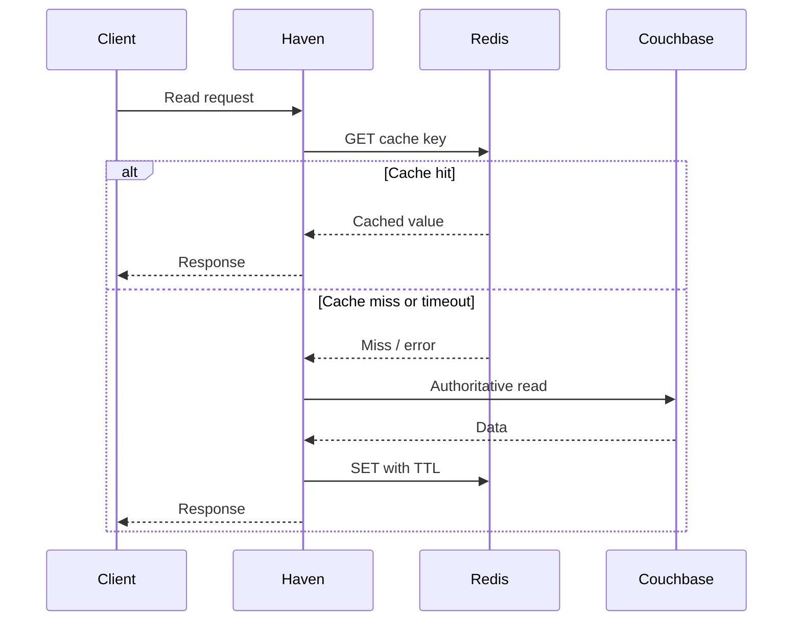

# ADR-006: Use Redis as a Non-Authoritative Cache and Rate-Limiting Store

## 1. Status

**Accepted**

---

## 2. Context

Haven's primary datastore is Couchbase.

Couchbase remains authoritative for:

- Organizations
- Resource metadata
- Reservations
- Idempotency records
- Schedule guard documents
- Event outbox records
- Consumer deduplication records where configured

However, several read-heavy or ephemeral concerns may benefit from a low-latency in-memory store:

- Resource metadata caching
- Organization policy caching
- Search-result caching
- Rate limiting
- Short-lived negative caching
- Distributed circuit-breaker support if later justified
- Temporary operational coordination that does not determine reservation correctness

The platform expects substantially more reads than writes, especially for:

- Resource search
- Resource detail
- Organization policy retrieval
- Availability discovery

The system must avoid adding Redis as a second source of truth.

A Redis outage must not permit:

- Double booking
- Lost reservation updates
- Cross-tenant access
- Idempotency failure
- Event loss

The main alternatives considered were:

- Redis
- In-process cache only
- Couchbase only
- Memcached
- Redis as a distributed locking and correctness layer
- CDN or reverse-proxy cache only

---

## 3. Problem Statement

Should Haven introduce Redis, and if so, what responsibilities may it own?

The decision must improve latency and reduce repeated datastore work without weakening correctness or making availability depend unnecessarily on the cache.

---

## 4. Decision Drivers

| Priority | Driver | Importance |
|---:|---|---|
| 1 | Preserve reservation correctness | Critical |
| 2 | Avoid a second source of truth | Critical |
| 3 | Low-latency read caching | High |
| 4 | Graceful degradation during cache outage | High |
| 5 | Multi-instance rate limiting | High |
| 6 | Tenant isolation | Critical |
| 7 | Operational visibility | High |
| 8 | Simple invalidation model | High |
| 9 | Horizontal application scaling | Medium |
| 10 | Local development support | Medium |
| 11 | Memory efficiency | Medium |
| 12 | Technology learning value | Medium |

---

## 5. Options Considered

### Option A — Redis as a Non-Authoritative Cache

Use Redis for:

- Cache-aside reads
- Short-lived search caching
- Organization policy caching
- Resource detail caching
- Distributed rate limiting
- Optional negative caching

Do not use Redis for:

- Reservation source of truth
- Authoritative availability
- Primary idempotency
- Distributed locking for double-booking prevention
- Event durability

### Option B — In-Process Cache Only

Each Haven instance maintains a local cache.

Advantages:

- Very low latency
- No network dependency
- Simple local implementation

Disadvantages:

- Cache duplication across instances
- Inconsistent invalidation
- No distributed rate limiting
- Higher aggregate memory use
- Cold cache on every instance

### Option C — Couchbase Only

Do not introduce a cache.

Advantages:

- Fewer dependencies
- Simpler operations
- No cache invalidation
- Strongly consistent direct reads where used

Disadvantages:

- Higher repeated-read load
- Higher latency for frequently read stable metadata
- No dedicated distributed rate-limiting store
- Less flexibility under search-heavy load

### Option D — Memcached

Use Memcached for simple distributed caching.

Advantages:

- Simple
- Fast
- Well understood

Disadvantages:

- Fewer data structures
- Weaker support for distributed rate-limiting algorithms
- Less operational flexibility
- No persistence options if later useful

### Option E — Redis as Lock and Correctness Store

Use Redis locks or atomic scripts to prevent conflicting reservations.

Rejected because it would make reservation correctness depend on cache/lease behavior outside the authoritative datastore.

### Option F — CDN or Reverse-Proxy Cache

Cache public or low-variance HTTP responses outside the application.

Useful for some future read paths, but insufficient for authenticated tenant-scoped search and policy caching.

---

## 6. Evaluation

| Criteria | Redis Cache | In-Process Cache | Couchbase Only | Memcached | Redis Correctness Layer |
|---|---|---|---|---|---|
| Shared across instances | Yes | No | Yes | Yes | Yes |
| Low-latency reads | Excellent | Excellent | Good | Excellent | Excellent |
| Graceful fallback | Yes when designed | Yes | Native | Yes | Dangerous |
| Distributed rate limiting | Excellent | No | Possible but poor fit | Limited | Excellent |
| Cache data structures | Rich | Application-defined | Document/KV | Basic | Rich |
| Operational complexity | Medium | Low | Low | Medium | High |
| Correctness risk | Low | Low | Low | Low | High |
| Invalidation complexity | Medium | High across instances | None | Medium | High |
| MVP suitability | High | Medium | High initially | Medium | Rejected |
| Horizontal application scaling | High | Medium | High | High | High |
| Portfolio value | High | Medium | Medium | Medium | Negative if unjustified |

---

## 7. Decision

Haven will use **Redis as a non-authoritative cache and distributed rate-limiting store**.

Redis may store only data that can be:

- Recomputed
- Reloaded from Couchbase
- Safely discarded
- Allowed to be briefly stale within documented bounds

Redis will not participate in the authoritative reservation transaction.

Redis failure must degrade performance or rate-limiting precision, not reservation correctness.

---

## 8. Rationale

### 8.1 Read Traffic Exceeds Write Traffic

Resource discovery and metadata reads are expected to dominate reservation writes.

Redis can reduce repeated Couchbase work for:

- Stable resource metadata
- Organization policy
- Repeated search queries
- Low-change reference data

### 8.2 Redis Supports Multi-Instance Cache Sharing

Haven API instances are stateless and horizontally scalable.

A shared cache provides:

- Better aggregate hit rate
- Less duplicate memory
- Consistent TTL behavior
- Shared invalidation
- Warm data available to newly started instances

### 8.3 Redis Is Suitable for Rate Limiting

Redis atomic operations and scripts support distributed algorithms such as:

- Fixed window
- Sliding window
- Token bucket
- Leaky bucket

This is preferable to per-instance rate limiting when multiple instances serve the same tenant or user.

### 8.4 Failure Can Be Isolated

Cache-aside design allows the application to bypass Redis when:

- Redis times out
- Redis is unavailable
- Circuit breaker is open
- Cache payload is corrupt
- Serialization version is unsupported

The authoritative request then continues against Couchbase when safe.

### 8.5 Redis Is Not Needed for Reservation Correctness

Couchbase transactions and schedule guard documents already provide the concurrency boundary.

Adding Redis locks would create:

- Lease-expiry risk
- Lock ownership complexity
- Split correctness responsibility
- More difficult failure reasoning

Redis therefore remains explicitly non-authoritative.

---

## 9. Allowed Responsibilities

Redis may be used for:

### 9.1 Organization Policy Cache

Key:

```text
haven:v1:org-policy:<organizationId>
```

Contains:

- Booking-window policy
- Maximum duration
- Maintenance duration
- Approval configuration
- Policy version
- Cache schema version

### 9.2 Resource Detail Cache

Key:

```text
haven:v1:resource:<organizationId>:<resourceId>
```

Contains stable resource metadata.

### 9.3 Resource Search Cache

Key derived from canonicalized search parameters:

```text
haven:v1:resource-search:<organizationId>:<queryHash>
```

Cache only bounded, paginated results.

### 9.4 Negative Cache

Short-lived cache for known absent or inactive resources where safe.

### 9.5 Rate Limiting

Examples:

```text
haven:v1:rate:user:<organizationId>:<userId>:<routeGroup>
haven:v1:rate:tenant:<organizationId>:<routeGroup>
haven:v1:rate:ip:<ipHash>:<routeGroup>
```

### 9.6 Feature-Independent Ephemeral State

Only when loss does not affect business correctness and ownership is documented.

---

## 10. Forbidden Responsibilities

Redis must not be the authoritative store for:

- Reservations
- Reservation status
- Confirmed availability
- Schedule guard state
- API idempotency results
- Event outbox
- Consumer completion
- Tenant membership
- Approval decision
- Audit history
- Resource ownership

Redis must not be used as the primary distributed lock for reservation allocation.

---

## 11. Cache-Aside Read Flow



Redis errors are logged and measured, then treated as misses where the use case supports fallback.

---

## 12. Cache Write Strategy

Haven uses cache-aside rather than write-through for the MVP.

When authoritative data changes:

1. Commit Couchbase state.
2. Invalidate relevant Redis keys.
3. Allow subsequent reads to repopulate.
4. Use event-driven invalidation later if needed.

The database commit must not depend on cache invalidation success.

If invalidation fails:

- The stale entry remains only until TTL expiry.
- A metric is emitted.
- Retry may be performed asynchronously when safe.

---

## 13. Cache Invalidation

### 13.1 Resource Update

Invalidate:

```text
resource detail key
affected search keys
```

Because identifying every affected search key may be expensive, use one of:

- Short search TTL
- Tenant resource-generation version
- Search-cache namespace version
- Event-driven tenant-level invalidation

Recommended initial approach:

- Directly invalidate resource detail.
- Use short TTL for search cache.
- Introduce generation-based invalidation only if measurement justifies it.

### 13.2 Organization Policy Update

Invalidate the organization's policy key immediately after commit.

### 13.3 Reservation Changes

Reservation writes do not require cache invalidation for correctness because authoritative allocation is never read from Redis.

Search availability responses, when cached, must use very short TTL or avoid caching dynamic availability entirely.

---

## 14. Availability Caching Policy

Haven will not cache authoritative availability decisions.

Permitted:

- Cache resource metadata candidates.
- Cache stable filters and resource properties.
- Cache broad search results that do not assert final availability.
- Use very short-lived availability response caching only after explicit review and with transaction revalidation on write.

The create/approve/extend path always rechecks authoritative schedule guards.

A cached "available" response is advisory, not a reservation guarantee.

---

## 15. Key Design

Key requirements:

- Versioned prefix
- Tenant-scoped
- Bounded length
- No raw secrets
- No raw JWT
- No unbounded purpose text
- Stable canonical format
- Hash high-dimensional query parameters

General format:

```text
haven:<schemaVersion>:<purpose>:<tenantScope>:<identifier>
```

Example:

```text
haven:v1:resource-search:org_01H...:7f83b1657ff1fc53
```

---

## 16. Value Serialization

Cache payloads include:

```json
{
  "cacheSchemaVersion": 1,
  "sourceVersion": "123456",
  "cachedAt": "2026-07-20T05:30:00Z",
  "data": {}
}
```

Rules:

- Validate schema version.
- Reject malformed data.
- Do not deserialize directly into domain aggregates without validation.
- Keep payloads compact.
- Avoid storing sensitive fields unnecessarily.
- Use deterministic serialization for testing.

---

## 17. TTL Strategy

Illustrative initial TTLs:

| Cache Entry | TTL |
|---|---:|
| Organization policy | 5 minutes |
| Resource detail | 5–15 minutes |
| Resource search | 15–60 seconds |
| Negative resource lookup | 5–15 seconds |
| Dynamic availability | Disabled initially |
| JWT signing keys if cached separately | Based on key metadata and security policy |

Exact values must be validated through load tests and change frequency.

TTL rules:

- Add jitter to reduce synchronized expiry.
- Prefer shorter TTL where invalidation is broad.
- Do not use infinite TTL for mutable business data.
- Monitor stale-hit incidents.

---

## 18. Cache Stampede Protection

Potential protections:

- TTL jitter
- Request coalescing within one process
- Short distributed fill lock only for cache population
- Stale-while-revalidate for non-critical metadata
- Probabilistic early refresh
- Bounded fallback concurrency

Any fill lock:

- Must never protect reservation correctness.
- Must have a short lease.
- May be skipped if unavailable.
- Must not block the request indefinitely.

Start with TTL jitter and bounded request coalescing before adding distributed fill locks.

---

## 19. Rate-Limiting Model

Rate limiting protects:

- Authentication endpoints if present
- Search endpoints
- Reservation write endpoints
- Administrative endpoints
- Expensive reporting endpoints

Dimensions may include:

- Tenant
- User
- IP address
- Route group

Recommended algorithm:

- Token bucket or sliding-window approximation
- Atomic Redis script
- Configurable capacity and refill rate
- Explicit retry-after response

Rate limiting must not reveal whether another tenant or user exists.

---

## 20. Rate-Limit Failure Policy

Redis outage creates a policy choice.

### Fail Open

Allow requests when rate-limit storage is unavailable.

Advantages:

- Better availability
- No accidental outage caused by Redis

Risks:

- Temporary abuse protection reduction

### Fail Closed

Reject requests when Redis is unavailable.

Advantages:

- Stronger abuse protection

Risks:

- Redis becomes an availability dependency

### Selected Policy

- Normal user-facing reservation and search endpoints: **fail open with local emergency limits**, while emitting alerts.
- Sensitive administrative endpoints: may **fail closed** depending on security policy.
- The failure policy must be route-specific and documented.

---

## 21. Timeout and Retry Policy

Redis must have a short operation timeout.

Guidelines:

- Redis timeout is much smaller than the request deadline.
- Treat timeout as cache miss for cache reads.
- Do not perform repeated Redis retries in one request.
- Cache writes may be best-effort.
- Rate-limit scripts may use one bounded retry only if time allows.
- Circuit breaker opens after sustained failures.
- Recovery uses periodic probes.

Illustrative timeout:

```text
10–20 ms in a local-region production environment
```

Actual values depend on deployment topology.

---

## 22. Circuit Breaker

When Redis failure rate exceeds a threshold:

1. Open the cache circuit.
2. Bypass cache operations.
3. Fall back to Couchbase.
4. Use local emergency rate limiting where configured.
5. Probe Redis periodically.
6. Close after sustained recovery.

The circuit breaker prevents Redis latency from dominating p99 request latency.

---

## 23. Consistency Model

Redis values are eventually consistent with Couchbase.

The system accepts:

- Temporary stale resource metadata
- Temporary stale organization policy only within defined TTL and invalidation bounds
- Temporary search-result staleness

The system does not accept:

- Stale authorization decisions that permit cross-tenant access
- Stale reservation state used for write correctness
- Stale schedule guard decisions
- Stale idempotency outcomes

Security-sensitive policy changes may require:

- Immediate invalidation
- Short TTL
- Version check against authoritative state
- Cache bypass

---

## 24. Tenant Isolation

Every tenant-scoped cache key includes authoritative organization identity from trusted caller context.

Never derive organization scope from an untrusted request body alone.

Tests must verify:

- Same resource ID in different organizations produces different keys.
- Search query hash includes organization identity.
- Cache invalidation cannot target another tenant accidentally.
- Rate-limit keys do not collapse tenants together unintentionally.

---

## 25. Security

### 25.1 Network

- Redis is private.
- TLS is used in production where supported.
- Authentication is required.
- Administrative access is restricted.
- Public internet exposure is prohibited.

### 25.2 Credentials

- Stored in secret manager/environment.
- Rotated.
- Not logged.
- Scoped where Redis deployment supports ACLs.

### 25.3 Data

Do not cache:

- Passwords
- JWTs
- Full authorization headers
- Raw payment information
- Sensitive purpose text
- Unnecessary personal information
- Full request bodies

### 25.4 Command Restrictions

Production ACLs should restrict Haven to required commands.

Avoid dangerous administrative commands from application credentials.

---

## 26. Observability

### Cache Metrics

- Cache request count
- Hit count
- Miss count
- Error count
- Timeout count
- Fill count
- Invalidation count
- Invalidation failure
- Payload size
- Operation latency
- Circuit-breaker state

### Rate-Limit Metrics

- Allowed request count
- Rejected request count
- Fail-open count
- Fail-closed count
- Redis script error
- Emergency local-limit activation

### Memory Metrics

- Used memory
- Eviction count
- Key count
- Fragmentation
- Expired keys
- Connection count

Metric labels must remain low-cardinality.

---

## 27. Performance Considerations

A cache is successful only when it improves end-to-end behavior.

Measure:

- p50/p95/p99 latency with and without cache
- Couchbase query reduction
- Cache hit rate
- Serialization cost
- Redis network latency
- Payload size
- Memory cost
- Eviction
- Stale-read frequency
- Circuit-breaker activation
- Search throughput

A high hit rate that does not reduce latency or database load is not sufficient justification.

---

## 28. Capacity Planning

Estimate memory using:

```text
entry count
× average key size
+ average value size
+ Redis metadata overhead
× replication factor
× safety margin
```

Plan for:

- Resource cache
- Organization policies
- Search-result cache
- Rate-limit keys
- Expiry bursts
- Replication overhead
- Operational headroom

Set a maximum memory policy appropriate for cache workloads.

Recommended eviction policy:

```text
allkeys-lru
```

or another measured policy aligned with the deployment.

Rate-limit keys must remain functional under the chosen eviction behavior. If necessary, isolate rate limiting into a separate Redis deployment or database.

---

## 29. High Availability

Production Redis should use an availability model appropriate to operational requirements:

- Managed Redis
- Redis Sentinel
- Redis Cluster
- Replication with failover

Because Redis is non-authoritative, failover can prioritize availability over strict cache persistence.

Rate limiting may temporarily lose precision during failover.

---

## 30. Persistence Policy

Cache data does not require durable persistence.

Rate-limit state is also ephemeral.

Therefore:

- Redis persistence is optional for the initial design.
- Enabling AOF/RDB is an operational choice, not a correctness requirement.
- Restart-induced cache loss is acceptable.
- The application must recover by repopulating.

---

## 31. Local Development

Docker Compose provides Redis with:

- Configurable port
- Health check
- Optional password
- Persistent volume only if useful for debugging
- Resource limits
- Metrics exporter under observability profile

Local environment may use a single Redis instance.

---

## 32. Testing Strategy

### Unit Tests

- Cache key generation
- Query canonicalization
- TTL selection
- Value serialization
- Cache schema version validation
- Rate-limit decision mapping
- Circuit-breaker transitions

### Integration Tests

- Cache hit and miss
- Expiry
- Invalidation
- Cross-tenant key isolation
- Redis timeout
- Redis unavailability
- Rate-limit atomicity
- Concurrent token consumption
- Circuit-breaker recovery

### Failure Tests

- Redis restart
- Network latency
- Corrupt cache value
- Eviction
- Memory pressure
- Partial invalidation failure
- Fail-open behavior
- Administrative fail-closed behavior

### Performance Tests

- Search throughput with cache
- Couchbase load reduction
- Stampede after expiry
- Rate-limit script latency
- Fallback under Redis outage

---

## 33. Consequences

### 33.1 Positive

- Lower latency for repeated reads
- Reduced Couchbase load
- Shared cache across application instances
- Distributed rate limiting
- Better burst handling
- Flexible TTL and atomic operations
- Graceful cache bypass
- Strong operational and learning value
- Supports future cache patterns without changing domain logic

### 33.2 Negative

- Additional infrastructure
- Cache invalidation complexity
- Potential stale reads
- Memory and eviction management
- Additional monitoring
- New failure mode affecting latency
- Rate-limiting precision may degrade during outage
- Serialization and network overhead
- Risk of accidental correctness coupling

### 33.3 Neutral

- Cache loss is acceptable.
- Redis does not remove the need for Couchbase indexes.
- Redis does not guarantee reservation availability.
- Redis is not required for every endpoint.
- Some caching may remain disabled until measurement justifies it.

---

## 34. Risks and Mitigations

| Risk | Likelihood | Impact | Mitigation |
|---|---|---|---|
| Redis becomes source of truth | Medium | Critical | Explicit forbidden-use rules |
| Stale policy data | Medium | High | Invalidation, short TTL, versioning |
| Cache stampede | Medium | High | TTL jitter and coalescing |
| Redis latency hurts p99 | Medium | High | Short timeout and circuit breaker |
| Cross-tenant key collision | Low–Medium | Critical | Tenant-scoped key builder and tests |
| Eviction breaks rate limiting | Medium | Medium | Capacity planning or separate deployment |
| Sensitive data cached | Medium | High | Data classification and review |
| Broad invalidation cost | Medium | Medium | Short TTL or generation version |
| Cache hit hides database issue | Low–Medium | High | Monitor Couchbase independently |
| Fail-open abuse window | Low–Medium | Medium | Local emergency limits and alerts |

---

## 35. Rejected Alternatives

### 35.1 In-Process Cache Only

Not selected as the primary shared cache because it:

- Duplicates data across instances
- Complicates invalidation
- Cannot provide distributed rate limiting
- Produces inconsistent hit rates across deployments

Small process-local caches may still be used for immutable or ultra-short-lived data after measurement.

### 35.2 Couchbase Only

This remains the safest initial fallback and may be sufficient during early implementation.

Redis is introduced for measured read optimization and distributed rate limiting, not because every architecture requires a cache.

If Redis provides no measurable benefit, affected caches should remain disabled.

### 35.3 Memcached

Not selected because Redis provides richer atomic operations and supports both caching and rate limiting.

### 35.4 Redis Distributed Locks

Rejected for reservation correctness because lock leases and database commits form separate failure domains.

### 35.5 CDN as Sole Cache

Insufficient for authenticated, tenant-scoped, dynamic resource queries.

A CDN may later cache public documentation or static assets.

---

## 36. Portability Strategy

Redis-specific code remains in infrastructure.

Application code depends on neutral interfaces such as:

```cpp
class ResourceCache {
public:
    virtual std::optional<ResourceSnapshot> get(
        const OrganizationId& organizationId,
        const ResourceId& resourceId) = 0;

    virtual void put(
        const OrganizationId& organizationId,
        const ResourceSnapshot& resource,
        std::chrono::seconds ttl) = 0;

    virtual void invalidate(
        const OrganizationId& organizationId,
        const ResourceId& resourceId) = 0;
};
```

Rate limiting exposes a neutral decision:

```cpp
struct RateLimitDecision {
    bool allowed;
    std::uint32_t remaining;
    std::chrono::seconds retryAfter;
};
```

Replacing Redis should not change domain behavior.

---

## 37. Migration Strategy

If Redis is replaced or removed:

1. Disable cache reads through configuration.
2. Verify Couchbase capacity.
3. Remove or bypass cache writes.
4. Replace distributed rate limiter if still required.
5. Compare latency and load.
6. Drain or discard Redis data.
7. Remove deployment resources.
8. Preserve neutral interfaces for future implementations if useful.

Because Redis is non-authoritative, no business-data migration is required.

---

## 38. Reconsideration Triggers

Revisit this ADR when:

- Cache hit rate remains too low.
- Redis does not improve end-to-end latency.
- Couchbase handles expected load without cache.
- Redis operational cost exceeds benefit.
- Rate limiting moves to an API gateway.
- Stale policy incidents occur.
- Memory use or eviction becomes problematic.
- A managed edge cache better fits search workloads.
- Multi-region deployment changes cache consistency requirements.
- Redis becomes a critical availability dependency despite the intended design.

---

## 39. Implementation Impact

### Domain

- No Redis dependency.
- No cache-aware business rules.

### Application

- May use optional cache ports.
- Treats cache miss and cache failure separately in telemetry.
- Never trusts cache for final reservation allocation.

### Infrastructure

Must implement:

- Redis client lifecycle
- Key builders
- Serialization
- Cache adapters
- Rate-limit scripts
- Timeouts
- Circuit breaker
- Health status
- Metrics

### API

- May return faster cached reads.
- Uses standard `429` response for rate limiting.
- Must not expose internal cache state.

### Deployment

Requires:

- Redis service/cluster
- Credentials
- Resource limits
- Memory policy
- Monitoring
- Optional high availability

### Testing

Requires:

- Redis container
- Failure and timeout tests
- Tenant-key isolation tests
- Rate-limit concurrency tests
- Performance comparison

---

## 40. Validation Criteria

The decision is successful when:

- Redis outage does not cause double booking.
- Redis outage does not lose reservations or events.
- Search or resource-read latency improves measurably.
- Couchbase read/query load decreases measurably.
- Cache keys remain tenant-isolated.
- Cache invalidation failures are visible.
- Rate limiting works across multiple Haven instances.
- Fail-open and fail-closed behavior matches route policy.
- Cache operations remain within strict latency budgets.
- Domain and application layers compile without Redis.

Warning signs:

- Reservation creation reads Redis availability as authoritative.
- Idempotency stored only in Redis.
- Controllers call Redis directly.
- Infinite TTL on mutable data.
- Redis timeout near the full request deadline.
- Raw request bodies used in keys.
- Cache failures returned as `500` for safe fallback reads.
- Rate-limit keys evicted routinely.

---

## 41. Follow-Up Tasks

- [ ] Add Redis through Docker Compose.
- [ ] Define versioned cache-key builder.
- [ ] Implement organization policy cache.
- [ ] Implement resource detail cache.
- [ ] Keep dynamic availability cache disabled initially.
- [ ] Implement short-lived search cache behind feature flag.
- [ ] Add TTL jitter.
- [ ] Implement Redis circuit breaker.
- [ ] Implement distributed rate limiter.
- [ ] Define route-specific failure policy.
- [ ] Add cache and rate-limit metrics.
- [ ] Add tenant-isolation tests.
- [ ] Add Redis outage tests.
- [ ] Benchmark Couchbase load with and without cache.
- [ ] Document Redis operational runbook.

---

## 42. Interview Notes

### Why introduce Redis when Couchbase already supports key-value access?

Couchbase remains authoritative. Redis is used only when repeated read latency, database load, or distributed rate limiting justify a separate low-latency ephemeral store.

### Why not use Redis to prevent double booking?

That would split correctness across Redis leases and Couchbase commits. Couchbase transactions and schedule guards already provide the authoritative concurrency boundary.

### What happens when Redis is down?

Cache reads become misses and fall back to Couchbase. Normal user-facing rate limiting fails open with local emergency limits, while sensitive administrative routes may fail closed.

### How do you handle cache invalidation?

Direct keys are invalidated after authoritative commits. Search caches use short TTLs initially because tracking every affected query key is expensive.

### Do you cache availability?

Not authoritatively. Resource metadata may be cached, but reservation creation always revalidates against Couchbase schedule guards.

### How do you prevent cache stampedes?

Start with TTL jitter and process-local request coalescing. Add distributed fill locks only if measurement shows they are needed.

### What is the biggest risk?

Redis gradually becoming an undocumented source of truth. The architecture explicitly forbids that and tests failure behavior.

---

## 43. Summary

**Decision:** Use Redis as a non-authoritative shared cache and distributed rate-limiting store.

**Reason:** Redis can reduce repeated read latency and Couchbase load while supporting atomic multi-instance rate limiting.

**Correctness boundary:** Couchbase remains authoritative for reservations, availability allocation, idempotency, and events.

**Failure behavior:** Redis failure degrades performance or rate-limit precision but must not compromise reservation correctness.

**Accepted trade-offs:** Additional infrastructure, invalidation complexity, stale-read risk, memory management, and operational monitoring.

---

## 44. Completion Checklist

- [x] Context documented
- [x] Problem defined
- [x] Decision drivers identified
- [x] Alternatives evaluated
- [x] Decision stated
- [x] Allowed responsibilities defined
- [x] Forbidden responsibilities defined
- [x] Cache-aside flow documented
- [x] Invalidation strategy included
- [x] Availability-caching policy included
- [x] Rate-limiting failure policy included
- [x] Timeout and circuit-breaker strategy included
- [x] Security and tenant isolation included
- [x] Observability included
- [x] Risks documented
- [x] Migration strategy included
- [x] Reconsideration triggers defined
- [x] Interview notes included
