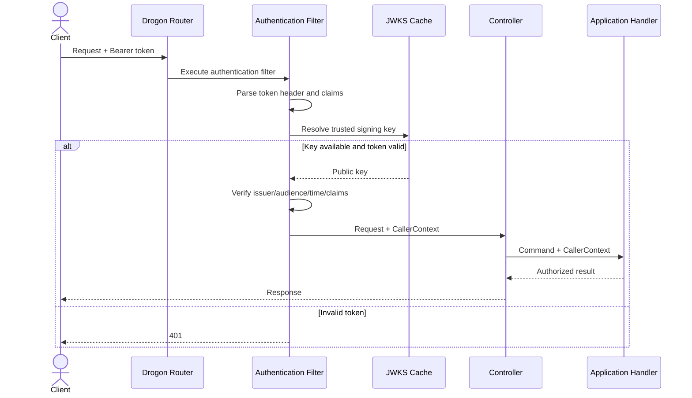

# ADR-007: Use JWT Bearer Authentication with External Identity Provider

## 1. Status

**Accepted**

---

## 2. Context

Haven is a multi-tenant reservation platform serving users from multiple organizations.

Every protected request must establish:

- Who the caller is
- Which organization the caller belongs to
- Which roles or permissions the caller has
- Whether the caller may access the requested tenant resource
- Whether the authentication proof is valid and unexpired

Haven must support:

- Stateless API instances
- Horizontal scaling
- Standard HTTP clients
- Role-based authorization
- Tenant isolation
- Short-lived access credentials
- Signing-key rotation
- Local development and automated testing
- Clear audit identity
- Separation between authentication and business authorization

The Haven backend is not intended to own:

- Password storage
- User registration
- Password reset
- Multi-factor authentication
- Identity federation
- Social login
- Account recovery
- Primary credential issuance

These capabilities belong to a dedicated identity provider.

The main authentication alternatives considered were:

- JWT bearer access tokens issued by an external identity provider
- Opaque bearer tokens with remote introspection
- Server-side sessions
- API keys
- Mutual TLS client identity
- Custom username/password authentication inside Haven

---

## 3. Problem Statement

How should Haven authenticate API callers while preserving stateless deployment, tenant isolation, key rotation, testability, and clear security boundaries?

The selected model must allow Haven to validate caller identity without becoming a full identity-management system.

---

## 4. Decision Drivers

| Priority | Driver | Importance |
|---:|---|---|
| 1 | Strong caller authentication | Critical |
| 2 | Tenant isolation | Critical |
| 3 | Stateless API scaling | High |
| 4 | Separation from password management | High |
| 5 | Standard protocol support | High |
| 6 | Signing-key rotation | High |
| 7 | Low per-request authentication latency | High |
| 8 | Role and permission claims | High |
| 9 | Revocation response | Medium |
| 10 | Local development and testing | Medium |
| 11 | Operational simplicity | Medium |
| 12 | Provider portability | Medium |

---

## 5. Options Considered

### Option A — JWT Bearer Tokens

An external identity provider issues signed, short-lived JWT access tokens.

Haven validates:

- Signature
- Algorithm
- Issuer
- Audience
- Expiration
- Not-before time
- Required claims
- Tenant membership claims

### Option B — Opaque Tokens with Introspection

The client sends an opaque token.

Haven calls the identity provider's introspection endpoint to validate every request or uses a short local cache.

### Option C — Server-Side Sessions

Haven stores session state in Redis or another shared store.

The client sends a session identifier through a cookie or header.

### Option D — API Keys

Each user or integration receives a long-lived API key.

### Option E — Mutual TLS

Client certificates establish machine identity.

### Option F — Haven-Owned Username and Password

Haven stores user credentials and implements login, password hashing, reset, and account security.

---

## 6. Evaluation

| Criteria | JWT | Opaque + Introspection | Sessions | API Keys | mTLS | Haven-Owned Credentials |
|---|---|---|---|---|---|---|
| Stateless API validation | Excellent | No | No | Good | Good | Depends |
| Per-request latency | Low | Network-dependent | Store lookup | Low | Low | Depends |
| Immediate revocation | Limited | Strong | Strong | Manual | Certificate revocation | Custom |
| Standard ecosystem | Excellent | Excellent | Excellent | Good | Strong for service identity | High effort |
| User-facing suitability | Excellent | Excellent | Excellent | Weak | Weak | Possible |
| Tenant/role claims | Strong | Strong | Session data | Custom | Custom | Custom |
| Key rotation | Strong | Provider-managed | Session secret rotation | Key rotation | Certificate rotation | Custom |
| Operational burden | Medium | Medium–High | Medium | Medium | High | Very high |
| Horizontal scaling | Excellent | Good | Requires shared state | Excellent | Excellent | Depends |
| MVP suitability | High | Medium | Medium | Low | Low | Rejected |

---

## 7. Decision

Haven will use **JWT bearer access tokens issued by an external OpenID Connect-compatible identity provider**.

Haven will:

- Validate JWT access tokens locally.
- Fetch signing keys from the provider's JWKS endpoint.
- Cache signing keys with bounded refresh behavior.
- Validate issuer and audience explicitly.
- Require short-lived access tokens.
- Map trusted claims into a neutral `CallerContext`.
- Perform authorization inside Haven using domain/application policies.
- Keep tenant identity derived from trusted claims, not request body input.
- Reject tokens using unexpected signing algorithms.
- Avoid storing access tokens in application persistence.

Haven will not implement password authentication or token issuance.

---

## 8. Rationale

### 8.1 Stateless Validation Supports Horizontal Scaling

Each Haven instance can validate a signed token without consulting shared session state on every request.

This supports:

- Load-balanced API instances
- Rolling deployment
- Process restart
- No sticky sessions
- Lower authentication latency

### 8.2 Identity Management Is Not Haven's Core Domain

Password security, account recovery, MFA, federation, and login risk controls are complex security capabilities.

Delegating them to an external identity provider allows Haven to focus on:

- Reservation behavior
- Tenant authorization
- Resource access
- Approval rules
- Auditability

### 8.3 JWT Claims Support Tenant and Role Context

A validated token can carry stable identifiers such as:

- Subject/user ID
- Organization ID or memberships
- Roles
- Scopes
- Token ID
- Authentication time

Haven converts these into a neutral caller model.

### 8.4 Local Validation Avoids Per-Request Network Dependency

Opaque-token introspection would make identity-provider availability and latency part of every protected API request.

JWT validation avoids that dependency while accepting a bounded revocation delay.

### 8.5 Standard Protocols Preserve Provider Portability

Using standard JWT and OpenID Connect concepts allows Haven to integrate with providers such as:

- Keycloak
- Auth0
- Okta
- Microsoft Entra ID
- Amazon Cognito
- Other OIDC-compatible systems

Provider-specific claims must be isolated through configuration and mapping.

---

## 9. Authentication and Authorization Boundary

Authentication answers:

> Who is calling, and is the identity proof valid?

Authorization answers:

> May this caller perform this operation on this tenant-owned resource?

The authentication middleware may:

- Validate token
- Extract trusted claims
- Create `CallerContext`
- Reject invalid or missing credentials

The application layer must decide:

- Whether caller belongs to the organization
- Whether caller owns a reservation
- Whether caller has approver role
- Whether caller may administer resources
- Whether cross-user access is permitted
- Whether organization policy permits the operation

JWT role claims do not replace domain authorization rules.

---

## 10. Caller Context

The presentation layer maps validated claims into a neutral type:

```cpp
struct CallerContext {
    UserId userId;
    OrganizationId organizationId;
    std::set<Role> roles;
    std::set<Permission> permissions;
    std::optional<std::string> tokenId;
    std::optional<std::chrono::system_clock::time_point> authenticatedAt;
};
```

Rules:

- No Drogon request type
- No raw JWT object
- No authorization header
- No provider SDK type
- Immutable during request handling
- Constructed only after successful validation

---

## 11. Required Token Claims

Illustrative required claims:

| Claim | Purpose |
|---|---|
| `iss` | Trusted token issuer |
| `aud` | Token intended for Haven |
| `sub` | Stable caller identity |
| `exp` | Expiration |
| `iat` | Issuance time |
| `nbf` | Optional not-before time |
| `jti` | Optional token identifier |
| `org_id` | Active organization context |
| `roles` or `scope` | Authorization input |

Exact claim names are configurable because identity providers differ.

Haven must not trust arbitrary user-editable profile claims for authorization.

---

## 12. Token Validation Rules

For every protected request, Haven validates:

1. Authorization header exists.
2. Scheme is `Bearer`.
3. Token structure is valid.
4. Signing algorithm is explicitly allowed.
5. Signature matches a trusted current key.
6. `iss` equals configured issuer.
7. `aud` contains configured Haven audience.
8. `exp` is in the future.
9. `nbf` is not in the future beyond allowed clock skew.
10. Required subject and tenant claims exist.
11. Claim types and lengths are valid.
12. Token is an access token, not an ID token, when provider exposes token type.
13. Organization context is valid for the route and operation.
14. Optional deny-list checks pass when enabled.

Failure results in `401 Unauthorized` unless identity is valid but permission is insufficient, which results in `403 Forbidden`.

---

## 13. Algorithm Restrictions

Haven must use an explicit allow-list of asymmetric signing algorithms.

Recommended initial choice:

```text
RS256
```

or another provider-supported asymmetric algorithm selected through security review.

Haven must reject:

- `alg=none`
- Unexpected symmetric algorithms
- Algorithm/key-type mismatch
- Tokens signed with untrusted keys
- Dynamically selected algorithms from unvalidated token input

The configured issuer metadata determines acceptable key types.

---

## 14. JWKS Key Management

### 14.1 Key Retrieval

Haven retrieves public signing keys from the configured JWKS endpoint.

### 14.2 Cache

Keys are cached in memory.

Optional Redis caching is not required because signing keys are small and each instance can cache them independently.

### 14.3 Refresh

Refresh occurs:

- Before configured expiry
- When an unknown `kid` is encountered
- Periodically in the background
- After verification failure caused by possible rotation

### 14.4 Failure Behavior

If refresh fails:

- Continue using still-valid cached keys.
- Emit metrics and alerts.
- Do not accept an unknown key.
- Do not disable signature validation.
- Reject tokens requiring unavailable new keys until refresh succeeds.

### 14.5 Rotation

The identity provider should expose old and new public keys during an overlap window.

---

## 15. Clock Skew

A small configurable clock skew may be allowed for:

- `exp`
- `nbf`
- `iat`

Illustrative maximum:

```text
30–60 seconds
```

Large skew weakens expiration guarantees and is not acceptable.

Production hosts must use reliable time synchronization.

---

## 16. Token Lifetime

Access tokens should be short-lived.

Illustrative range:

```text
5–15 minutes
```

Exact duration is identity-provider policy.

Long-lived refresh tokens are handled only by the identity provider/client and are never accepted by Haven API endpoints as access tokens.

Short-lived tokens reduce exposure from:

- Token theft
- Role changes
- Tenant membership changes
- Revocation delay

---

## 17. Revocation Model

JWT local validation does not provide immediate revocation by default.

Haven accepts bounded revocation delay equal to the remaining token lifetime for normal user tokens.

Mitigations:

- Short access-token lifetime
- Identity-provider session revocation
- Signing-key rotation for broad emergencies
- Optional token-ID deny list for exceptional cases
- Versioned membership or security epoch claim if later required
- Immediate authoritative checks for highly sensitive administrative operations

A deny list must not become an unbounded permanent token store.

---

## 18. Tenant Context

### 18.1 Selected Organization

The token contains or derives a trusted active organization context.

The client must not select a different organization merely by changing:

- Request body
- Query parameter
- Header
- Resource identifier

### 18.2 Resource Ownership

Repository methods require organization scope.

Example:

```cpp
findById(OrganizationId organizationId, ResourceId resourceId);
```

### 18.3 Multi-Organization Membership

If a user belongs to multiple organizations, the identity provider may issue a token for one active organization at a time.

Alternative future design:

- Token contains memberships.
- Client supplies organization selector.
- Haven validates selector against trusted membership claims.

The MVP prefers one active organization per token to reduce ambiguity.

---

## 19. Role Model

Illustrative roles:

- `MEMBER`
- `APPROVER`
- `RESOURCE_ADMIN`
- `ORG_ADMIN`
- `SYSTEM_ADMIN`

Roles are coarse identity attributes.

Application permissions remain operation-specific.

Examples:

| Operation | Minimum Authorization |
|---|---|
| Search resources | Authenticated tenant member |
| Create reservation | Authenticated tenant member |
| View own reservation | Owner or authorized administrator |
| Cancel own reservation | Owner subject to policy |
| Approve priority resource | Approver for organization/resource |
| Create resource | Resource administrator |
| Modify organization policy | Organization administrator |
| Cross-tenant operation | System administrator with explicit support path |

System administrator access must be tightly controlled and audited.

---

## 20. Scope and Permission Mapping

Identity-provider scopes may map to neutral permissions.

Example:

```text
haven:reservation:create
haven:reservation:read
haven:reservation:approve
haven:resource:manage
haven:organization:manage
```

Mapping logic belongs in authentication/authorization adapters and configuration.

The domain must not parse raw OAuth scope strings.

---

## 21. Public and Protected Routes

### Public

- `GET /health/live`
- Restricted minimal readiness endpoint as deployment requires
- API documentation only in permitted environments
- Authentication callbacks only if later introduced outside Haven core

### Protected

- Resource search
- Resource detail
- Reservation creation
- Reservation retrieval
- Cancellation
- Extension
- Approval
- Administrative APIs
- Detailed operational endpoints

A route is protected by default unless explicitly classified public.

---

## 22. HTTP Behavior

### Missing or Invalid Authentication

```http
HTTP/1.1 401 Unauthorized
WWW-Authenticate: Bearer
```

### Valid Identity but Insufficient Permission

```http
HTTP/1.1 403 Forbidden
```

### Error Body

Use the standard Haven error contract:

```json
{
  "code": "AUTHENTICATION_REQUIRED",
  "message": "A valid access token is required.",
  "traceId": "trace_01H..."
}
```

Do not reveal:

- Which signature check failed in detail
- Whether a specific user exists
- Internal key IDs beyond safe diagnostics
- Raw token contents

Detailed failure categories belong in protected logs and metrics.

---

## 23. Middleware Flow



---

## 24. Framework Boundary

Drogon authentication filters may handle HTTP concerns.

JWT library/provider types remain in:

```text
src/infrastructure/auth/
src/presentation/rest/filters/
src/bootstrap/
```

They must not appear in:

```text
src/domain/
src/application/
```

Application use cases receive only neutral caller context and permissions.

---

## 25. Security Logging

Authentication logs may include:

- Trace ID
- Issuer
- Audience result
- Safe token ID hash
- Subject ID
- Organization ID
- Failure category
- Key refresh status
- Route template

Logs must not include:

- Raw JWT
- Authorization header
- Signature bytes
- Full JWKS response
- Refresh token
- Sensitive user profile claims

Repeated authentication failure should be rate-limited and monitored.

---

## 26. Observability

### Metrics

- Authentication request count
- Success count
- Missing-token count
- Invalid-signature count
- Expired-token count
- Invalid-issuer count
- Invalid-audience count
- Missing-claim count
- Unknown-key-ID count
- JWKS refresh success/failure
- Authorization denial count
- Authentication latency

Metric labels:

- Route group
- Outcome category
- Issuer identifier with bounded values
- Environment

Do not use user ID or token ID as metric labels.

### Traces

Trace attributes may include:

- Authentication outcome
- Authorization outcome
- Organization ID
- Role count
- Key refresh performed
- Failure category

Sensitive token data must not be attached.

---

## 27. Availability Behavior

### Identity Provider Login Unavailable

Existing unexpired access tokens can continue to validate locally if signing keys are cached.

New login/token issuance may be unavailable to clients.

### JWKS Endpoint Unavailable

Known cached keys continue working until cache policy expires.

Unknown keys are rejected.

### Clock Synchronization Failure

The instance should become operationally unhealthy if system clock drift threatens token validation correctness.

### Redis Unavailable

Authentication remains functional because JWT validation does not depend on Redis.

Optional deny-list checks require documented failure behavior.

---

## 28. Local Development

Recommended local identity options:

### Option A — Keycloak Container

Provides:

- OIDC discovery
- JWT issuance
- Roles
- Organizations/groups
- JWKS rotation testing
- Realistic integration

### Option B — Test Token Issuer

A small test-only utility issues signed tokens using local keys.

Rules:

- Never enabled in production.
- Separate configuration profile.
- Test keys are not production keys.
- Startup clearly identifies development mode.

### Option C — Static Test Tokens

Allowed only for narrow automated tests and not as the primary developer workflow.

Keycloak is the preferred realistic local environment when authentication work begins.

---

## 29. Testing Strategy

### Unit Tests

- Header parsing
- Claim mapping
- Issuer validation
- Audience validation
- Expiration and clock skew
- Required claims
- Role mapping
- Organization extraction
- Algorithm allow-list
- Error-category mapping

### Integration Tests

- Valid signed token
- Expired token
- Future `nbf`
- Wrong issuer
- Wrong audience
- Unknown `kid`
- Key rotation
- JWKS outage with cached key
- Missing organization claim
- Invalid role type
- Multi-tenant isolation
- Protected route behavior

### Security Tests

- `alg=none`
- Algorithm confusion
- Malformed JWT segments
- Oversized token
- Duplicate JSON claims where parser behavior matters
- Untrusted JWKS URL injection
- Header parameter abuse
- Replayed expired token
- Raw token log leakage
- Cross-tenant resource identifier attack

### Authorization Tests

- Member creates own reservation
- Member cannot approve
- Approver can approve tenant reservation
- Approver cannot approve another tenant
- Resource admin can manage resources
- Caller cannot override `organizationId`

---

## 30. Token Size and Request Limits

JWTs can grow due to roles and memberships.

Haven must:

- Set a maximum Authorization header size.
- Reject excessively large tokens.
- Avoid embedding extensive user profile data.
- Prefer compact role/scope claims.
- Avoid putting all resource permissions into the token.
- Use authoritative application checks for complex access.

Large tokens increase:

- Network overhead
- Header parsing cost
- Proxy limits
- Logging risk

---

## 31. Key and Library Management

- Use a maintained JWT/JWS library.
- Pin dependency versions.
- Apply vulnerability updates.
- Do not implement cryptographic verification manually.
- Validate the library's algorithm behavior.
- Review JSON parser behavior.
- Use secure TLS validation for JWKS retrieval.
- Restrict issuer and JWKS configuration.
- Do not accept a JWKS URL supplied by the token.

---

## 32. Consequences

### 32.1 Positive

- Stateless API authentication
- Low per-request validation latency
- Horizontal scaling without shared sessions
- Standard OIDC/JWT integration
- Clear separation from password management
- Tenant and role claims available
- Signing-key rotation support
- Existing tokens can survive short identity-provider outages
- Provider portability through standards
- Strong testability

### 32.2 Negative

- Immediate revocation is limited.
- JWT validation rules are security-sensitive.
- Key-cache refresh must be implemented correctly.
- Claims can become stale until token expiration.
- Large tokens increase header size.
- Provider claim differences require mapping.
- Token leakage remains dangerous until expiration.
- Authorization cannot rely solely on broad roles.

### 32.3 Neutral

- JWT does not replace application authorization.
- JWT does not store reservation state.
- JWT does not require Redis.
- OIDC discovery is operational configuration, not domain behavior.
- Refresh tokens remain outside Haven.

---

## 33. Risks and Mitigations

| Risk | Likelihood | Impact | Mitigation |
|---|---|---|---|
| Algorithm confusion | Low–Medium | Critical | Explicit algorithm allow-list |
| Wrong issuer accepted | Low | Critical | Exact issuer validation |
| Wrong audience accepted | Low | Critical | Exact audience validation |
| Stale revoked access | Medium | High | Short token lifetime |
| Unknown key during rotation | Medium | Medium | On-demand refresh and overlap |
| Raw token logged | Medium | High | Central redaction and tests |
| Cross-tenant claim misuse | Medium | Critical | Trusted active org and repository scoping |
| Oversized token | Low–Medium | Medium | Header-size limits |
| Provider-specific coupling | Medium | Medium | Claim mapper adapter |
| Clock drift | Low | High | Time synchronization and monitoring |
| JWT role too broad | Medium | High | Application authorization checks |
| Test bypass enabled in production | Low | Critical | Build/config guard and startup failure |

---

## 34. Rejected Alternatives

### 34.1 Opaque Tokens with Introspection

This provides stronger immediate revocation but introduces:

- Network call or cache dependency
- Higher latency
- Identity-provider availability on request path
- More operational coupling

Reconsider if immediate revocation becomes a hard compliance requirement.

### 34.2 Server-Side Sessions

Not selected because:

- Shared session storage becomes an availability dependency.
- Sticky-session or distributed-session concerns arise.
- API clients naturally support bearer tokens.
- OIDC-based external identity remains preferable.

Sessions may still be used by a separate browser frontend or API gateway, which then calls Haven with an access token.

### 34.3 API Keys

Not selected for normal users because:

- They are often long-lived.
- They carry weaker user/session context.
- Rotation and revocation are manual.
- Browser usage is poor.

API keys may later support machine integrations with separate policies.

### 34.4 Mutual TLS

Strong for service-to-service identity but unsuitable as the primary end-user authentication model.

It may later secure internal machine clients.

### 34.5 Haven-Owned Password Authentication

Rejected because implementing secure identity management is outside the project scope and creates substantial security risk.

---

## 35. Portability Strategy

Provider portability is preserved through:

- Standard OIDC discovery
- Standard JWT validation
- Configurable issuer and audience
- Configurable claim names
- Neutral `CallerContext`
- Neutral role/permission types
- No provider SDK in domain/application layers
- Contract tests for claim mapping

Provider-specific integrations remain in the authentication adapter.

---

## 36. Migration Strategy

If Haven moves to another identity provider:

1. Define equivalent issuer, audience, and claims.
2. Configure parallel trusted issuers during migration if necessary.
3. Implement provider-specific claim mapping.
4. Run authentication and authorization contract tests.
5. Validate key rotation and outage behavior.
6. Migrate clients to new token issuer.
7. Remove old issuer after all old tokens expire.
8. Retain audit correlation across stable user identifiers where possible.

If moving to opaque tokens:

- Replace validation adapter.
- Keep `CallerContext` unchanged.
- Add introspection caching and failure policy.
- Supersede this ADR.

---

## 37. Reconsideration Triggers

Revisit this ADR when:

- Immediate revocation becomes mandatory.
- Token claims become too large.
- Identity provider cannot issue suitable access tokens.
- Multi-organization membership requires dynamic authorization data.
- Compliance requires per-request introspection.
- Service-to-service authentication becomes dominant.
- API gateway becomes the authoritative authentication boundary.
- JWT library security or maintenance becomes unacceptable.
- Provider federation requirements change substantially.
- Token lifetime cannot be kept sufficiently short.

---

## 38. Implementation Impact

### Presentation

- Add bearer-token authentication filter.
- Map authentication failures to `401`.
- Attach neutral `CallerContext`.
- Set `WWW-Authenticate` where appropriate.

### Application

- Accept `CallerContext`.
- Perform operation-level authorization.
- Never trust organization ID from request body without matching caller context.

### Domain

- No JWT or HTTP dependency.
- May define neutral roles and permissions.

### Infrastructure

Must implement:

- OIDC metadata/JWKS client
- Key cache
- JWT validation
- Claim mapping
- Refresh logic
- Safe telemetry
- Optional emergency deny list

### Deployment

Requires:

- Issuer URL
- Audience
- JWKS/metadata endpoint
- Allowed algorithms
- Claim mapping
- Clock skew
- TLS trust
- Local identity-provider profile

### Testing

Requires:

- Local signing keys or identity-provider container
- Key rotation tests
- Claim validation tests
- Tenant-isolation tests
- Log-redaction tests

---

## 39. Validation Criteria

The decision is successful when:

- Valid access tokens authenticate across all Haven instances.
- Missing and invalid tokens return `401`.
- Valid but unauthorized callers receive `403`.
- A caller cannot access another tenant by changing request data.
- Unknown signing keys trigger bounded refresh.
- Cached keys survive short JWKS outages.
- Rotated keys work during overlap.
- Raw tokens never appear in logs or traces.
- Domain and application layers compile without JWT dependencies.
- Authentication latency remains within budget.
- Local development can issue realistic test tokens.

Warning signs:

- Controllers parsing JWT claims manually
- Organization ID trusted from request body
- `alg` accepted dynamically
- Raw token stored in logs
- ID token accepted as access token without policy
- Long-lived access tokens
- Redis required for every authentication decision
- Test authentication bypass available in production
- Application authorization replaced entirely by token roles

---

## 40. Follow-Up Tasks

- [ ] Select maintained C++ JWT/JWS library.
- [ ] Add OIDC issuer configuration.
- [ ] Implement JWKS client.
- [ ] Implement in-memory key cache.
- [ ] Implement bounded key refresh.
- [ ] Define neutral `CallerContext`.
- [ ] Define role and permission mapping.
- [ ] Implement Drogon authentication filter.
- [ ] Add standard `401` and `403` responses.
- [ ] Add authorization policy helpers.
- [ ] Add tenant-isolation integration tests.
- [ ] Add key rotation tests.
- [ ] Add authentication metrics.
- [ ] Add token redaction tests.
- [ ] Add Keycloak local-development profile.
- [ ] Document identity-provider setup.
- [ ] Add production guard against test-token mode.

---

## 41. Interview Notes

### Why JWT instead of sessions?

JWT allows each Haven instance to validate requests locally without shared session state, which supports stateless horizontal scaling.

### Why use an external identity provider?

Password handling, MFA, federation, recovery, and account security are specialized capabilities. Haven should consume identity, not rebuild identity management.

### What is the main JWT trade-off?

Immediate revocation is weaker. Haven mitigates it with short-lived access tokens and optional exceptional deny-listing.

### How do you prevent algorithm-confusion attacks?

Use an explicit allow-list, validate key type, reject `none`, and never select trust configuration from unverified token fields.

### How do you handle signing-key rotation?

Cache JWKS keys, refresh periodically, refresh once on an unknown key ID, and require the provider to publish overlapping old and new keys.

### How do you enforce tenant isolation?

The active organization comes from validated trusted claims, repository calls always include tenant scope, and request-supplied organization IDs cannot override caller context.

### Are roles in the token enough for authorization?

No. Roles are input. Application policies still verify ownership, tenant scope, reservation state, and resource-specific permissions.

### What happens if the identity provider is temporarily down?

Existing unexpired tokens continue validating with cached signing keys. New token issuance may fail outside Haven.

---

## 42. Summary

**Decision:** Authenticate Haven API callers using short-lived JWT bearer access tokens issued by an external OIDC-compatible identity provider.

**Reason:** This provides standard, stateless, low-latency authentication while keeping password and account-management complexity outside Haven.

**Authorization boundary:** JWT validation establishes trusted caller context; Haven application policies enforce tenant and operation authorization.

**Accepted trade-off:** Revocation is bounded by token lifetime unless exceptional deny-listing or introspection is introduced.

**Security requirements:** Exact issuer/audience validation, algorithm allow-listing, JWKS rotation, short token lifetime, safe logging, and strict tenant scoping.

---

## 43. Completion Checklist

- [x] Context documented
- [x] Problem defined
- [x] Decision drivers identified
- [x] Alternatives evaluated
- [x] Decision stated
- [x] Authentication/authorization boundary defined
- [x] Required claims documented
- [x] Validation rules documented
- [x] Algorithm restrictions included
- [x] JWKS rotation included
- [x] Revocation trade-off documented
- [x] Tenant isolation included
- [x] Security logging included
- [x] Testing strategy included
- [x] Risks documented
- [x] Migration strategy included
- [x] Reconsideration triggers defined
- [x] Interview notes included
