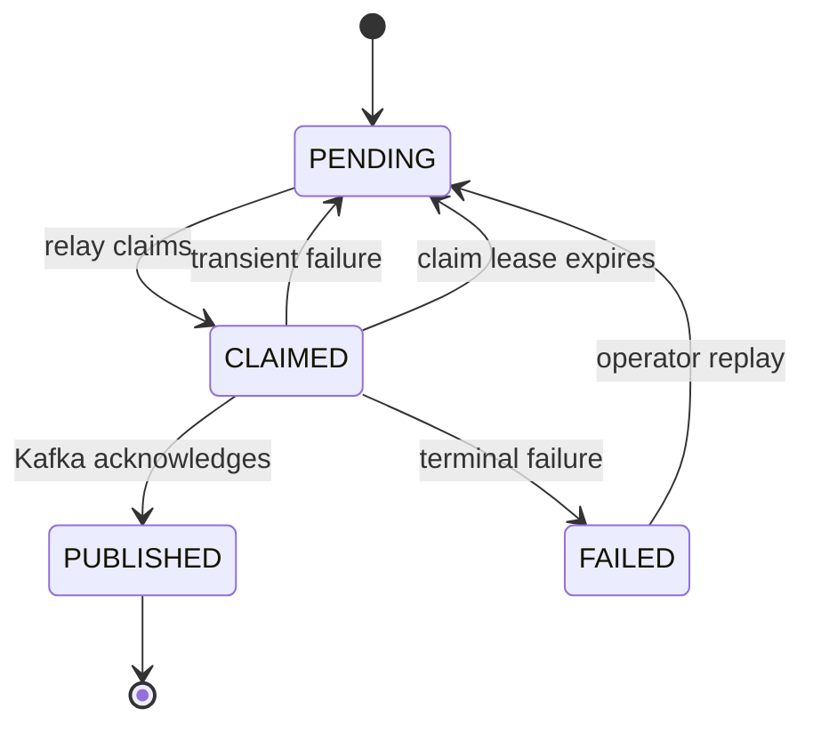
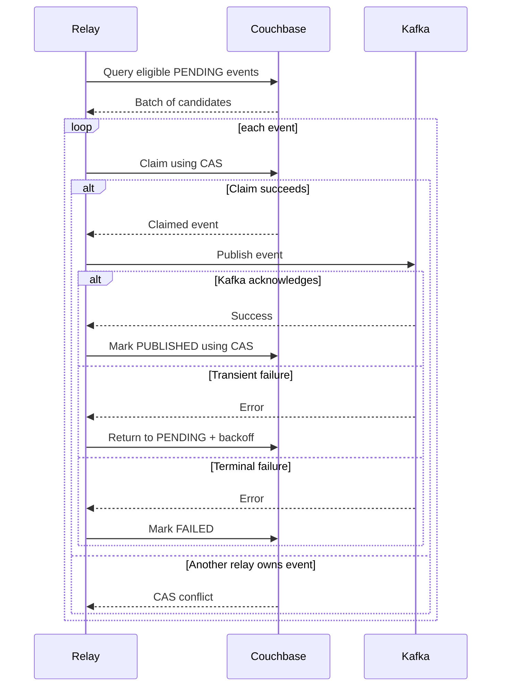

# ADR-008: Use the Transactional Outbox Pattern

## 1. Status

**Accepted**

---

## 2. Context

Haven persists authoritative reservation state in Couchbase and distributes reservation lifecycle events through Kafka.

A reservation operation may need to perform both:

1. Commit business state in Couchbase.
2. Publish one or more events to Kafka.

Examples:

- Confirm a reservation and publish `ReservationConfirmed`.
- Create a pending reservation and publish `ReservationApprovalRequested`.
- Cancel a reservation and publish `ReservationCancelled`.
- Extend a reservation and publish `ReservationExtended`.

Couchbase and Kafka do not share one atomic transaction.

A direct dual-write flow is unsafe:

```text
save reservation
publish event
```

or:

```text
publish event
save reservation
```

Both orderings create failure windows.

### Database First Failure

```text
Couchbase commit succeeds
Kafka publish fails
```

Result:

- Reservation exists.
- Downstream consumers never learn about it.
- Notification, reporting, and audit may remain incomplete.

### Kafka First Failure

```text
Kafka publish succeeds
Couchbase commit fails
```

Result:

- Consumers observe an event for business state that never committed.
- Reporting or notifications may describe a reservation that does not exist.

The system therefore needs a durable mechanism that makes business-state persistence and the intention to publish events atomic.

The main alternatives considered were:

- Transactional outbox
- Direct dual write
- Distributed transaction across Couchbase and Kafka
- Kafka-first event sourcing
- Change-data capture
- Best-effort retry from application memory
- Periodic scanning of Reservation documents

---

## 3. Problem Statement

How should Haven reliably publish Kafka events corresponding to committed reservation state without requiring a distributed transaction between Couchbase and Kafka?

The selected design must guarantee:

- No committed business event is silently forgotten.
- No event is published for uncommitted state through the normal path.
- Publication can recover after process or broker failure.
- Duplicate publication is tolerated.
- Operational backlog is visible.
- Reservation request latency does not depend on downstream consumers.

---

## 4. Decision Drivers

| Priority | Driver | Importance |
|---:|---|---|
| 1 | Prevent silent event loss | Critical |
| 2 | Preserve state/event consistency | Critical |
| 3 | Recover after process crash | Critical |
| 4 | Support Kafka outage | High |
| 5 | Avoid distributed transactions | High |
| 6 | Keep reservation write path bounded | High |
| 7 | Support multiple application instances | High |
| 8 | Make backlog observable | High |
| 9 | Support at-least-once publication | High |
| 10 | Preserve event ordering per aggregate | High |
| 11 | Keep operational complexity reasonable | Medium |
| 12 | Support replay and repair | Medium |

---

## 5. Options Considered

### Option A — Transactional Outbox

Persist the business state and an outbox record in the same Couchbase transaction.

A relay later publishes the outbox record to Kafka and marks it published.

### Option B — Direct Dual Write

The request handler writes to Couchbase and publishes to Kafka directly.

### Option C — Distributed Transaction

Coordinate Couchbase and Kafka through a two-phase commit or equivalent distributed transaction mechanism.

### Option D — Kafka-First Event Sourcing

Publish the event to Kafka as the primary write, then derive reservation state from the event log.

### Option E — Change-Data Capture

Observe Couchbase changes and convert them into Kafka events.

### Option F — In-Memory Retry Queue

If Kafka publication fails, retain the event in process memory and retry.

### Option G — Scan Reservations for Missing Events

Periodically inspect reservation state and infer which events should have been published.

---

## 6. Evaluation

| Criteria | Transactional Outbox | Direct Dual Write | Distributed Transaction | Kafka-First | CDC | In-Memory Retry | Reservation Scan |
|---|---|---|---|---|---|---|---|
| Atomic state + intent | Yes | No | Yes | Event is primary | Indirect | No | No |
| Survives process crash | Yes | No | Yes | Yes | Yes | No | Yes, imperfect |
| Kafka outage tolerance | Yes | Partial | Depends | Write unavailable or buffered | Yes | Limited | Yes |
| Duplicate possibility | Yes | Yes | Lower | Yes | Yes | Yes | Yes |
| Implementation complexity | Medium | Low | Very high | High | Medium–High | Low | High |
| Operational clarity | High | Low | Low | Medium | Medium | Low | Low |
| Fits current domain model | Excellent | Poor | Poor | Low | Medium | Poor | Poor |
| MVP suitability | High | Rejected | Rejected | Rejected | Deferred | Rejected | Rejected |

---

## 7. Decision

Haven will use the **transactional outbox pattern**.

Every business operation that raises externally relevant domain events will persist:

- Authoritative business state
- Schedule guard changes where applicable
- Idempotency outcome where applicable
- One outbox document per event

inside the same Couchbase transaction.

A background outbox relay will:

1. Discover publishable outbox records.
2. Claim them safely.
3. Publish them to Kafka.
4. Mark them published.
5. Retry transient failures.
6. Expose backlog and failure metrics.
7. Move terminally failed records into an inspectable failed state.

Delivery from outbox to Kafka is **at least once**.

Consumers must remain idempotent.

---

## 8. Rationale

### 8.1 Atomic Intent Is Sufficient

Haven cannot atomically commit Couchbase and Kafka together.

It can atomically commit:

```text
business state + durable publication intent
```

Once the outbox record exists, event publication can be retried independently until it succeeds.

### 8.2 Couchbase Owns the Authoritative Transaction

The reservation workflow already uses Couchbase transactions for:

- Reservation persistence
- Schedule guard changes
- Idempotency
- Concurrency control

Adding the outbox record to that same transaction preserves one authoritative consistency boundary.

### 8.3 Kafka Outage Does Not Block Reservation Correctness

When Kafka is unavailable:

- Reservation commits can continue while outbox capacity is safe.
- Outbox records accumulate.
- The relay retries later.
- Operators observe backlog age and count.

Downstream delay is visible but no event is silently lost.

### 8.4 Process Failure Is Recoverable

If the Haven process crashes:

- Before Couchbase commit: neither state nor outbox exists.
- After Couchbase commit: state and outbox both exist.
- During publication: the relay can resume from durable records.

### 8.5 Duplicate Publication Is Easier Than Lost Publication

A relay may publish successfully and crash before marking the outbox record published.

That event may be published again.

The architecture accepts duplicates and requires idempotent consumers because preventing all duplicates across independent systems is more complex than safely handling them.

---

## 9. Outbox Record Model

Illustrative document:

```json
{
  "schemaVersion": 1,
  "documentType": "OutboxEvent",
  "eventId": "evt_01H...",
  "eventType": "ReservationConfirmed",
  "eventVersion": 1,
  "organizationId": "org_01H...",
  "aggregateType": "Reservation",
  "aggregateId": "rsv_01H...",
  "partitionKey": "org_01H...:rsv_01H...",
  "topic": "haven.reservation.events.v1",
  "occurredAt": "2026-07-20T05:30:00Z",
  "createdAt": "2026-07-20T05:30:00Z",
  "payload": {},
  "headers": {
    "correlationId": "trace_01H...",
    "causationId": "cmd_01H..."
  },
  "publication": {
    "status": "PENDING",
    "attemptCount": 0,
    "nextAttemptAt": "2026-07-20T05:30:00Z",
    "claimedBy": null,
    "claimExpiresAt": null,
    "publishedAt": null,
    "lastErrorCategory": null,
    "lastErrorMessage": null
  }
}
```

---

## 10. Document Key

Recommended key:

```text
outbox::<organizationId>::<eventId>
```

Properties:

- Unique
- Tenant-aware
- Directly retrievable
- Independent of aggregate version
- Stable for replay and diagnosis

The event ID must be generated before the transaction commits.

---

## 11. Outbox States

```text
PENDING
CLAIMED
PUBLISHED
FAILED
```

### PENDING

Ready for relay processing when:

```text
nextAttemptAt <= now
```

### CLAIMED

Temporarily owned by one relay worker.

Contains:

- `claimedBy`
- `claimExpiresAt`

### PUBLISHED

Kafka acknowledged publication.

Contains:

- `publishedAt`
- Optional partition and offset metadata

### FAILED

Retry policy is exhausted or failure is non-retryable.

Requires:

- Operator visibility
- Repair or replay procedure
- Alerting

---

## 12. State Transitions



Invalid transitions must be rejected.

---

## 13. Transaction Boundary

### Reservation Creation

The transaction may include:

```text
idempotency record
schedule guard update
reservation insert
outbox event insert(s)
idempotency response completion
```

### Reservation Approval

The transaction may include:

```text
reservation state update
schedule guard update
outbox event insert
```

### Reservation Cancellation

The transaction may include:

```text
reservation state update
schedule guard update
outbox event insert
```

No Kafka network call occurs inside the Couchbase transaction.

---

## 14. Relay Processing Flow



---

## 15. Claiming Strategy

Multiple relay instances may run concurrently.

A relay claims an event using CAS and records:

```text
claimedBy
claimExpiresAt
```

Rules:

- Claim lease is bounded.
- Relay identity is unique per process instance.
- Claim update uses the expected version.
- An expired claim may be reclaimed.
- Relay does not hold an in-memory-only lock.
- Claim conflicts are expected and not treated as system errors.
- Batch query results are candidates, not ownership guarantees.

---

## 16. Claim Lease

The claim lease must exceed the normal Kafka publish deadline with safety margin.

Illustrative:

```text
publish timeout: 10 seconds
claim lease: 30 seconds
```

The exact value depends on:

- Producer configuration
- Network behavior
- Batch size
- Retry policy

A relay should not indefinitely extend claims.

If long publication operations become necessary, the design should be reconsidered.

---

## 17. Publication Semantics

The relay publishes:

- Event envelope as message value
- `partitionKey` as Kafka message key
- Event metadata as headers where useful

Producer configuration should use:

- Strong acknowledgments
- Idempotent producer capability where supported
- Bounded delivery timeout
- Retry of transient broker errors
- TLS and authentication in production

Kafka producer idempotence reduces some duplicates but does not eliminate the relay crash window between publish acknowledgment and Couchbase status update.

---

## 18. Marking Published

After Kafka acknowledgment, the relay updates the outbox record using expected CAS.

The update may include:

```json
{
  "status": "PUBLISHED",
  "publishedAt": "2026-07-20T05:30:01Z",
  "kafkaPartition": 4,
  "kafkaOffset": 123456,
  "claimedBy": null,
  "claimExpiresAt": null
}
```

If this update fails because the process loses connectivity or crashes:

- The claim eventually expires.
- Another relay may republish.
- Consumer idempotency handles the duplicate.

---

## 19. Retry Policy

### Retryable

- Kafka timeout
- Broker unavailable
- Leader election
- Temporary network failure
- Producer queue pressure
- Temporary Couchbase failure while updating relay state

### Non-Retryable

- Unsupported event schema
- Missing required partition key
- Invalid topic configuration
- Serialization failure caused by corrupt persisted data
- Authorization failure caused by invalid deployment configuration

### Backoff

Use:

```text
exponential backoff + jitter
```

Example progression:

```text
1s, 5s, 15s, 1m, 5m, 15m
```

Exact values are configuration.

---

## 20. Retry Exhaustion

After the configured maximum attempts or maximum event age:

- Mark the record `FAILED`.
- Emit an alert.
- Preserve the payload.
- Preserve the original event ID.
- Require operator review or automated repair policy.
- Do not silently delete the event.

The retry policy may distinguish:

- Infrastructure outage
- Poison event
- Invalid configuration
- Permanent authorization failure

---

## 21. Ordering

Outbox records are created in business-transaction order, but relay polling across multiple documents does not guarantee global ordering.

Haven requires only per-reservation ordering.

Mechanisms:

- Kafka partition key uses organization and reservation ID.
- Event `occurredAt` and event version are included.
- Consumers handle duplicate and stale versions.
- Relay may publish different reservations in parallel.
- Relay should avoid intentionally reordering multiple pending events for the same aggregate where detectable.

If strict aggregate sequence becomes necessary, add an aggregate sequence number.

---

## 22. Aggregate Sequence

Initial events may include an optional monotonic aggregate sequence:

```text
aggregateSequence: 1, 2, 3...
```

Benefits:

- Detect missing events
- Detect stale or out-of-order processing
- Support projection repair
- Improve auditability

Implementation must update aggregate state and outbox sequence atomically.

This may be introduced once the event model stabilizes.

---

## 23. Event Immutability

An outbox event payload must not be edited after the business transaction commits.

Permitted updates apply only to publication metadata:

- Status
- Claim
- Attempts
- Last error
- Published timestamp
- Broker metadata

If the payload is invalid:

- Mark failed.
- Fix the producer bug.
- Create a new corrective event or controlled replay artifact.
- Preserve the original record for audit.

---

## 24. Retention

Published outbox records need not remain forever.

Retention must support:

- Operational diagnosis
- Replay confidence
- Audit correlation
- Duplicate investigation

Illustrative:

- `PUBLISHED`: retain 7–30 days
- `FAILED`: retain until resolved plus audit period
- `PENDING/CLAIMED`: never delete automatically

Kafka and Reservation storage remain the longer-lived sources for event history and business state.

---

## 25. Cleanup

A cleanup worker may remove or archive old published records.

Rules:

- Delete only `PUBLISHED`.
- Apply configured minimum age.
- Process bounded batches.
- Emit deletion metrics.
- Never delete pending or failed records.
- Avoid competing heavily with reservation traffic.
- Support dry-run mode.

---

## 26. Backpressure

If Kafka remains unavailable, outbox backlog grows.

The system must monitor:

- Pending count
- Oldest pending age
- Storage growth
- Relay throughput
- Publish failure rate

Operational policy may define thresholds:

| Level | Example Behavior |
|---|---|
| Normal | Continue |
| Warning | Alert and investigate |
| Critical | Scale relay or repair Kafka |
| Capacity risk | Reject non-essential writes or reservation writes with `503` before storage exhaustion |

Haven must not allow unbounded backlog to exhaust Couchbase silently.

---

## 27. Health Semantics

### API Readiness

Kafka outage alone does not necessarily make Haven API unready because outbox persistence protects events.

API readiness becomes unhealthy when:

- Couchbase cannot persist outbox records.
- Outbox collection is unavailable.
- Backlog reaches unsafe capacity threshold.
- Required transaction cannot commit.

### Relay Readiness

Relay readiness depends on:

- Couchbase access
- Kafka producer readiness
- Valid topic and credentials
- Worker initialization

### Health Reporting

Detailed backlog and broker state belong in internal health/metrics, not public liveness.

---

## 28. Idempotency Interaction

API idempotency prevents duplicate business command execution.

Outbox event IDs are part of the stable idempotent result.

When the same create request is replayed:

- The existing reservation is returned.
- No additional reservation is created.
- No new event is created for the same successful command.
- Existing outbox publication continues independently.

API idempotency and consumer idempotency solve different duplicate boundaries.

---

## 29. Consumer Idempotency

Every consumer records or derives completion using:

```text
consumerName + eventId
```

Examples:

- Notification: `eventId + recipient + channel`
- Reporting: upsert by event ID
- Audit: unique event ID constraint

Consumer idempotency is mandatory because the outbox relay provides at-least-once publication.

---

## 30. Failure Scenarios

| Scenario | Outcome |
|---|---|
| Transaction fails before commit | No business state and no outbox |
| Transaction commits, process crashes | Relay later publishes |
| Kafka unavailable | Event remains pending |
| Relay crashes before publish | Claim expires, event retried |
| Relay publishes, crashes before mark | Event may be published again |
| Relay marks published | Normal completion |
| Outbox query is stale | Event discovered later |
| Claim CAS conflict | Another relay owns candidate |
| Poison payload | Mark failed and alert |
| Cleanup crashes | Safe to retry |
| Consumer crashes after side effect | Duplicate handled by consumer idempotency |

---

## 31. Query and Index Strategy

Relay query requires an index covering:

- Publication status
- Next-attempt timestamp
- Claim-expiry timestamp
- Creation time

Conceptual query:

```sql
SELECT META(o).id, o.*
FROM `haven`.`integration`.`outbox` AS o
WHERE
  (
    o.publication.status = "PENDING"
    AND o.publication.nextAttemptAt <= $now
  )
  OR
  (
    o.publication.status = "CLAIMED"
    AND o.publication.claimExpiresAt <= $now
  )
ORDER BY o.createdAt
LIMIT $batchSize;
```

The query only discovers candidates.

CAS establishes ownership.

---

## 32. Batch Processing

Relay batch configuration includes:

- Poll interval
- Candidate batch size
- Maximum in-flight publishes
- Claim lease
- Publish timeout
- Retry backoff
- Worker count

Rules:

- Keep batches bounded.
- Avoid loading large payload collections.
- Limit concurrent Kafka publishes.
- Preserve request-independent resource limits.
- Measure query and claim latency.
- Avoid one poison event blocking the entire batch.

---

## 33. Deployment Model

The relay may initially run:

### In the Haven API Process

Advantages:

- Fewer deployment units
- Simple local development
- Shared configuration and clients

Risks:

- Relay load can affect API process
- Deployment restarts both API and relay
- Worker failures share process blast radius

### Separate Worker Process

Advantages:

- Independent scaling
- Independent resource limits
- Better failure isolation
- Separate readiness

Risks:

- Additional deployment unit
- More configuration and monitoring

### Decision

- Support both through one codebase.
- Use in-process mode for early local development.
- Prefer a separate relay worker for production-oriented deployment once stable.

---

## 34. Security

- Outbox collection is private.
- Only trusted Haven components may write.
- Relay credentials have least privilege.
- Kafka credentials allow publish only to configured topics.
- Event payloads follow data-minimization rules.
- Secrets and raw tokens are forbidden in payloads.
- Error messages stored in outbox are sanitized.
- Replay tooling requires restricted operator access.
- Cross-tenant replay is prohibited.

---

## 35. Observability

### Metrics

- `outbox_pending_total`
- `outbox_claimed_total`
- `outbox_failed_total`
- `outbox_oldest_pending_seconds`
- `outbox_claim_attempt_total`
- `outbox_claim_conflict_total`
- `outbox_publish_attempt_total`
- `outbox_publish_success_total`
- `outbox_publish_failure_total`
- `outbox_publish_latency_seconds`
- `outbox_retry_total`
- `outbox_cleanup_total`
- `outbox_replay_total`

### Logs

Include:

- Event ID
- Event type
- Aggregate ID
- Organization ID
- Relay instance ID
- Attempt
- Status transition
- Failure category
- Kafka partition/offset where available
- Trace/correlation ID

### Traces

Trace spans:

```text
outbox.poll
outbox.claim
outbox.serialize
kafka.publish
outbox.mark_published
```

---

## 36. Alerts

Recommended alerts:

- Oldest pending event exceeds threshold
- Pending count grows continuously
- Failed outbox record exists
- Publish failure rate exceeds threshold
- Relay has no successful publication for expected traffic period
- Claim conflicts spike unexpectedly
- Cleanup backlog grows
- Outbox collection storage approaches limit

Alerts should include runbook links.

---

## 37. Testing Strategy

### Unit Tests

- Outbox state transitions
- Retry classification
- Backoff calculation
- Event serialization
- Claim-expiry logic
- Cleanup eligibility
- Replay validation

### Integration Tests

- Reservation and outbox commit atomically
- Transaction rollback removes both
- Relay claims using CAS
- Multiple relays do not own same claim
- Kafka publication
- Mark published
- Claim expiry recovery
- Failed-event state
- Cleanup of published records

### Failure Injection

- Crash after Couchbase commit
- Crash before Kafka publish
- Crash after Kafka acknowledgment
- Couchbase unavailable during mark-published
- Kafka unavailable
- Invalid topic
- Serialization failure
- Expired claim
- Duplicate relay processing

### End-to-End

```text
API request
→ Couchbase reservation + outbox
→ Kafka event
→ consumer
→ side effect
```

Verify duplicate publication does not duplicate the side effect.

---

## 38. Performance Considerations

Outbox persistence adds one document insert per event to the business transaction.

Expected impact:

- Additional transaction write
- Additional storage
- Relay query and update load
- Kafka publication delay independent of API response

Performance targets should distinguish:

- API commit latency
- Commit-to-publish latency
- Publish-to-consume latency
- End-to-end side-effect latency

Tune:

- Event payload size
- Number of events per command
- Relay batch size
- Worker concurrency
- Poll interval
- Index design
- Cleanup schedule

---

## 39. Consequences

### 39.1 Positive

- Prevents silent event loss after committed state
- Avoids distributed transactions
- Survives process and broker failure
- Decouples API latency from consumers
- Supports operational backlog visibility
- Fits Couchbase transaction model
- Supports Kafka at-least-once delivery
- Enables replay and repair
- Preserves modular boundaries
- Provides clear failure semantics

### 39.2 Negative

- Adds outbox storage and indexes.
- Requires relay worker implementation.
- Duplicate publication remains possible.
- Consumers must be idempotent.
- Backlog requires monitoring and capacity planning.
- Failed records require operational handling.
- Cleanup and retention must be managed.
- Ordering across multiple records needs care.
- More integration and failure testing is required.

### 39.3 Neutral

- Kafka remains unavailable temporarily without losing events.
- Outbox is not a replacement for Kafka retention.
- Outbox records are not the authoritative reservation state.
- Producer idempotence does not remove consumer idempotency.
- Event delivery remains asynchronous.

---

## 40. Risks and Mitigations

| Risk | Likelihood | Impact | Mitigation |
|---|---|---|---|
| Published event marked pending after crash | High over time | Medium | Consumer idempotency |
| Outbox backlog exhausts storage | Low–Medium | Critical | Capacity alert and load shedding |
| Poison event retries forever | Medium | High | Bounded retry and FAILED state |
| Multiple relays duplicate work | Medium | Medium | CAS claim and idempotent consumers |
| Payload schema invalid | Low–Medium | High | Validate before transaction |
| Event missing from transaction | Medium | Critical | Use-case tests and repository contract |
| Cleanup deletes pending record | Low | Critical | State guard and tests |
| Claim lease too short | Medium | Medium | Tune against publish timeout |
| Sensitive data persisted | Medium | High | Event review and schema controls |
| Relay affects API resources | Medium | Medium | Separate worker process |

---

## 41. Rejected Alternatives

### 41.1 Direct Dual Write

Rejected because no operation ordering eliminates the failure window between Couchbase and Kafka.

### 41.2 Distributed Transaction

Rejected because:

- Operational complexity is excessive.
- Cross-system support is limited.
- Availability would decrease.
- Failure diagnosis becomes harder.
- The outbox provides sufficient guarantees.

### 41.3 Kafka-First Event Sourcing

Rejected for MVP because:

- Haven's current domain model is aggregate/document oriented.
- Event sourcing changes persistence, recovery, query, and evolution strategy substantially.
- The added complexity is not required to meet current requirements.

### 41.4 Change-Data Capture

Deferred because:

- Domain event intent is richer than raw document mutation.
- Mapping low-level changes into business facts is complex.
- CDC infrastructure adds operational dependency.
- Application outbox gives explicit event schema and causation metadata.

CDC may later publish the outbox collection itself if supported reliably.

### 41.5 In-Memory Retry

Rejected because process restart loses the event.

### 41.6 Reservation Scanning

Rejected because inferring missing business events from current state is ambiguous and expensive.

---

## 42. Portability Strategy

The application depends on an outbox abstraction, not Kafka directly.

Neutral concepts:

- Domain event
- Event envelope
- Outbox record
- Publication status
- Event publisher port

Kafka-specific producer details remain in infrastructure.

Couchbase-specific storage and CAS remain in the outbox repository adapter.

---

## 43. Migration Strategy

If the outbox implementation changes:

1. Preserve event envelope and event IDs.
2. Stop creating new records in the old format only after new writer deployment.
3. Allow old relay to drain old records.
4. Run new relay for new schema.
5. Verify consumer idempotency across both.
6. Migrate pending and failed records if necessary.
7. Retain audit records during the transition.
8. Remove old indexes and cleanup jobs last.

If moving to CDC:

- CDC should consume the existing outbox collection rather than raw reservation documents initially.
- Validate duplicate and ordering behavior.
- Supersede this ADR only if the publication-intent persistence model changes.

---

## 44. Reconsideration Triggers

Revisit this ADR when:

- Couchbase transaction limits make outbox writes impractical.
- A managed CDC solution can publish outbox records with equivalent guarantees.
- Kafka and datastore support a proven shared transactional mechanism.
- Event-sourcing requirements emerge.
- Outbox backlog management becomes operationally dominant.
- Event throughput exceeds polling design limits.
- Multi-region publication requires another architecture.
- Strict aggregate ordering requires a sequenced event log.
- Regulatory retention changes outbox storage requirements.

---

## 45. Implementation Impact

### Domain

- Raises immutable domain events.
- No outbox or Kafka dependency.

### Application

- Collects domain events from successful aggregate operations.
- Passes them into the transactional persistence boundary.
- Ensures event IDs and payloads are created before commit.

### Infrastructure

Must implement:

- Outbox repository
- Transactional insertion
- Candidate query
- CAS claiming
- Kafka publisher
- Retry and failure transitions
- Cleanup
- Replay tooling
- Metrics and health

### Deployment

Requires:

- Relay process or background component
- Kafka connectivity
- Couchbase outbox collection
- Indexes
- Worker resource limits
- Backlog alerts

### Testing

Requires:

- Couchbase and Kafka containers
- Crash-window tests
- Duplicate-publication tests
- Consumer-idempotency tests
- Backlog and replay tests

---

## 46. Validation Criteria

The decision is successful when:

- Every committed externally relevant domain event has an outbox record.
- A transaction failure leaves neither business state nor outbox state.
- Kafka outage does not lose events.
- Process crash after commit is recoverable.
- Multiple relay instances process safely.
- Duplicate publication does not duplicate consumer side effects.
- Failed events are visible and replayable.
- Backlog age and count are monitored.
- API latency does not include consumer processing.
- Domain and application layers do not depend on Kafka clients.

Warning signs:

- Controller publishes directly to Kafka.
- Event insert occurs outside the business transaction.
- Outbox record is deleted before Kafka acknowledgment.
- Pending records have no alert.
- Consumers assume exactly-once delivery.
- Relay stores ownership only in memory.
- Failed records are discarded.
- Event payload changes after commit.

---

## 47. Follow-Up Tasks

- [ ] Define outbox document mapper.
- [ ] Create outbox collection and indexes.
- [ ] Implement transactional event insertion.
- [ ] Implement relay candidate query.
- [ ] Implement CAS claim.
- [ ] Implement claim-expiry recovery.
- [ ] Configure Kafka producer.
- [ ] Implement publication-state transitions.
- [ ] Implement retry and jitter.
- [ ] Implement FAILED state and replay command.
- [ ] Implement published-record cleanup.
- [ ] Add backlog metrics and alerts.
- [ ] Add API readiness capacity threshold.
- [ ] Add crash-window integration tests.
- [ ] Add duplicate-publication consumer tests.
- [ ] Document outbox recovery runbook.

---

## 48. Interview Notes

### What problem does the transactional outbox solve?

It removes the unsafe dual-write gap between committing reservation state in Couchbase and publishing the corresponding event to Kafka.

### What is atomic?

The reservation state and the durable intent to publish are atomic. Kafka publication itself remains asynchronous.

### Can the same event be published twice?

Yes. A relay may publish and crash before marking the record published. Consumers therefore deduplicate using the event ID.

### Why not use a distributed transaction?

It adds substantial complexity and availability cost. The outbox provides the required reliability with simpler failure recovery.

### What happens when Kafka is down?

Reservations may continue while Couchbase can safely store the outbox backlog. The relay retries later, and alerts track backlog age and capacity.

### How do multiple relays avoid processing the same event?

They claim candidate records using Couchbase CAS and a bounded lease. Duplicate publication is still tolerated.

### Is the outbox the event source of truth?

It is the durable publication intent. Reservation documents remain authoritative business state, while Kafka is the downstream event stream.

### Why not publish directly from the request handler?

A crash or broker failure after the database commit would silently lose the event.

---

## 49. Summary

**Decision:** Persist domain events in a Couchbase transactional outbox and publish them asynchronously to Kafka through a relay.

**Reason:** This guarantees atomic business state plus publication intent without a distributed transaction.

**Delivery guarantee:** At least once.

**Failure model:** Duplicate publication is possible and consumers must be idempotent; silent loss after committed state is not acceptable.

**Operational requirement:** Monitor backlog count, oldest age, failed events, relay health, and storage capacity.

---

## 50. Completion Checklist

- [x] Dual-write problem documented
- [x] Alternatives evaluated
- [x] Decision stated
- [x] Transaction boundary defined
- [x] Outbox schema defined
- [x] Claiming strategy defined
- [x] Retry and failure states defined
- [x] Ordering discussed
- [x] Retention and cleanup included
- [x] Backpressure included
- [x] Health semantics included
- [x] Security included
- [x] Observability included
- [x] Testing strategy included
- [x] Risks documented
- [x] Migration strategy included
- [x] Reconsideration triggers defined
- [x] Interview notes included
